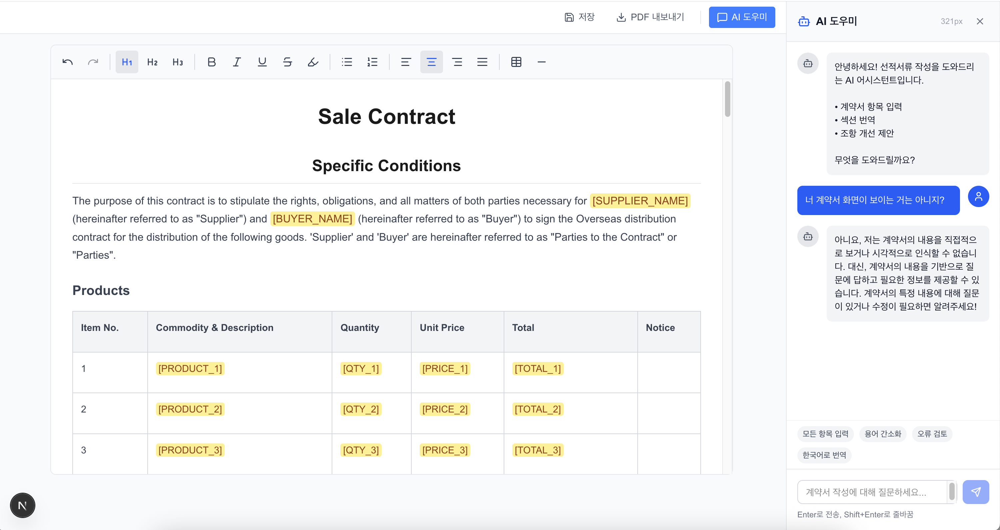

# 에디터 테스트 
(테스트 화면)



## 주요 기능

- 리치 텍스트 에디터 (서식, 테이블, 하이라이트 등)
- 템플릿 기반 작성
- AI 채팅 사이드바 (계약서 작성 지원)
- PDF 내보내기
- 사이드바 크기 조절 가능

## 기술 스택

### 프론트엔드 프레임워크
| 기술 | 버전 | 설명 |
|------|------|------|
| **Next.js** | 16.0.4 | React 기반 풀스택 프레임워크 |
| **React** | 19.2.0 | UI 라이브러리 |
| **TypeScript** | 5.x | 정적 타입 지원 |
| **Tailwind CSS** | 4.x | 유틸리티 기반 CSS 프레임워크 |

### 에디터
| 기술 | 버전 | 설명 |
|------|------|------|
| **Tiptap** | 3.11.0 | ProseMirror 기반 헤드리스 리치 텍스트 에디터 |
| **@tiptap/starter-kit** | 3.11.0 | 기본 에디터 기능 (볼드, 이탤릭, 리스트 등) |
| **@tiptap/extension-table** | 3.11.0 | 테이블 지원 |
| **@tiptap/extension-highlight** | 3.11.0 | 텍스트 하이라이트 |
| **@tiptap/extension-text-align** | 3.11.0 | 텍스트 정렬 |
| **@tiptap/extension-underline** | 3.11.0 | 밑줄 |
| **@tiptap/extension-placeholder** | 3.11.0 | 플레이스홀더 텍스트 |

### AI 통합
| 기술 | 버전 | 설명 |
|------|------|------|
| **OpenAI SDK** | 6.9.1 | OpenAI API 클라이언트 (GPT-4o-mini 사용) |
| **Server-Sent Events (SSE)** | - | 스트리밍 응답 처리 |

### 기타 라이브러리
| 기술 | 버전 | 설명 |
|------|------|------|
| **html2pdf.js** | 0.12.1 | HTML을 PDF로 변환 |
| **Lucide React** | 0.554.0 | 아이콘 라이브러리 |

## 프로젝트 구조

```
contract-editor/
├── src/
│   ├── app/
│   │   ├── page.tsx          # 메인 페이지
│   │   └── api/
│   │       └── chat/
│   │           └── route.ts  # AI 채팅 API (OpenAI 연동)
│   ├── components/
│   │   ├── editor/
│   │   │   ├── ContractEditor.tsx  # Tiptap 에디터 컴포넌트
│   │   │   ├── EditorToolbar.tsx   # 에디터 툴바
│   │   │   └── editor.css          # 에디터 스타일
│   │   └── chat/
│   │       └── AISidebar.tsx       # AI 채팅 사이드바
│   ├── templates/
│   │   └── saleContract.ts         # 계약서 HTML 템플릿
│   └── types/
│       └── index.ts                # TypeScript 타입 정의
├── .env.local                      # 환경 변수 (API 키)
├── package.json
└── README.md
```

## 설치 및 실행

### 1. 의존성 설치

```bash
npm install
```

### 2. 환경 변수 설정

`.env.local` 파일 생성:

```env
# Django 백엔드 URL (향후 연동용)
NEXT_PUBLIC_API_URL=http://localhost:8000

# OpenAI API 키
OPENAI_API_KEY=sk-your-api-key-here
```

### 3. 개발 서버 실행

```bash
npm run dev
```

브라우저에서 `http://localhost:3000` 접속

### 4. 프로덕션 빌드

```bash
npm run build
npm start
```

## 아키텍처

```
┌─────────────────────────────────────────────────────────┐
│                      Next.js App                        │
├─────────────────────────────────────────────────────────┤
│  ┌─────────────────────┐  ┌─────────────────────────┐  │
│  │   Contract Editor   │  │     AI Sidebar          │  │
│  │   (Tiptap)          │  │     (Chat UI)           │  │
│  │                     │  │                         │  │
│  │  - 리치 텍스트 편집  │  │  - 메시지 입/출력       │  │
│  │  - 템플릿 로드       │  │  - 스트리밍 응답        │  │
│  │  - PDF 내보내기      │  │  - 빠른 액션 버튼       │  │
│  └─────────────────────┘  └─────────────────────────┘  │
│                                    │                    │
│                                    ▼                    │
│                          ┌─────────────────┐           │
│                          │  /api/chat      │           │
│                          │  (API Route)    │           │
│                          └────────┬────────┘           │
└───────────────────────────────────┼─────────────────────┘
                                    │
                                    ▼
                           ┌─────────────────┐
                           │   OpenAI API    │
                           │   (GPT-4o-mini) │
                           └─────────────────┘
```

## 향후 연동 계획

현재는 테스트용으로 OpenAI API에 직접 연결되어 있습니다.
실제 배포 시에는 다음 아키텍처로 연동 예정:

```
NGINX → Django Backend → LLM Agent (Gunicorn)
```

- Django: 인증, 문서 저장, API 게이트웨이
- LLM Agent: RAG, 웹 검색, 문서 생성 도구

## 라이선스

내부 프로젝트
