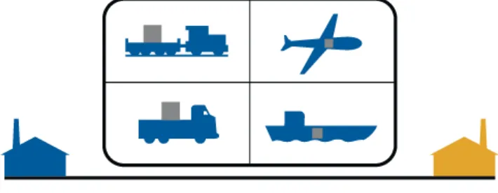
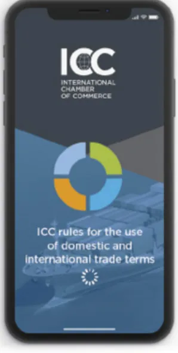
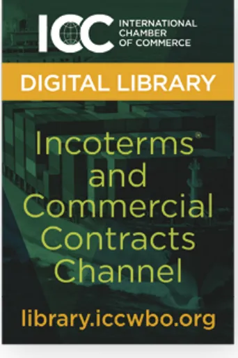
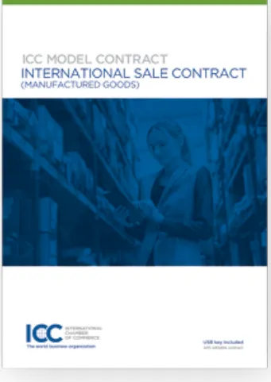
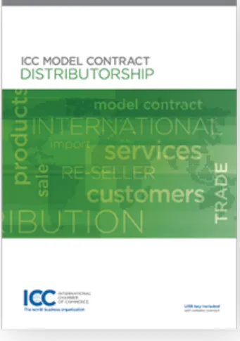
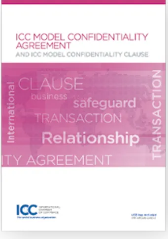

# Inco®terms

## 2020 by the International Chamber of Commerce (ICC)

ENG

ICC RULES  
FOR THE USE  
OF DOMESTIC AND  
INTERNATIONAL  
TRADE TERMS

INTERNATIONAL  
CHAMBER  
OF COMMERCE

The world business organization# Inco®terms

## 2020 by the International Chamber of Commerce (ICC)

ICC RULES  
FOR THE USE OF  
DOMESTIC AND  
INTERNATIONAL  
TRADE TERMS

ICC INTERNATIONAL  
CHAMBER  
OF COMMERCE  
The world business organization**Incoterms® 2020**

**ICC rules for the use of domestic and international trade terms**

© 2019 International Chamber of Commerce (ICC)

All rights reserved.

ICC holds all copyright and other intellectual property rights in this work.

No part of this work may be reproduced, distributed, transmitted, translated or adapted in any form or by any means, except as permitted by law, without the written permission of ICC.

Permission can be requested from ICC through [publications@iccwbo.org](mailto:publications@iccwbo.org)

ICC Services

Publications Department

33-43 avenue du Président Wilson

75116 Paris, France

The English language version of the publication provides the official text of the rules.

"Incoterms" is a registered trademark of ICC. Rules on the correct usage of the trademark can be found on <https://iccwbo.org/incoterms-copyright/>

ICC Publication: @723E

ISBN: 978-92-842-0511-0## Foreword

By John W.H. Denton, AO, ICC Secretary General

The growth of the global economy has given most businesses greater access than ever before to markets all over the world. Goods are sold today in more countries, in larger quantities, in greater variety, and at a faster pace as a result. But as both the volume and complexity of global trade increase, so do possibilities for misunderstandings and costly disputes when sale contracts are not adequately drafted.

The ICC Incoterms® rules on the use of domestic and international trade terms address this risk by facilitating the conduct of global trade. Reference to an Incoterms® 2020 rule in a contract for the sale of goods clearly defines the parties' respective obligations regarding topics such as risk, cost and arrangement of transport and customs clearance, thereby reducing the potential for legal complications.

Since ICC first codified a set of standard trading terms as the Incoterms® rules in 1936, this globally accepted contractual standard has been updated periodically to reflect the evolution of international trade. The Incoterms® 2020 rules take account of the increased attention to security in the movement of goods, the need for flexibility in insurance coverage depending on the nature of goods and transport, and the call by banks for an on-board bill of lading in certain financed sales under the FCA rule.

*Incoterms® 2020* also offers a simpler and clearer presentation of all the rules, featuring revised language, an expanded introduction and explanatory notes, and articles reordered to better reflect the logic of a sale transaction. *Incoterms® 2020* is also the first version of ICC's Incoterms® rules to include a 'horizontal' presentation, grouping all like articles together and allowing users to clearly see differences in treatment of particular issues across the 11 Incoterms® rules.

ICC's deep expertise in commercial law—drawn from a global membership representing all trade sectors and companies of all sizes—ensures that *Incoterms® 2020* responds to business needs everywhere.

ICC would like to express its gratitude to the members of the drafting group from the ICC Commission on Commercial Law and Practice for their contributions to *Incoterms® 2020*. The working group comprised David Lowe (Co-Chair, UK), Christoph Martin Radtke (Co-Chair, France), Charles Debattista(Special Advisor, UK), Ercüment Erdem (Turkey), Virginie Jan (Jian Baozhu (China)), Burghard Piltz (Germany), Frank Reynolds (US), and Bob Ronai (Australia). We also thank Asko Räty (Finland) for his assistance with the images depicting the 11 rules.

Our appreciation is also due to Emily O'Connor (Director, Multilateral Rules for Trade and Investment, ICC) and Florence Binta Diao-Gueye (Commission on Commercial Law and Practice, ICC).# Contents

## INTRODUCTION TO INCOTERMS® 2020 5

## RULES FOR ANY MODE OR MODES OF TRANSPORT 21

EXW | Ex Works 22

FCA | Free Carrier 28

CPT | Carriage Paid To 38

CIP | Carriage and Insurance Paid To 45

DAP | Delivered at Place 54

DPU | Delivered at Place Unloaded 61

DDP | Delivered Duty Paid 67

## RULES FOR SEA AND INLAND WATERWAY TRANSPORT 73

FAS | Free Alongside Ship 74

FOB | Free On Board 81

CFR | Cost and Freight 88

CIF | Cost Insurance and Freight 95

## ARTICLE-BY-ARTICLE TEXT OF RULES 105

## INCOTERMS® 2020 DRAFTING GROUP 150

## INCOTERMS® PUBLICATIONS AND RESOURCES 156

## OTHER INTERNATIONAL TRADE RELATED PUBLICATIONS 161

## NOTES 164## Introduction to Incoterms® 2020

1. The purpose of the text of this Introduction is fourfold:
   - to explain what the Incoterms® 2020 rules do and do NOT do and how they are best incorporated;
   - to set out the important fundamentals of the Incoterms® rules: the basic roles and responsibilities of seller and buyer, delivery, risk, and the relationship between the Incoterms® rules and the contracts surrounding a typical contract of sale for export/import and also, where appropriate, for domestic sales;
   - to explain how best to choose the right Incoterms® rule for the particular sale contract; and
   - to set out the central changes between *Incoterms® 2010* and *Incoterms® 2020*.
2. The Introduction follows this structure:
   1. What the Incoterms® rules do
   2. What the Incoterms® rules do NOT do
   3. How best to incorporate the Incoterms® rules
   4. Delivery, risk and costs in the Incoterms® 2020 rules
   5. Incoterms® 2020 rules and the carrier
   6. Rules for the contract of sale and their relationship to other contracts
   7. The eleven Incoterms® 2020 rules—"sea and inland waterway" and "any mode(s) of transport": getting it right
   8. Order within the Incoterms® 2020 rules
   9. Differences between *Incoterms® 2010* and *Incoterms® 2020*
   10. Caution with variants of Incoterms® rules
3. This Introduction gives guidance on the use of, and about the fundamental principles behind, the Incoterms® 2020 rules.

### I. WHAT THE INCOTERMS® RULES DO

1. The Incoterms® rules explain a set of eleven of the most commonly-used three-letter trade terms, e.g. CIF, DAP, etc., reflecting business-to-business practice in contracts for the sale and purchase of goods.
2. The Incoterms® rules describe:
   - *Obligations*: Who does what as between seller and buyer, e.g. who organises carriage or insurance of the goods or who obtains shipping documents and export or import licences;
   - *Risk*: Where and when the seller "delivers" the goods, in other words where risk transfers from seller to buyer; and
   - *Costs*: Which party is responsible for which costs, for example transport, packaging, loading or unloading costs, and checking or security-related costs.

The Incoterms® rules cover these areas in a set of ten articles, numbered A1/B1 etc., the A articles representing the seller's obligations and the B articles representing the buyer's obligations. See paragraph 53 below.

### II. WHAT THE INCOTERMS® RULES DO NOT DO

1. The Incoterms® rules are NOT in themselves—and are therefore no substitute for—a contract of sale. They are devised to reflect trade practice for no particular type of goods—and for any. They can be used as much for the trading of a bulk cargo of iron ore as for five containers of electronic equipment or ten pallets of airfreighted fresh flowers.
2. The Incoterms® rules do NOT deal with the following matters:
   - whether there is a contract of sale at all;
   - the specifications of the goods sold;
   - the time, place, method or currency of payment of the price;- the remedies which can be sought for breach of the contract of sale;
- most consequences of delay and other breaches in the performance of contractual obligations;
- the effect of sanctions;
- the imposition of tariffs;
- export or import prohibitions;
- force majeure or hardship;
- intellectual property rights; or
- the method, venue, or law of dispute resolution in case of such breach.

Perhaps most importantly, it must be stressed that the Incoterms® rules do NOT deal with the transfer of property/title/ownership of the goods sold.

**8.** These are matters for which the parties need to make specific provision in their contract of sale. Failure to do so is likely to cause problems later if disputes arise about performance and breach. In essence, the Incoterms® 2020 rules are *not* themselves a contract of sale: they only become *part* of that contract when they are incorporated into a contract which already exists. Neither do the Incoterms® rules provide the law applicable to the contract. There may be legal regimes which apply to the contract, whether international, like the Convention on the International Sale of Goods (CISG); or domestic mandatory law relating, for example, to health and safety or the environment.

### III. HOW BEST TO INCORPORATE THE INCOTERMS® RULES

**9.** If parties want the Incoterms® 2020 rules to apply to their contract, the safest way to ensure this is to make that intention clear in their contract, through words such as

**“[the chosen Incoterms® rule] [named port, place or point] Incoterms® 2020”.**

**10.** Thus, for example, CIF Shanghai Incoterms® 2020, or DAP No 123, ABC Street, Importland Incoterms® 2020.

**11.** Leaving the year out could cause problems that may be difficult to resolve. The parties, a judge or an arbitrator need to be able to determine which version of the Incoterms® rules applies to the contract.

**12.** The place named next to the chosen Incoterms® rule is even more important:

- in all Incoterms® rules except the C rules, the named place indicates where the goods are “delivered”, i.e. where risk transfers from seller to buyer;
- in the D rules, the named place is the place of delivery and also the place of destination and the seller must organise carriage to that point;
- in the C rules, the named place indicates the destination to which the seller must organise and pay for the carriage of the goods, which is not, however, the place or port of delivery.

**13.** Thus, an FOB sale raising doubt about the port of shipment leaves both parties uncertain as to where the buyer must present the ship to the seller for the shipment and the transport of the goods—and as to where the seller must deliver the goods on board so as to transfer risk in the goods from seller to buyer. Again, a CPT contract with an unclear named destination will leave both parties in doubt as to the point to which the seller must contract and pay for the transport of the goods.

**14.** It is best to avoid these types of issues by being as geographically specific as possible in naming the port, place or point, as the case may be, in the chosen Incoterms® rule.

**15.** When incorporating a particular Incoterms® 2020 rule into a sale contract, it is not necessary to use the trademark symbol. For further guidance on trademark and copyright, please refer to <https://iccwbo.org/incoterms-copyright/>.

### IV. DELIVERY, RISK AND COSTS IN THE INCOTERMS® 2020 RULES

**16.** A named place or port attached to the three letters, e.g. CIP Las Vegas or CIF Los Angeles, then, is critical in the workings of the Incoterms® 2020 rules. Depending on which Incoterms® 2020 rule is chosen, that place will identify either the place or port at which the goods are considered to have been “delivered” by the seller to the buyer, the place of “delivery”, or the place or port to which the seller must organise the carriage of the goods, i.e. their destination; or, in the case of the D rules, both.17. In all Incoterms® 2020 rules, A2 will define the place or port of “delivery”—and that place or port is closest to the seller in EXW and FCA (seller’s premises) and closest to the buyer in DAP, DPU and DDP.

18. The place or port of delivery identified by A2 is critical both for risk and for costs.

19. The place or port of delivery under A2 marks the place at which risk transfers from seller to buyer under A3. It is at that place or port that the seller performs its obligation to provide the goods under the contract as reflected in A1 such that the buyer cannot recover against the seller for the loss of or damage to the goods occurring after that point has passed.

20. The place or port of delivery under A2 also marks the central point under A9 which allocates costs to seller and buyer. In broad terms, A9 allocates costs before the point of delivery to the seller and costs after that point to the buyer.

## Delivery points

### Extremes and in-betweens: the four traditional Incoterms® rules groups

21. Versions of the Incoterms® rules before 2010 traditionally grouped the rules into four, namely E, F, C and D, with E and D lying at extreme poles from each other in terms of the point of delivery and the F and C rules lying in between. While the Incoterms® rules have, since 2010, been grouped according to the means of transport used, the old groupings are still helpful in understanding the point of delivery. Thus, the delivery point in EXW is an agreed point for collection of the goods by the buyer, whatever the destination to which the buyer will take them. At the other extreme in DAP, DPU and DDP, the delivery point is the same as the destination point to which the seller or its carrier will carry the goods. In the first, EXW, risk transfers before the transport cycle even starts; in the second, the D rules, risk transfers very late in that cycle. Again, in the first, EXW and, for that matter, FCA (seller’s premises), the seller performs its obligation to deliver the goods whether or not they actually arrive at their destination. In the second, the seller performs its obligation to deliver the goods only if they actually arrive at their destination.

22. The two rules at the extreme ends of the Incoterms® rules are EXW and DDP. However, traders should consider alternative rules to these two for their international contracts. Thus, with EXW the seller has to merely put the goods at the buyer’s disposal. This may cause problems for the seller and the buyer, respectively, with loading and export clearance. The seller would be better advised to sell under the FCA rule. Likewise, with DDP, the seller owes some obligations to the buyer which can only be performed within the buyer’s country, for example obtaining import clearance. It may be physically or legally difficult for the seller to carry out those obligations within the buyer’s country and a seller would therefore be better advised to consider selling goods in such circumstances under the DAP or DPU rules.

23. Between the two extremes of E and D rules, there lie the three F rules (FCA, FAS and FOB), and the four C rules (CPT, CIP, CFR and CIF).

24. With all seven F and C rules, the place of delivery is on the seller’s side of the anticipated carriage: consequently sales using these Incoterms® rules are often called “shipment” sales. Delivery occurs, for example,

1. when the goods are placed on board the vessel at the port of loading in CFR, CIF and FOB; or
2. by handing the goods over to the carrier in CPT and CIP; or
3. by loading them on the means of transport provided by the buyer or placing them at the disposal of the buyer’s carrier in FCA.

In the F and C groups, risk transfers at the seller’s end of the main carriage such that the seller will have performed its obligation to deliver the goods whether or not the goods actually arrive at their destination. This feature, of being shipment sales with delivery happening at the seller’s end early in the transit cycle, is common to the F and the C rules, whether they are the maritime Incoterms® rules or the Incoterms® rules intended for any mode[s] of transport.

25. The F and the C rules do, however, differ as to whether it is the seller or buyer who contracts for or arranges the carriage of the goods beyond the place or port of delivery. In the F rules, it is the buyer who makes such arrangements, unless the parties agree otherwise. In the C rules, this obligation falls to the seller.

26. Given that a seller on any of the C rules contracts for or arranges the carriage of the goods beyond delivery, the parties need to know what the destination is to which it must arrange carriage—and that is the place attached to the name of the Incoterms® rule, e.g. “CIF the port of Dalian” or “CIP the inland city ofShenyang". Whatever that named destination is, that place is not and never becomes the place of delivery. Risk will have transferred on shipment or on handing over the goods at the place of delivery, but the contract of carriage must have been made by the seller for the named destination. Delivery and destination, then, in the C rules, are necessarily not the same place.

#### V. INCOTERMS® 2020 RULES AND THE CARRIER

27. In the F and the C rules, placing the goods, for example, on board the vessel or handing them over to, or placing them at the disposal of, the carrier marks the point at which the goods are "delivered" by the seller to the buyer. Therefore this is the point at which risk transfers from the seller to the buyer.

28. Given those two important consequences, it becomes essential to identify who the carrier is where there is more than one carrier, each carrying out a separate leg of transport, for instance by road, rail, air or sea. Of course, where the seller has taken the far more prudent course of making one contract of carriage with one carrier taking responsibility for the entire carriage chain, in a so-called "through" contract of carriage, the problem does not arise. However, where there is no such "through" carriage contract, the goods could be handed over (where the CIP or CPT rules are used) to a road-haulier or rail company for onward transmission to a sea carrier. The same situation may arise with exclusively maritime transport where, for example, the goods are first handed over to a river or feeder short-sea carrier for onward transmission to an ocean carrier.

29. In these situations, when does the seller "deliver" the goods to the buyer: when it hands the goods over to the first, second or third carrier?

30. Before we answer that question, a preliminary point. While in most cases the carrier will be an independent third party engaged under a contract of carriage by either the seller or the buyer (depending on whether the parties have chosen a C Incoterms® rule or an F Incoterms® rule), there are situations where no such independent third party is engaged at all because the seller or the buyer itself will carry the goods sold. This is more likely to happen in the D rules (DAP, DPU and DDP), where the seller may use its own means of transport to carry the goods to the buyer at the delivery destination. Provision has therefore been made in the Incoterms® 2020 rules for a seller under the D rules either to *contract for carriage* or to *arrange for carriage*, that is to say through its own means of transport: see A4.

31. The question asked at paragraph 29 above is not simply a "carriage" question: it is an important "sale" question. The question is not which carrier can a seller or buyer of goods damaged in transit sue under the contract of carriage. The "sale" question is: where there is more than one carrier involved in the carriage of the goods from seller to buyer, at which point in the carriage string does the handing over of the goods mark the point of delivery and the transfer of risk *as between seller and buyer*?

32. There needs to be a simple answer to this question because the relationships between the multiple carriers used, and between the seller and/or the buyer with those several carriers, will be complex, depending as they do on the terms of a number of separate contracts of carriage. Thus, for example, in any such chain of contracts of carriage, one carrier, such as a carrier actually performing a leg of the transit by road, may well act as the seller's agent in concluding a contract of carriage with a carrier by sea.

33. The Incoterms® 2020 rules give a clear answer to this question where the parties contract on FCA. In FCA, the relevant carrier is the carrier nominated by the buyer to whom the seller hands over the goods at the place or point agreed in the contract of sale. Thus even if a seller engages a road haulier to take the goods to the agreed delivery point, risk would transfer not at the place and time where the seller hands the goods over to the haulier engaged by the seller, but at the place and time where the goods are placed at the disposal of the carrier engaged by the buyer. This is why the naming of the place or point of delivery as precisely as possible is so important in FCA sales. The same situation can arise in FOB if a seller engages a feeder vessel or barge to take the goods to the vessel engaged by the buyer. A similar answer is provided by Incoterms® 2020: delivery occurs when the goods are placed on board the buyer's carrier.

34. With the C rules, the position is more complex and may well attract different solutions under different legal systems. In CPT and CIP, the relevant carrier is likely to be regarded, at any rate in some jurisdictions, as the first carrier to whom the seller hands over the goods under A2 (unless the parties have agreed on the point of delivery). The buyer knows nothing of the contractual arrangements made between the seller and the first or subsequent carriers, or indeed between that first carrier and subsequent carriers. What the buyer does know, however, is that the goods are "in transit" to him or her—and that "transit" starts as far as the buyer knows, when the goods are put by the seller into the hands of the first carrier. The consequence isthat risk transfers from seller to buyer at that early stage of “delivery” to the first carrier. The same situation can arise in CFR and CIF if a seller engages a feeder vessel or barge to take the goods to the agreed port of shipment, if any. A similar answer might be suggested in some legal systems: delivery occurs when the goods are placed on board the vessel at the agreed port of shipment, if any.

35. Such a conclusion, if adopted, may seem harsh on the buyer. Risk would transfer from seller to buyer in CPT and CIP sales when the goods are handed over to the first carrier. The buyer does not know at that stage whether or not that first carrier is responsible for loss of or damage to the goods under the relevant carriage contract. The buyer is not a party to that contract, has no control over it and will not know its terms. Yet, despite this, the buyer would end up bearing the risk in the goods from the very earliest moment of handing over, possibly without recovery against that first carrier.

36. While the buyer would end up bearing the risk of loss of or damage to the goods at an early stage of the transport chain, it would, on this view however, have a remedy against the seller. A2/A3 do not operate in a vacuum: under A4, the seller must contract for the carriage of the goods “from the agreed point of delivery, if any, at the place of delivery to the named place of destination or, if agreed, any point at that place.” Even if risk has transferred to the buyer at the time the goods were handed over to the first carrier under A2/A3, if that first carrier does not undertake responsibility under its contract of carriage for the through carriage of the goods to the named destination, the seller, on this view, would remain liable to the buyer under A4. In essence, the seller should make a contract of carriage to the destination named under the contract of sale.

## VI. RULES FOR THE CONTRACT OF SALE AND THEIR RELATIONSHIP TO OTHER CONTRACTS

37. This discussion of the role of the carrier in the delivery of the goods as between the seller and the buyer in the C and F Incoterms® rules raises the question: what role do the Incoterms® rules play in the contract of carriage, or, indeed, in any of the other contracts typically surrounding an export contract, for example an insurance contract or a letter of credit?

38. The short answer is that the Incoterms® rules do not form part of those other contracts: where incorporated, the Incoterms® rules apply to and govern *only* certain aspects of the contract of sale.

39. This is not the same as saying, however, that the Incoterms® rules have no *impact* on those other contracts. Goods are exported and imported through a network of contracts that, in an ideal world, should match the one with the other. Thus, the sale contract, for example, will require the tender of a transport document issued by the carrier to the seller/shipper under a contract of carriage and against which the seller/shipper/beneficiary might wish to be paid under a letter of credit. Where the three contracts match, things go well; where they do not, problems rapidly arise.

40. What the Incoterms® rules say, for example, about carriage or transport documents (in A4/B4 and A6/B6), or what they say about insurance cover (A5/B5), does not *bind* the carrier or the insurer or any of the banks involved. Thus, a carrier is only bound to issue a transport document as required by the contract of carriage it makes with the other party to *that* contract: it is not bound to issue a transport document complying with the Incoterms® rules. Likewise, an insurer is bound to issue a policy to the level and in the terms agreed with the party purchasing the insurance, not a policy which complies with the Incoterms® rules. Finally, a bank will look only at the documentary requirements in the letter of credit, if any, not at the requirements of the sales contract.

41. However, it is very much in the interests of all the parties to the different contracts in the network to ensure that the carriage or insurance terms they have agreed with the carrier or insurer, or the terms of a letter of credit, comply with what the sale contract says about ancillary contracts that need to be made or documents that need to be obtained and tendered. *That* task does not fall on the carrier, the insurer or the bank, none of whom are party to the contract of sale and none of whom are, therefore, party to or bound by the Incoterms® 2020 rules. It *is*, however, in the seller's and buyer's interest to try to ensure that the different parts of the network of contracts match—and the starting point is the sale contract—and therefore, where they apply, the Incoterms® 2020 rules.

## VII. THE ELEVEN INCOTERMS® 2020 RULES—“SEA AND INLAND WATERWAY” AND “ANY MODE(S) OF TRANSPORT”: GETTING IT RIGHT

42. The main distinction introduced in the Incoterms® 2010 rules, that between **Rules for any Mode or Modes of Transport** (comprising EXW, FCA, CPT, CIP, DAP, the newly named DPU—the old DAT—andDDP), and **Rules for Sea and Inland Waterway Transport**, (comprising FAS, FOB, CFR and CIF) has been retained.

43. The four so-called “maritime” Incoterms® rules are intended for use where the seller places the goods on board (or in FAS alongside) a vessel at a sea or river port. It is at this point that the seller delivers the goods to the buyer. When these rules are used, the risk of loss of or damage to those goods is on the buyer’s shoulders from that port.

44. The seven Incoterms® rules for any mode or modes of transport (so-called “multi-modal”), on the other hand, are intended for use where

1. the point at which the seller hands the goods over to, or places them at the disposal of, a carrier, or
2. the point at which the carrier hands the goods over to the buyer, or the point at which they are placed at the disposal of the buyer, or
3. both points (a) and (b)

are not on board (or in FAS alongside) a vessel.

45. Where delivery happens and risk transfers in each of these seven Incoterms® rules will depend on which particular rule is used. For example, in CPT, delivery happens at the seller’s end when the goods are handed over to the carrier contracted by the seller. In DAP, on the other hand, delivery happens when the goods are placed at the buyer’s disposal at the named place or point of destination.

46. The order in which the Incoterms® 2010 rules were presented has, as we have said, been largely retained in *Incoterms® 2020* and it is important to underline the distinction between the two families of Incoterms® rules so that the right rule is used for the contract of sale depending on the means of transport used.

47. One of the most frequent problems in the use of the Incoterms® rules is the choice of the wrong rule for the particular type of contract.

48. Thus, for example, an FOB inland point (for example an airport or a warehouse) sale contract makes little sense: what type of contract of carriage must the buyer make? Does the buyer owe the seller an obligation to make a contract of carriage under which the carrier is bound to take over the goods at the named inland point or at the nearest port to that point?

49. Again, a CIF named sea port sale contract where the buyer expects the goods to be brought to an inland point in the buyer’s country makes little sense. Must the seller procure a contract of carriage and insurance cover to the eventual inland destination intended by the parties or to the seaport named in the sale contract?

50. Gaps, overlaps and unnecessary costs are likely to arise—and all this because the wrong Incoterms® rule has been chosen for the particular contract. What makes the mismatch “wrong” is that insufficient regard has been given to the two most important features of the Incoterms® rules, features which are mirrors of each other, namely the port, place or point of delivery and the transfer of risks.

51. The reason for the frequent misuse of the wrong Incoterms® rule is that Incoterms® rules are frequently regarded exclusively as price indicators: this or that is the EXW, FOB, or DAP price. The initials used in the Incoterms® rules are doubtless handy abbreviations for the formula used in the calculation of the price. Incoterms® rules are not, however, exclusively, or even primarily, price indicators. They are a list of general obligations that sellers and buyers owe each other under well-recognised forms of sale contract—and one of their main tasks is to indicate the port, place or point of delivery where the risk is transferred.

### VIII. ORDER WITHIN THE INCOTERMS® 2020 RULES

52. All the ten A/B articles in each of the Incoterms® rules are important—but some are more important than others.

53. There has, indeed, been a radical shake-up in the internal order in which the ten articles within each Incoterms® rule have been organised. In *Incoterms® 2020*, the internal order within each Incoterms® rule now follows this sequence:

A1/B1 General obligations  
A2/B2 Delivery/Taking delivery  
A3/B3 Transfer of risksA4/B4 Carriage  
A5/B5 Insurance  
A6/B6 Delivery/transport document  
A7/B7 Export/import clearance  
A8/B8 Checking/packaging/markings  
A9/B9 Allocation of costs  
A10/B10 Notices

54. It will be noticed that concerning the Incoterms® 2020 rules, after recording in A1/B1 the basic goods/payment obligations of the parties, Delivery and the Transfer of risks are moved to a more prominent location, namely to A2 and A3 respectively.

55. The broad sequence thereafter goes:

- ancillary contracts (A4/B4 and A5/B5, carriage and insurance);
- transport documents (A6/B6);
- export/import clearance (A7/B7);
- packaging (A8/B8);
- costs (A9/B9); and
- notices (A10/B10).

56. It is appreciated that this change in the order of the A/B articles will take some time—and cost—to become familiar. It is hoped that with delivery and risk now made more prominent, traders will find it easier to identify the differences among the various Incoterms® rules, i.e. the different points in time and place at which the seller “delivers” the goods to the buyer with risk transferring to the buyer from that time and point.

57. For the first time, the Incoterms® rules are published both in the traditional format setting out the eleven Incoterms® rules and in a new “horizontal” format setting out the ten articles within each Incoterms® rule under each of the headings listed above in paragraph 53, first for the seller and then for the buyer. Traders can therefore now far more easily see the difference, for example, between the place of delivery in FCA and the place of delivery in DAP; or the items of cost which fall on a buyer in CIF when compared with the items of cost which fall on a buyer in CFR. It is hoped that this “horizontal” representation of the Incoterms® 2020 rules will further assist traders in choosing the Incoterms® rule most appropriate to their commercial requirements.

#### IX. DIFFERENCES BETWEEN INCOTERMS® 2010 AND 2020

58. The most important initiative behind the Incoterms® 2020 rules has been to focus on how the presentation could be enhanced to steer users towards the right Incoterms® rule for their sale contract. Thus:

1. a greater emphasis in this Introduction on making the right choice;
2. a clearer explanation of the demarcation and connection between the sale contract and its ancillary contracts;
3. upgraded Guidance Notes presented now as Explanatory Notes to each Incoterms® rule; and
4. a re-ordering within the Incoterms® rules giving delivery and risk more prominence.

All these changes, though cosmetic in appearance, are in reality substantial attempts on the part of ICC to assist the international trading community towards smoother export/import transactions.

59. Apart from these general changes, there are more substantive changes in the Incoterms® 2020 rules when compared with *Incoterms® 2010*. Before looking at those changes, mention must be made of a particular development in trade practice which occurred since 2010 and which ICC has decided should not lead to a change in the Incoterms® 2020 rules, namely Verified Gross Mass (VGM).

60. *Note on Verified Gross Mass (VGM)*—Since 1 July 2016, Regulation 2 under the International Convention for the Safety of Life at Sea (SOLAS) imposed on shippers in the case of the shipment of containers the obligation either to weigh the packed container using calibrated and certified equipment, or to weigh thecontents of the container and add the weight of the container when empty. In either case, the VGM is to be recorded with the carrier. A failure to comply bears the sanction under the SOLAS Convention that the container "should not be loaded onto a ship": see paragraph 4.2, MSC1/Circ.1475, 9 June 2014.

These weighing operations obviously incur expense and failure may lead to delay in loading. As this happened after 2010, it is unsurprising that there was some pressure in the consultations leading to *Incoterms® 2020* for a clear indication to be given as to who, as between seller and buyer, should bear such obligations.

61. It was felt by the Drafting Group that obligations and costs relating to VGM were too specific and complex to warrant explicit mention in the *Incoterms® 2020* rules.

62. Returning to the changes made by ICC to the *Incoterms® 2010* rules in the *Incoterms® 2020* rules, these are:

- [a] Bills of lading with an on-board notation and the FCA *Incoterms®* rule
- [b] Costs, where they are listed
- [c] Different levels of insurance cover in CIF and CIP
- [d] Arranging for carriage with seller's or buyer's own means of transport in FCA, DAP, DPU and DDP
- [e] Change in the three-letter initials for DAT to DPU
- [f] Inclusion of security-related requirements within carriage obligations and costs
- [g] Explanatory Notes for Users

#### [a] Bills of lading with an on-board notation and the FCA *Incoterms®* rule

63. Where goods are sold FCA for carriage by sea, sellers or buyers (or more likely their banks where a letter of credit is in place) might want a bill of lading with an on-board notation.

64. However, delivery under the FCA rule is completed before the loading of the goods on board the vessel. It is by no means certain that the seller can obtain an on-board bill of lading from the carrier. That carrier is likely, under its contract of carriage, to be bound and entitled to issue an on-board bill of lading only once the goods are actually on board.

65. To cater for this situation, FCA A6/B6 of *Incoterms® 2020* now provides for an additional option. The buyer and the seller can agree that the buyer will instruct its carrier to issue an on-board bill of lading to the seller after the loading of the goods, the seller then being obliged to tender that bill of lading to the buyer, typically through the banks. ICC recognises that, despite this somewhat unhappy union between an on-board bill of lading and FCA delivery, this caters for a demonstrated need in the marketplace. Finally, it should be emphasised that even where this optional mechanism is adopted, the seller is under no obligation to the buyer as to the terms of the contract of carriage.

66. Does it remain true to say that where containerised goods are delivered by seller to buyer by handing over to a carrier before loading onto a ship, the seller is well advised to sell on FCA terms rather than on FOB terms? The answer to that question is Yes. Where *Incoterms® 2020* have made a difference, however, is that where such a seller still wants or needs a bill of lading with an on-board notation, the new additional option in the FCA term A6/B6 makes provision for such a document.

#### [b] Costs, where they are listed

67. In the new ordering of the articles within the *Incoterms® 2020* rules, costs now appear at A9/B9 of each *Incoterms®* rule. Apart from that re-location, however, there is another change that will become obvious to users early on. The various costs which fall to be allocated by various articles within the *Incoterms®* rules have traditionally appeared in different parts of each *Incoterms®* rule. Thus, for example, costs related to the obtaining of a delivery document in FOB 2010 were mentioned in A8, the article under the heading "Delivery Document", but not in A6, the article under the heading "Allocation of Costs".

68. In the *Incoterms® 2020* rules, however, the equivalent of A6/B6, namely A9/B9, now lists all the costs allocated by each particular *Incoterms®* rule. A9/B9 in the *Incoterms® 2020* rules are consequently longer than A6/B6 in the *Incoterms® 2010* rules.

69. The purpose is to provide users with a one-stop list of costs, so that the seller or buyer can now find in one place all the costs for which it would be responsible under that particular *Incoterms®* rule. Items of cost arealso mentioned in their home article: thus, for example, the costs involved in obtaining documents in FOB still also appear at A6/B6 as well as at A9/B9. The thinking here was that users interested in discovering the specific allocation of documentary costs might be more inclined to go to the specific article dealing with delivery documents rather than to the general article listing all the costs.

#### [c] Different levels of insurance cover in CIF and CIP

70. In the Incoterms® 2010 rules, A3 of both CIF and CIP imposed on the seller the obligation to "obtain at its own expense cargo insurance complying at least with the minimum cover as provided by Clauses (C) of the Institute Cargo Clauses (Lloyd's Market Association/International Underwriting Association 'LMA/IUA') or any similar clauses." Institute Cargo Clauses (C) provide cover for a number of listed risks, subject to itemised exclusions; Institute Cargo Clauses (A), on the other hand, cover "all risks", again subject to itemised exclusions. During the consultations leading to the Incoterms® 2020 rules, the case was made for moving from Institute Cargo Clauses (C) to Institute Cargo Clauses (A), thus increasing the cover obtained by the seller for the benefit of the buyer. This could, of course, also involve an additional cost in premium. The contrary case, namely to stay with Institute Cargo Clauses (C), was equally strongly put, particularly by those involved in the maritime trade of commodities. After considerable discussion within and beyond the Drafting Group, the decision was made to provide for different minimum cover in the CIF Incoterms® rule and in the CIP Incoterms® rule. In the first, which is much more likely to be used in the maritime commodity trades, the status quo has been retained, with Institute Cargo Clauses (C) as the default position, although it is, of course, open to the parties to agree to higher cover. In the second, namely the CIP Incoterms® rule, the seller must now obtain insurance cover complying with Institute Cargo Clauses (A), although it is, of course, again open to the parties to agree on a lower level of cover.

#### [d] Arranging for carriage with seller's or buyer's own means of transport in FCA, DAP, DPU and DDP

71. In the Incoterms® 2010 rules, it was assumed throughout that where the goods were to be carried from the seller to the buyer, they would be carried by a third-party carrier engaged for the purpose either by the seller or the buyer, depending on which Incoterms® rule was used.

72. It became clear in the deliberations leading to Incoterms® 2020, however, that there were some situations where, although the goods were to be carried from the seller to the buyer, they could be so carried without any third-party carrier being engaged at all. Thus, for example, there was nothing stopping a seller on a D rule from arranging for such carriage without outsourcing that function to a third party, namely by using its own means of transportation. Likewise, with an FCA purchase, there was nothing to stop the buyer from using its own vehicle for the collection of the goods and for their transport to the buyer's premises.

73. The rules appeared not to take account of these eventualities. The Incoterms® 2020 rules now do, by expressly allowing not only for the making of a contract of carriage, but also for simply arranging for the necessary carriage.

#### [e] Change in the three-letter initials for DAT to DPU

74. The only difference between DAT and DAP in the Incoterms® 2010 rules was that in DAT the seller delivered the goods once unloaded from the arriving means of transport into a "terminal"; whereas in DAP, the seller delivered the goods when the goods were placed at the disposal of the buyer on the arriving means of transport for unloading. It will also be recalled that the Guidance Note for DAT in Incoterms® 2010 defined the word "terminal" broadly to include "any place, whether covered or not..."

75. ICC decided to make two changes to DAT and DAP. First, the order in which the two Incoterms® 2020 rules are presented has been inverted, and DAP, where delivery happens before unloading, now appears before DAT. Secondly, the name of the rule DAT has been changed to DPU (Delivered at Place Unloaded), emphasising the reality that the place of destination could be any place and not only a "terminal". However, if that place is not in a terminal, the seller should make sure that the place where it intends to deliver the goods is a place where it is able to unload the goods.

#### [f] Inclusion of security-related requirements within carriage obligations and costs

76. It will be recalled that security-related requirements made a rather subdued entry into the Incoterms® 2010 rules, through A2/B2 and A10/B10 in each rule. The Incoterms® 2010 rules were the first revision of the Incoterms® rules to come into force after security-related concerns became so prevalent in the early part of this century. Those concerns, and the associated shipping practices which they have created in their wake,are now much more established. Connected as they are to carriage requirements, an express allocation of security-related obligations has now been added to A4 and A7 of each Incoterms® rule. The costs incurred by these requirements are also now given a more prominent position in the costs article, namely A9/B9.

#### [g] Explanatory Notes for Users

77. The Guidance Notes appearing at the start of each Incoterms® rule in the 2010 version now appear as "Explanatory Notes for Users". These Notes explain the fundamentals of each Incoterms® 2020 rule, such as when it should be used, when risk transfers and how costs are allocated between seller and buyer. The Explanatory Notes are intended (a) to help the user accurately and efficiently steer towards the appropriate Incoterms® rule for a particular transaction; and (b) to provide those deciding or advising on disputes or contracts governed by *Incoterms® 2020* with guidance on matters which might require interpretation. For guidance on more fundamental issues that cut across the Incoterms® 2020 rules more generally, reference may, of course, also be made to the text of this Introduction.

#### X. CAUTION WITH VARIANTS OF INCOTERMS® RULES

78. Sometimes the parties want to alter an Incoterms® rule. The Incoterms® 2020 rules do not prohibit such alteration, but there are dangers in so doing. In order to avoid any unwelcome surprises, the parties would need to make the intended effect of such alterations extremely clear in their contract. Thus, for example, if the allocation of costs in the Incoterms® 2020 rules is altered in the contract, the parties should also clearly state whether they intend to vary the point at which delivery is made and the risk transfers to the buyer.

Charles Debatista\*  
Special ICC Advisor  
Incoterms® 2020 Drafting Group

36 Stone  
Gray's Inn  
London

\* I am very grateful for comments received on earlier drafts of this personal Introduction to the new rules, both from ICC national committees and from my colleagues on the Drafting Group. The views expressed in this Introduction, however, remain my own and do not therefore form part of the Incoterms® 2020 rules themselves.

RULES  
FOR ANY MODE  
OR MODES  
OF TRANSPORT

For the illustrations used throughout the book, please note that blue indicates the seller's obligations and gold indicates the buyer's obligations as shown in the headings throughout the book, and green indicates where these are mixed or shared.# EXW | Ex Works

**EXW** (insert named place of delivery) Incoterms® 2020

![Diagram illustrating the EXW Incoterm. A blue factory building is on the left, and a yellow warehouse is on the right. A horizontal line separates them. A truck is shown near the factory, indicating the seller's premises. Arrows labeled 'COSTS' and 'RISKS' point from the factory towards the warehouse, indicating that the seller bears all costs and risks up to the named place of delivery. Labels 'Export formalities' are associated with the factory side, and 'Import formalities' are associated with the warehouse side.](4be332dbedee9986804d42ce346253b8_3_img.webp)

## EXPLANATORY NOTES FOR USERS

**1. Delivery and risk**—“Ex Works” means that the seller delivers the goods to the buyer

- when it places the goods at the disposal of the buyer at a named place (like a factory or warehouse), and
- that named place may or may not be the seller's premises.

For delivery to occur, the seller does not need to load the goods on any collecting vehicle, nor does it need to clear the goods for export, where such clearance is applicable.

**2. Mode of transport**—This rule may be used irrespective of the mode or modes of transport, if any, selected.

**3. Place or precise point of delivery**—The parties need only name the *place* of delivery. However, the parties are well advised *also* to specify as clearly as possible the precise *point* within the named place of delivery. A named precise *point* of delivery makes it clear to both parties when the goods are delivered and when risk transfers to the buyer; such precision also marks the point at which costs are for the buyer's account. If the parties do *not* name the *point* of delivery, then they are taken to have left it to the seller to select the point "that best suits its purpose". This means that the buyer may incur the risk that the seller may choose a point just before the point at which goods are lost or damaged. Best for the buyer therefore to select the precise point within a place where delivery will occur.

**4. A note of caution to buyers**—EXW is the Incoterms® rule which imposes the least set of obligations on the seller. From the buyer's perspective, therefore, the rule should be used with care for different reasons as set out below.

**5. Loading risks**— Delivery happens—and risk transfers—when the goods are placed, not loaded, at the buyer's disposal. However, risk of loss of or damage to the goods occurring while the loading operation is carried out by the seller, as it may well be, might arguably lie with the buyer, who has not physically participated in the loading. Given this possibility, it would be advisable, where the seller is to load the goods, for the parties to agree in advance who is to bear the risk of any loss of or damage to the goods during loading. This is a common situation simply because the seller is more likely to have the necessary loading equipment at its own premises or because applicable safety or security rules prevent access to the seller's premises by unauthorised personnel. Where the buyer is keen to avoid any risk during loading at the seller's premises, then the buyer ought to consider choosing the FCA rule (under which, if the goods are delivered at the seller's premises, the seller owes the buyer an obligation to load, with the risk of loss of or damage to the goods during that operation remaining with the seller).

**6. Export clearance**—With delivery happening when the goods are at the buyer's disposal either at the seller's premises or at another named point typically within the seller's jurisdiction or within the same Customs Union, there is no obligation on the seller to organise export clearance or clearance within third countries through which the goods pass in transit. Indeed, EXW may be suitable for domestic trades, where there is no intention at all to export the goods. The seller's participation in exportclearance is limited to providing assistance in obtaining such documents and information as the buyer may require for the purpose of exporting the goods. Where the buyer intends to export the goods and where it anticipates difficulty in obtaining export clearance, the buyer would be better advised to choose the FCA rule, under which the obligation and cost of obtaining export clearance lies with the seller.

## A THE SELLER'S OBLIGATIONS

### A1 General obligations

The seller must provide the goods and the commercial invoice in conformity with the contract of sale and any other evidence of conformity that may be required by the contract.

Any document to be provided by the seller may be in paper or electronic form as agreed or, where there is no agreement, as is customary.

### A2 Delivery

## B THE BUYER'S OBLIGATIONS

### B1 General obligations

The buyer must pay the price of the goods as provided in the contract of sale.

Any document to be provided by the buyer may be in paper or electronic form as agreed or, where there is no agreement, as is customary.

### B2 Taking delivery## A THE SELLER'S OBLIGATIONS

The seller must deliver the goods by placing them at the disposal of the buyer at the agreed point, if any, at the named place of delivery, not loaded on any collecting vehicle. If no specific point has been agreed within the named place of delivery, and if there are several points available, the seller may select the point that best suits its purpose. The seller must deliver the goods on the agreed date or within the agreed period.

### A3 Transfer of risks

The seller bears all risks of loss of or damage to the goods until they have been delivered in accordance with A2, with the exception of loss or damage in the circumstance described in B3.

### A4 Carriage

## B THE BUYER'S OBLIGATIONS

The buyer must take delivery of the goods when they have been delivered under A2 and notice given under A10.

### B3 Transfer of risks

The buyer bears all risks of loss of or damage to the goods from the time they have been delivered under A2.

If the buyer fails to give notice in accordance with B10, then the buyer bears all risks of loss of or damage to the goods from the agreed date or the end of the agreed period for delivery, provided that the goods have been clearly identified as the contract goods.

### B4 Carriage## A THE SELLER'S OBLIGATIONS

The seller has no obligation to the buyer to make a contract of carriage.

However, the seller must provide the buyer, at the buyer's request, risk and cost, with any information in the possession of the seller, including transport-related security requirements, that the buyer needs for arranging carriage.

### A5 Insurance

The seller has no obligation to the buyer to make a contract of insurance. However, the seller must provide the buyer, at the buyer's request, risk and cost with information in the possession of the seller that the buyer needs for obtaining insurance.

### A6 Delivery/transport document

The seller has no obligation to the buyer.

### A7 Export/import clearance

## B THE BUYER'S OBLIGATIONS

It is up to the buyer to contract or arrange at its own cost for the carriage of the goods from the named place of delivery.

### B5 Insurance

The buyer has no obligation to the seller to make a contract of insurance.

### B6 Proof of delivery

The buyer must provide the seller with appropriate evidence of having taken delivery.

### B7 Export/import clearance## A THE SELLER'S OBLIGATIONS

Where applicable, the seller must assist the buyer, at the buyer's request, risk and cost, in obtaining any documents and/or information related to all export/transit/import clearance formalities required by the countries of export/transit/import, such as:

- export/transit/import licence;
- security clearance for export/transit/import;
- pre-shipment inspection; and
- any other official authorisation.

### A8 Checking/packaging/markings

The seller must pay the costs of those checking operations (such as checking quality, measuring, weighing, counting) that are necessary for the purpose of delivering the goods in accordance with A2.

The seller must, at its own cost, package the goods, unless it is usual for the particular trade to transport the type of goods sold unpackaged. The seller must package and mark the goods in the manner appropriate for their transport, unless the parties have agreed on specific packaging or marking requirements.

### A9 Allocation of costs

## B THE BUYER'S OBLIGATIONS

Where applicable, it is up to the buyer to carry out and pay for all export/transit/import clearance formalities required by the countries of export/transit/import, such as:

- export/transit/import licence;
- security clearance for export/transit/import;
- pre-shipment inspection; and
- any other official authorisation.

### B8 Checking/packaging/markings

The buyer has no obligation to the seller.

### B9 Allocation of costs## A THE SELLER'S OBLIGATIONS

The seller must pay all costs relating to the goods until they have been delivered in accordance with A2, other than those payable by the buyer under B9.

## B THE BUYER'S OBLIGATIONS

The buyer must:

1. pay all costs relating to the goods from the time they have been delivered under A2;
2. reimburse all costs and charges incurred by the seller in providing assistance or information under A4, A5, or A7;
3. pay, where applicable, all duties, taxes and other charges, as well as the costs of carrying out customs formalities payable upon export; and
4. pay any additional costs incurred by failing either to take delivery of the goods when they have been placed at its disposal or to give appropriate notice in accordance with B10, provided that the goods have been clearly identified as the contract goods.

### A10 Notices

The seller must give the buyer any notice needed to enable the buyer to take delivery of the goods.

### B10 Notices

The buyer must, whenever it is agreed that the buyer is entitled to determine the time within an agreed period and/or the point of taking delivery within the named place, give the seller sufficient notice.# FCA | Free Carrier

**FCA** (insert named place of delivery) Incoterms® 2020

![Diagram illustrating the FCA (Free Carrier) Incoterm. The diagram shows two scenarios. Top scenario: Goods are loaded onto a truck at the seller's premises (blue building). The seller's costs and risks are shown up to the point of loading. The buyer's costs and risks are shown from the point of loading onwards. Labels indicate 'Export formalities' (seller's responsibility) and 'Import formalities' (buyer's responsibility). Bottom scenario: Goods are loaded onto a truck at a named place (yellow building). The seller's costs and risks are shown up to the point of loading at the named place. The buyer's costs and risks are shown from the point of loading onwards. Labels indicate 'Export formalities' (seller's responsibility) and 'Import formalities' (buyer's responsibility).](a21e2cb9fc1331d76f0222b91752e466_3_img.webp)

## EXPLANATORY NOTES FOR USERS

1. **Delivery and risk**—“Free Carrier (named place)” means that the seller delivers the goods to the buyer in one or other of two ways.

- First, when the named place is the seller's premises, the goods are delivered
  - when they are loaded on the means of transport arranged by the buyer.

- Second, when the named place is another place, the goods are delivered
  - when, having been loaded on the seller's means of transport,
  - they reach the named other place and- are ready for unloading from that seller's means of transport and
- at the disposal of the carrier or of another person nominated by the buyer.

Whichever of the two is chosen as the place of delivery, that place identifies where risk transfers to the buyer and the time from which costs are for the buyer's account.

**2. Mode of transport**—This rule may be used irrespective of the mode of transport selected and may also be used where more than one mode of transport is employed.

**3. Place or point of delivery**—A sale under FCA can be concluded naming only the place of delivery, either at the seller's premises or elsewhere, without specifying the precise point of delivery within that named place. However, the parties are well advised *also* to specify as clearly as possible the precise *point* within the named place of delivery. A named precise *point* of delivery makes it clear to both parties when the goods are delivered and when risk transfers to the buyer; such precision also marks the point at which costs are for the buyer's account. Where the precise point is not identified, however, this may cause problems for the buyer. The seller in this case has the right to select the point "that best suits its purpose": that point becomes the point of delivery, from which risk and costs transfer to the buyer. If the precise point of delivery is not identified by naming it in the contract, then the parties are taken to have left it to the seller to select the point "that best suits its purpose". This means thatthe buyer may incur the risk that the seller may choose a point just before the point at which goods are lost or damaged. Best for the buyer therefore to select the precise point within a place where delivery will occur.

4. **'or procure goods so delivered'**—The reference to “procure” here caters for multiple sales down a chain (string sales), particularly, although not exclusively, common in the commodity trades.

5. **Export/import clearance**—FCA requires the seller to clear the goods for export, where applicable. However, the seller has no obligation to clear the goods for import or for transit through third countries, to pay any import duty or to carry out any import customs formalities.

6. **Bills of lading with an on-board notation in FCA sales**—We have already seen that FCA is intended for use irrespective of the mode or modes of transport used. Now if goods are being picked up by the buyer's road-haulier in Las Vegas, it would be rather uncommon to expect a bill of lading with an on-board notation to be issued by the carrier *from Las Vegas*, which is not a port and which a vessel cannot reach for goods to be placed on board. Nonetheless, sellers selling FCA Las Vegas do sometimes find themselves in a situation where they *need* a bill of lading with an on-board notation (typically because of a bank collection or a letter of credit requirement), albeit necessarily stating that the goods have been placed on board in Los Angeles as well as stating that they were received for carriage in Las Vegas. To cater for this possibility of an FCA seller needing a bill of lading with an on-board notation, FCA Incoterms® 2020 has, for the first time, provided the following optional mechanism. If the parties have so agreed in the contract, the buyer must instruct its carrier to issue a bill of lading with an on-board notation to the seller. The carrier may or may not, of course, accede to the buyer's request, given that the carrier is only bound and entitled to issue such a bill of lading once the goods are on board in Los Angeles. However, if and when the bill of lading is issued to the seller by the carrier at the buyer's cost and risk, the seller must provide that same document to the buyer, who will need the bill of lading in order to obtain discharge of the goods from the carrier. This optionalmechanism becomes unnecessary, of course, if the parties have agreed that the seller will present to the buyer a bill of lading stating simply that the goods have been received for shipment rather than that they have been shipped on board. Moreover, it should be emphasised that even where this optional mechanism is adopted, the seller is under no obligation to the buyer as to the terms of the contract of carriage. Finally, when this optional mechanism is adopted, the dates of delivery inland and loading on board will necessarily be different, which may well create difficulties for the seller under a letter of credit.

## A THE SELLER'S OBLIGATIONS

### A1 General obligations

The seller must provide the goods and the commercial invoice in conformity with the contract of sale and any other evidence of conformity that may be required by the contract.

Any document to be provided by the seller may be in paper or electronic form as agreed or, where there is no agreement, as is customary.

### A2 Delivery

## B THE BUYER'S OBLIGATIONS

### B1 General obligations

The buyer must pay the price of the goods as provided in the contract of sale.

Any document to be provided by the buyer may be in paper or electronic form as agreed or, where there is no agreement, as is customary.

### B2 Taking delivery## A THE SELLER'S OBLIGATIONS

The seller must deliver the goods to the carrier or another person nominated by the buyer at the named point, if any, at the named place, or procure goods so delivered.

The seller must deliver the goods

1. on the agreed date or
2. at the time within the agreed period notified by the buyer under B10(b) or,
3. if no such time is notified, then at the end of the agreed period.

Delivery is completed either:

a) If the named place is the seller's premises, when the goods have been loaded on the means of transport provided by the buyer; or

b) In any other case, when the goods are placed at the disposal of the carrier or another person nominated by the buyer on the seller's means of transport ready for unloading.

If no specific point has been notified by the buyer under B10(d) within the named place of delivery, and if there are several points available, the seller may select the point that best suits its purpose.

### A3 Transfer of risks

## B THE BUYER'S OBLIGATIONS

The buyer must take delivery of the goods when they have been delivered under A2.

### B3 Transfer of risks## A THE SELLER'S OBLIGATIONS

The seller bears all risks of loss of or damage to the goods until they have been delivered in accordance with A2, with the exception of loss or damage in the circumstances described in B3.

## B THE BUYER'S OBLIGATIONS

The buyer bears all risks of loss of or damage to the goods from the time they have been delivered under A2.

If:

a) the buyer fails to nominate a carrier or another person under A2 or to give notice in accordance with B10; or

b) the carrier or person nominated by the buyer under B10(a) fails to take the goods into its charge,

then, the buyer bears all risks of loss of or damage to the goods:

(i) from the agreed date, or in the absence of an agreed date,

(ii) from the time selected by the buyer under B10(b); or, if no such time has been notified,

(iii) from the end of any agreed period for delivery,

provided that the goods have been clearly identified as the contract goods.

### A4 Carriage

### B4 Carriage## A THE SELLER'S OBLIGATIONS

The seller has no obligation to the buyer to make a contract of carriage. However, the seller must provide the buyer, at the buyer's request, risk and cost, with any information in the possession of the seller, including transport-related security requirements, that the buyer needs for arranging carriage. If agreed, the seller must contract for carriage on the usual terms at the buyer's risk and cost.

The seller must comply with any transport-related security requirements up to delivery.

### A5 Insurance

The seller has no obligation to the buyer to make a contract of insurance. However, the seller must provide the buyer, at the buyer's request, risk and cost, with information in the possession of the seller that the buyer needs for obtaining insurance.

### A6 Delivery/transport document

## B THE BUYER'S OBLIGATIONS

The buyer must contract or arrange at its own cost for the carriage of the goods from the named place of delivery, except when the contract of carriage is made by the seller as provided for in A4.

### B5 Insurance

The buyer has no obligation to the seller to make a contract of insurance.

### B6 Delivery/transport document## A THE SELLER'S OBLIGATIONS

The seller must provide the buyer at the seller's cost with the usual proof that the goods have been delivered in accordance with A2.

The seller must provide assistance to the buyer, at the buyer's request, risk and cost, in obtaining a transport document.

Where the buyer has instructed the carrier to issue to the seller a transport document under B6, the seller must provide any such document to the buyer.

### A7 Export/import clearance

## B THE BUYER'S OBLIGATIONS

The buyer must accept the proof that the goods have been delivered in accordance with A2.

If the parties have so agreed, the buyer must instruct the carrier to issue to the seller, at the buyer's cost and risk, a transport document stating that the goods have been loaded (such as a bill of lading with an onboard notation).

### B7 Export/import clearance## A THE SELLER'S OBLIGATIONS

**a) Export clearance** Where applicable, the seller must carry out and pay for all export clearance formalities required by the country of export, such as:

- export licence;
- security clearance for export;
- pre-shipment inspection; and
- any other official authorisation.

**b) Assistance with import clearance** Where applicable, the seller must assist the buyer, at the buyer's request, risk and cost, in obtaining any documents and/or information related to all transit/import clearance formalities, including security requirements and pre-shipment inspection, needed by any country of transit or the country of import.

## B THE BUYER'S OBLIGATIONS

**a) Assistance with export clearance** Where applicable, the buyer must assist the seller at the seller's request, risk and cost in obtaining any documents and/or information related to all export clearance formalities, including security requirements and pre-shipment inspection, needed by the country of export.

**b) Import clearance** Where applicable, the buyer must carry out and pay for all formalities required by any country of transit and the country of import, such as:

- import licence and any licence required for transit;
- security clearance for import and any transit;
- pre-shipment inspection; and
- any other official authorisation.

## A8 Checking/packaging/markings

## B8 Checking/packaging/markings## A THE SELLER'S OBLIGATIONS

The seller must pay the costs of those checking operations (such as checking quality, measuring, weighing, counting) that are necessary for the purpose of delivering the goods in accordance with A2.

The seller must, at its own cost, package the goods, unless it is usual for the particular trade to transport the type of goods sold unpackaged. The seller must package and mark the goods in the manner appropriate for their transport, unless the parties have agreed on specific packaging or marking requirements.

### A9 Allocation of costs

## B THE BUYER'S OBLIGATIONS

The buyer has no obligation to the seller.

### B9 Allocation of costs## A THE SELLER'S OBLIGATIONS

The seller must pay:

a) all costs relating to the goods until they have been delivered in accordance with A2, other than those payable by the buyer under B9;

b) the costs of providing the usual proof to the buyer under A6 that the goods have been delivered;

c) where applicable, duties, taxes and any other costs related to export clearance under A7(a); and

d) the buyer for all costs and charges related to providing assistance in obtaining documents and information in accordance with B7(a).

## B THE BUYER'S OBLIGATIONS

The buyer must pay:

a) all costs relating to the goods from the time they have been delivered under A2, other than those payable by the seller under A9;

b) the seller for all costs and charges related to providing assistance in obtaining documents and information in accordance with A4, A5, A6 and A7(b);

c) where applicable, duties, taxes and any other costs related to transit or import clearance under B7(b); and

d) any additional costs incurred, either because:

(i) the buyer fails to nominate a carrier or another person under B10, or

(ii) the carrier or person nominated by the buyer under B10 fails to take the goods into its charge,

provided that the goods have been clearly identified as the contract goods.

### A10 Notices

### B10 Notices## A THE SELLER'S OBLIGATIONS

The seller must give the buyer sufficient notice either that the goods have been delivered in accordance with A2 or that the carrier or another person nominated by the buyer has failed to take the goods within the time agreed.

## B THE BUYER'S OBLIGATIONS

The buyer must notify the seller of

1. the name of the carrier or another person nominated within sufficient time as to enable the seller to deliver the goods in accordance with A2;
2. the selected time, if any, within the period agreed for delivery when the carrier or person nominated will receive the goods;
3. the mode of transport to be used by the carrier or the person nominated including any transport-related security requirements; and
4. the point where the goods will be received within the named place of delivery.# CPT | Carriage Paid To

CPT (insert named place of destination) Incoterms® 2020

## EXPLANATORY NOTES FOR USERS

1. **Delivery and risk**—"Carriage Paid To" means that the seller delivers the goods—and transfers the risk—to the buyer
   - by handing them over to the carrier
   - contracted by the seller
   - or by procuring the goods so delivered.
   - The seller may do so by giving the carrier physical possession of the goods in the manner and at the place appropriate to the means of transport used.

Once the goods have been delivered to the buyer in this way, the seller does not guarantee that the goods will reach the place of destination in sound condition, in the stated quantity or indeed at all. This is because risk transfers from seller to buyer when the goods are delivered to the buyer by handing them over to the carrier; the seller must nonetheless contract for the carriage of the goods from delivery to the agreed destination. Thus, for example, goods are handed over to a carrier in Las Vegas (which is not a port) for carriage to Southampton (a port) or to Winchester (which is not a port). In either case, delivery transferring risk to the buyer happens in Las Vegas, and the seller must make a contract of carriage to either Southampton or Winchester.2. **Mode of transport**—This rule may be used irrespective of the mode of transport selected and may also be used where more than one mode of transport is employed.

3. **Places (or points) of delivery and destination**—In CPT, two locations are important: the place or point (if any) at which the goods are delivered (for the transfer of risk) and the place or point agreed as the destination of the goods (as the point to which the seller promises to contract for carriage).

4. **Identifying the place or point of delivery with precision**—The parties are well advised to identify both places, or indeed points within those places, as precisely as possible in the contract of sale. Identifying the place or point (if any) of delivery as precisely as possible is important to cater for the common situation where several carriers are engaged, each for different legs of the transit from delivery to destination. Where this happens and the parties do not agree on a specific place or point of delivery, the default position is that risk transfers when the goods have been delivered to the first carrier at a point entirely of the seller's choosing and over which the buyer has no control. Should the parties wish the risk to transfer at a later stage (e.g. at a sea or river port or at an airport), or indeed an earlier one (e.g. an inland point some way away from a sea or river port), they need to specify this in their contract of sale and to carefully think through the consequences of so doing in case the goods are lost or damaged.

5. **Identifying the destination as precisely as possible**—The parties are also well advised to identify as precisely as possible in the contract of sale the point within the agreed place of destination, as this is the point to which the seller must contract for carriage and this is the point to which the costs of carriage fall on the seller.

6. **'or procuring the goods so delivered'**—The reference to "procure" here caters for multiple sales down a chain (string sales), particularly common in the commodity trades.7. **Costs of unloading at destination**—If the seller incurs costs under its contract of carriage related to unloading at the named place of destination, the seller is not entitled to recover such costs separately from the buyer unless otherwise agreed between the parties.

8. **Export/import clearance**—CPT requires the seller to clear the goods for export, where applicable. However, the seller has no obligation to clear the goods for import or for transit through third countries, or to pay any import duty or to carry out any import customs formalities.

## A THE SELLER'S OBLIGATIONS

### A1 General obligations

The seller must provide the goods and the commercial invoice in conformity with the contract of sale and any other evidence of conformity that may be required by the contract.

Any document to be provided by the seller may be in paper or electronic form as agreed or, where there is no agreement, as is customary.

### A2 Delivery

The seller must deliver the goods by handing them over to the carrier contracted in accordance with A4 or by procuring the goods so delivered. In either case the seller must deliver the goods on the agreed date or within the agreed period.

## B THE BUYER'S OBLIGATIONS

### B1 General obligations

The buyer must pay the price of the goods as provided in the contract of sale.

Any document to be provided by the buyer may be in paper or electronic form as agreed or, where there is no agreement, as is customary.

### B2 Taking delivery

The buyer must take delivery of the goods when they have been delivered under A2 and receive them from the carrier at the named place of destination or if agreed, at the point within that place.## A THE SELLER'S OBLIGATIONS

### A3 Transfer of risks

The seller bears all risks of loss of or damage to the goods until they have been delivered in accordance with A2, with the exception of loss or damage in the circumstance described in B3.

### A4 Carriage

## B THE BUYER'S OBLIGATIONS

### B3 Transfer of risks

The buyer bears all risks of loss of or damage to the goods from the time they have been delivered under A2.

If the buyer fails to give notice in accordance with B10, then the buyer bears all risks of loss of or damage to the goods from the agreed date or the end of the agreed period for delivery, provided that the goods have been clearly identified as the contract goods.

### B4 Carriage## A THE SELLER'S OBLIGATIONS

The seller must contract or procure a contract for the carriage of the goods from the agreed point of delivery, if any, at the place of delivery to the named place of destination or, if agreed, any point at that place. The contract of carriage must be made on usual terms at the seller's cost and provide for carriage by the usual route in a customary manner of the type normally used for carriage of the type of goods sold. If a specific point is not agreed or is not determined by practice, the seller may select the point of delivery and the point at the named place of destination that best suit its purpose.

The seller must comply with any transport-related security requirements for transport to the destination.

### A5 Insurance

The seller has no obligation to the buyer to make a contract of insurance. However, the seller must provide the buyer, at the buyer's request, risk and cost, with information in the possession of the seller that the buyer needs for obtaining insurance.

### A6 Delivery/transport document

## B THE BUYER'S OBLIGATIONS

The buyer has no obligation to the seller to make a contract of carriage.

### B5 Insurance

The buyer has no obligation to the seller to make a contract of insurance.

### B6 Delivery/transport document## A THE SELLER'S OBLIGATIONS

If customary or at the buyer's request, the seller must provide the buyer, at the seller's cost, with the usual transport document[s] for the transport contracted in accordance with A4.

This transport document must cover the contract goods and be dated within the period agreed for shipment. If agreed or customary, the document must also enable the buyer to claim the goods from the carrier at the named place of destination and enable the buyer to sell the goods in transit by the transfer of the document to a subsequent buyer or by notification to the carrier.

When such a transport document is issued in negotiable form and in several originals, a full set of originals must be presented to the buyer.

### A7 Export/import clearance

## B THE BUYER'S OBLIGATIONS

The buyer must accept the transport document provided under A6 if it is in conformity with the contract.

### B7 Export/import clearance## A THE SELLER'S OBLIGATIONS

**a) Export clearance** Where applicable, the seller must carry out and pay for all export clearance formalities required by the country of export, such as:

- export licence;
- security clearance for export;
- pre-shipment inspection; and
- any other official authorisation.

**b) Assistance with import clearance** Where applicable, the seller must assist the buyer, at the buyer's request, risk and cost, in obtaining any documents and/or information related to all transit/import clearance formalities, including security requirements and pre-shipment inspection, needed by any country of transit or the country of import.

## B THE BUYER'S OBLIGATIONS

**a) Assistance with export clearance** Where applicable, the buyer must assist the seller at the seller's request, risk and cost in obtaining any documents and/or information related to all export clearance formalities, including security requirements and pre-shipment inspection, needed by the country of export.

**b) Import clearance** Where applicable, the buyer must carry out and pay for all formalities required by any country of transit and the country of import, such as:

- import licence and any licence required for transit;
- security clearance for import and any transit;
- pre-shipment inspection; and
- any other official authorisation.

### A8 Checking/packaging/markings

### B8 Checking/packaging/markings## A THE SELLER'S OBLIGATIONS

The seller must pay the costs of those checking operations (such as checking quality, measuring, weighing, counting) that are necessary for the purpose of delivering the goods in accordance with A2.

The seller must, at its own cost, package the goods, unless it is usual for the particular trade to transport the type of goods sold unpackaged. The seller must package and mark the goods in the manner appropriate for their transport, unless the parties have agreed on specific packaging or marking requirements.

### A9 Allocation of costs

## B THE BUYER'S OBLIGATIONS

The buyer has no obligation to the seller.

### B9 Allocation of costs## A THE SELLER'S OBLIGATIONS

The seller must pay:

1. all costs relating to the goods until they have been delivered in accordance with A2, other than those payable by the buyer under B9;
2. transport and all other costs resulting from A4, including the costs of loading the goods and transport-related security costs;
3. any charges for unloading at the agreed place of destination but only if those charges were for the seller's account under the contract of carriage;
4. the costs of transit that were for the seller's account under the contract of carriage;
5. the costs of providing the usual proof to the buyer under A6 that the goods have been delivered;
6. where applicable, duties, taxes and any other costs related to export clearance under A7(a); and
7. the buyer for all costs and charges related to providing assistance in obtaining documents and information in accordance with B7(a).

## A10 Notices

## B THE BUYER'S OBLIGATIONS

The buyer must pay:

1. all costs relating to the goods from the time they have been delivered under A2, other than those payable by the seller under A9;
2. the costs of transit, unless such costs were for the seller's account under the contract of carriage;
3. unloading costs, unless such costs were for the seller's account under the contract of carriage;
4. the seller for all costs and charges related to providing assistance in obtaining documents and information in accordance with A5 and A7(b);
5. where applicable, duties, taxes and any other costs related to transit or import clearance under B7(b); and
6. any additional costs incurred if it fails to give notice in accordance with B10, from the agreed date or the end of the agreed period for shipment, provided that the goods have been clearly identified as the contract goods.

## B10 Notices**A** THE SELLER'S OBLIGATIONS

The seller must notify the buyer that the goods have been delivered in accordance with A2.

The seller must give the buyer any notice required to enable the buyer to receive the goods.

**B** THE BUYER'S OBLIGATIONS

The buyer must, whenever it is agreed that the buyer is entitled to determine the time for dispatching the goods and/or the point of receiving the goods within the named place of destination, give the seller sufficient notice.# CIP | Carriage and Insurance Paid To

CIP (insert named place of destination) Incoterms® 2020

## EXPLANATORY NOTES FOR USERS

1. **Delivery and risk**—"Carriage and Insurance Paid To" means that the seller delivers the goods—and transfers the risk—to the buyer
   - by handing them over to the carrier
   - contracted by the seller
   - or by procuring the goods so delivered.
   - The seller may do so by giving the carrier physical possession of the goods in the manner and at the place appropriate to the means of transport used.

Once the goods have been delivered to the buyer in this way, the seller does not guarantee that the goods will reach the place of destination in sound condition, in the stated quantity or indeed at all. This is because risk transfers from seller to buyer when the goods are delivered to the buyer by handing them over to the carrier; the seller must nonetheless contract for the carriage of the goods from delivery to the agreed destination. Thus, for example, goods are handed over to a carrier in Las Vegas (which is not a port) for carriage to Southampton (a port) or to Winchester (which is nota port). In either case, delivery transferring risk to the buyer happens in Las Vegas, and the seller must make a contract of carriage to either Southampton or Winchester.

2. **Mode of transport**—This rule may be used irrespective of the mode of transport selected and may also be used where more than one mode of transport is employed.

3. **Places (or points) of delivery and destination**—In CIP two locations are important: the place or point at which the goods are delivered (for the transfer of risk) and the place or point agreed as the destination of the goods (as the point to which the seller promises to contract for carriage).

4. **Insurance**—The seller must also contract for insurance cover against the buyer's risk of loss of or damage to the goods from the point of delivery to at least the point of destination. This may cause difficulty where the destination country requires insurance cover to be purchased locally: in this case the parties should consider selling and buying under CPT. The buyer should also note that under the CIP Incoterms® 2020 rule the seller is required to obtain extensive insurance cover complying with Institute Cargo Clauses (A) or similar clause, rather than with the more limited cover under Institute Cargo Clauses (C). It is, however, still open to the parties to agree on a lower level of cover.

5. **Identifying the place or point of delivery with precision**—The parties are well advised to identify both places, or indeed points within those places, as precisely as possible in the contract of sale. Identifying the place or point (if any) of delivery as precisely as possible is important to cater for the common situation where several carriers are engaged, each for different legs of the transit from delivery to destination. Where this happens and the parties do not agree on a specific place or point of delivery, the default position is that risk transfers when the goods have been delivered to the first carrier at a point entirely of the seller's choosing and over which the buyer has no control. Should the parties wish the risk to transfer at a later stage (e.g. at a sea or river port or at an airport), orindeed an earlier one (e.g. an inland point some way away from a sea or river port), they need to specify this in their contract of sale and to carefully think through the consequences of so doing in case the goods are lost or damaged.

1. **Identifying the destination as precisely as possible**—The parties are also well advised to identify as precisely as possible in the contract of sale the point within the agreed place of destination, as this is the point to which the seller must contract for carriage and insurance and this is the point to which the costs of carriage and insurance fall on the seller.
2. **'or procuring the goods so delivered'**—The reference to “procure” here caters for multiple sales down a chain (string sales), particularly common in the commodity trades.
3. **Costs of unloading at destination**—If the seller incurs costs under its contract of carriage related to unloading at the named place of destination, the seller is not entitled to recover such costs separately from the buyer unless otherwise agreed between the parties.
4. **Export/import clearance**—CIP requires the seller to clear the goods for export, where applicable. However, the seller has no obligation to clear the goods for import or for transit through third countries, or to pay any import duty or to carry out any import customs formalities.

## A THE SELLER'S OBLIGATIONS

### A1 General obligations

## B THE BUYER'S OBLIGATIONS

### B1 General obligations## A THE SELLER'S OBLIGATIONS

The seller must provide the goods and the commercial invoice in conformity with the contract of sale and any other evidence of conformity that may be required by the contract.

Any document to be provided by the seller may be in paper or electronic form as agreed or, where there is no agreement, as is customary.

### A2 Delivery

The seller must deliver the goods by handing them over to the carrier contracted in accordance with A4 or by procuring the goods so delivered. In either case the seller must deliver the goods on the agreed date or within the agreed period.

### A3 Transfer of risks

The seller bears all risks of loss of or damage to the goods until they have been delivered in accordance with A2, with the exception of loss or damage in the circumstance described in B3.

### A4 Carriage

## B THE BUYER'S OBLIGATIONS

The buyer must pay the price of the goods as provided in the contract of sale.

Any document to be provided by the buyer may be in paper or electronic form as agreed or, where there is no agreement, as is customary.

### B2 Taking delivery

The buyer must take delivery of the goods when they have been delivered under A2 and receive them from the carrier at the named place of destination or if agreed, at the point within that place.

### B3 Transfer of risks

The buyer bears all risks of loss of or damage to the goods from the time they have been delivered under A2.

If the buyer fails to give notice in accordance with B10, then the buyer bears all risks of loss of or damage to the goods from the agreed date or the end of the agreed period for delivery, provided that the goods have been clearly identified as the contract goods.

### B4 Carriage## A THE SELLER'S OBLIGATIONS

The seller must contract or procure a contract for the carriage of the goods from the agreed point of delivery, if any, at the place of delivery to the named place of destination or, if agreed, any point at that place. The contract of carriage must be made on usual terms at the seller's cost and provide for carriage by the usual route in a customary manner of the type normally used for carriage of the type of goods sold. If a specific point is not agreed or is not determined by practice, the seller may select the point of delivery and the point at the named place of destination that best suit its purpose.

The seller must comply with any transport-related security requirements for transport to the destination.

### A5 Insurance

Unless otherwise agreed or customary in the particular trade, the seller must obtain at its own cost cargo insurance complying with the cover provided by Clauses (A) of the Institute Cargo Clauses (LMA/IUA) or any similar clauses as appropriate to the means of transport used. The insurance shall be contracted with underwriters or an insurance company of good repute and entitle the buyer, or any other person having an insurable interest in the goods, to claim directly from the insurer.

## B THE BUYER'S OBLIGATIONS

The buyer has no obligation to the seller to make a contract of carriage.

### B5 Insurance

The buyer has no obligation to the seller to make a contract of insurance. However, the buyer must provide the seller, upon request, with any information necessary for the seller to procure any additional insurance requested by the buyer under A5.## A THE SELLER'S OBLIGATIONS

When required by the buyer, the seller must, subject to the buyer providing any necessary information requested by the seller, provide at the buyer's cost any additional cover, if procurable, such as cover complying with the Institute War Clauses and/or Institute Strikes Clauses (LMA/IUA) or any similar clauses (unless such cover is already included with the cargo insurance described in the preceding paragraph).

The insurance shall cover, at a minimum, the price provided in the contract plus 10% (i.e. 110%) and shall be in the currency of the contract.

The insurance shall cover the goods from the point of delivery set out in A2 to at least the named place of destination.

The seller must provide the buyer with the insurance policy or certificate or any other evidence of insurance cover.

Moreover, the seller must provide the buyer, at the buyer's request, risk and cost, with information that the buyer needs to procure any additional insurance.

### A6 Delivery/transport document

## B THE BUYER'S OBLIGATIONS

### B6 Delivery/transport document**A** THE SELLER'S OBLIGATIONS

If customary or at the buyer's request, the seller must provide the buyer, at the seller's cost, with the usual transport document[s] for the transport contracted in accordance with A4.

This transport document must cover the contract goods and be dated within the period agreed for shipment. If agreed or customary, the document must also enable the buyer to claim the goods from the carrier at the named place of destination and enable the buyer to sell the goods in transit by the transfer of the document to a subsequent buyer or by notification to the carrier.

When such a transport document is issued in negotiable form and in several originals, a full set of originals must be presented to the buyer.

**A7** Export/import clearance**B** THE BUYER'S OBLIGATIONS

The buyer must accept the transport document provided under A6 if it is in conformity with the contract.

**B7** Export/import clearance## A THE SELLER'S OBLIGATIONS

**a) Export clearance** Where applicable, the seller must carry out and pay for all export clearance formalities required by the country of export, such as:

- export licence;
- security clearance for export;
- pre-shipment inspection; and
- any other official authorisation.

**b) Assistance with import clearance** Where applicable, the seller must assist the buyer, at the buyer's request, risk and cost, in obtaining any documents and/or information related to all transit/import clearance formalities, including security requirements and pre-shipment inspection, needed by any country of transit or the country of import.

## B THE BUYER'S OBLIGATIONS

**a) Assistance with export clearance** Where applicable, the buyer must assist the seller at the seller's request, risk and cost in obtaining any documents and/or information related to all export clearance formalities, including security requirements and pre-shipment inspection, needed by the country of export.

**b) Import clearance** Where applicable, the buyer must carry out and pay for all formalities required by any country of transit and the country of import, such as:

- import licence and any licence required for transit;
- security clearance for import and any transit;
- pre-shipment inspection; and
- any other official authorisation.

## A8 Checking/packaging/marketing

## B8 Checking/packaging/marketing## A THE SELLER'S OBLIGATIONS

The seller must pay the costs of those checking operations (such as checking quality, measuring, weighing, counting) that are necessary for the purpose of delivering the goods in accordance with A2.

The seller must, at its own cost, package the goods, unless it is usual for the particular trade to transport the type of goods sold unpackaged. The seller must package and mark the goods in the manner appropriate for their transport, unless the parties have agreed on specific packaging or marking requirements.

### A9 Allocation of costs

The seller must pay:

1. all costs relating to the goods until they have been delivered in accordance with A2, other than those payable by the buyer under B9;
2. transport and all other costs resulting from A4, including the costs of loading the goods and transport-related security costs;
3. any charges for unloading at the agreed place of destination but only if those charges were for the seller's account under the contract of carriage;
4. the costs of transit that were for the seller's account under the

## B THE BUYER'S OBLIGATIONS

The buyer has no obligation to the seller.

### B9 Allocation of costs

The buyer must pay:

1. all costs relating to the goods from the time they have been delivered under A2, other than those payable by the seller under A9;
2. the costs of transit, unless such costs were for the seller's account under the contract of carriage;
3. unloading costs, unless such costs were for the seller's account under the contract of carriage;
4. the costs of any additional insurance procured at the buyer's request under A5 and B5;## A THE SELLER'S OBLIGATIONS

contract of carriage;

e) the costs of providing the usual proof to the buyer under A6 that the goods have been delivered;

f) the costs of insurance resulting from A5;

g) where applicable, duties, taxes and any other costs related to export clearance under A7(a); and

h) the buyer for all costs and charges related to providing assistance in obtaining documents and information in accordance with B7(a).

### A10 Notices

The seller must notify the buyer that the goods have been delivered in accordance with A2.

The seller must give the buyer any notice required to enable the buyer to receive the goods.

## B THE BUYER'S OBLIGATIONS

e) the seller for all costs and charges related to providing assistance in obtaining documents and information in accordance with A5 and A7(b);

f) where applicable, duties, taxes and any other costs related to transit or import clearance under B7(b); and

g) any additional costs incurred if it fails to give notice in accordance with B10, from the agreed date or the end of the agreed period for shipment, provided that the goods have been clearly identified as the contract goods.

### B10 Notices

The buyer must, whenever it is agreed that the buyer is entitled to determine the time for dispatching the goods and/or the point of receiving the goods within the named place of destination, give the seller sufficient notice.# DAP | Delivered at Place

**DAP** (insert named place of destination) Incoterms® 2020

![Diagram illustrating the DAP (Delivered at Place) Incoterm. A blue factory (seller) is on the left, and a yellow warehouse (buyer) is on the right. A truck carrying goods is shown moving from the factory towards the warehouse. Below the transport line, a horizontal bar indicates the division of costs and risks. The left side (blue) represents the seller's costs and risks, and the right side (yellow) represents the buyer's costs and risks. The seller's costs and risks extend to the point of delivery (the truck). The seller's costs include 'Export formalities' (stacked blue boxes), and the buyer's costs include 'Import formalities' (stacked yellow boxes).](780cd1787665c36d47f7d592a43a7bcb_3_img.webp)

## EXPLANATORY NOTES FOR USERS

1. **Delivery and risk**—"Delivered at Place" means that the seller delivers the goods—and transfers risk—to the buyer
   - when the goods are placed at the disposal of the buyer
   - on the arriving means of transport ready for unloading
   - at the named place of destination or
   - at the agreed point within that place, if any such point is agreed.

The seller bears all risks involved in bringing the goods to the named place of destination or to the agreed point within that place. In this Incoterms® rule, therefore, delivery and arrival at destination are the same.

1. **Mode of transport**—This rule may be used irrespective of the mode of transport selected and may also be used where more than one mode of transport is employed.

**3. Identifying the place or point of delivery/destination precisely**—The parties are well advised to specify the destination place or point as clearly as possible and this for several reasons. First, risk of loss of or damage to the goods transfers to the buyer at that point of delivery/destination—and it is best for the seller and the buyer to be clear about the point at which that critical transfer happens. Secondly, the costs before that place or point of delivery/destination are for the account of the seller and the costs after that place or point are for the account of the buyer. Thirdly, the seller must contract or arrange for the carriage of the goods to the agreed place or point of delivery/destination. If it fails to do so, the seller is in breach of its obligations under the Incoterms® DAP rule and will be liable to the buyer for any ensuing loss. Thus, for example, the seller would be responsible for any additional costs levied by the carrier to the buyer for any additional on-carriage.

**4. 'or procuring the goods so delivered'**—The reference to “procure” here caters for multiple sales down a chain (string sales), particularly common in the commodity trades.

**5. Unloading costs**—The seller is not required to unload the goods from the arriving means of transportation. However, if the seller incurs costs under its contract of carriage related to unloading at the place of delivery/destination, the seller is not entitled to recover such costs separately from the buyer unless otherwise agreed between the parties.

**6. Export/import clearance**—DAP requires the seller to clear the goods for export, where applicable. However, the seller has no obligation to clear the goods for import or for post-delivery transit through third countries, to pay any import duty or to carry out any import customs formalities. As a result, if the buyer fails to organise import clearance, the goods will be held up at a port or inland terminal in the destination country. Who bears the risk of any loss that might occur while the goods are thus held up at the port of entry in the destination country? The answer is the buyer: delivery will not have occurred yet, B3(a) ensuring that the risk of loss of or damage to the goods is with the buyer until transit to a named inland point can beresumed. If, in order to avoid this scenario, the parties intend the seller to clear the goods for import, pay any import duty or tax and carry out any import customs formalities, the parties might consider using DDP.

## A THE SELLER'S OBLIGATIONS

### A1 General obligations

The seller must provide the goods and the commercial invoice in conformity with the contract of sale and any other evidence of conformity that may be required by the contract.

Any document to be provided by the seller may be in paper or electronic form as agreed or, where there is no agreement, as is customary.

### A2 Delivery

The seller must deliver the goods by placing them at the disposal of the buyer on the arriving means of transport ready for unloading at the agreed point, if any, at the named place of destination or by procuring the goods so delivered. In either case the seller must deliver the goods on the agreed date or within the agreed period.

### A3 Transfer of risks

## B THE BUYER'S OBLIGATIONS

### B1 General obligations

The buyer must pay the price of the goods as provided in the contract of sale.

Any document to be provided by the buyer may be in paper or electronic form as agreed or, where there is no agreement, as is customary.

### B2 Taking delivery

The buyer must take delivery of the goods when they have been delivered under A2.

### B3 Transfer of risks## A THE SELLER'S OBLIGATIONS

The seller bears all risks of loss of or damage to the goods until they have been delivered in accordance with A2, with the exception of loss or damage in the circumstances described in B3.

### A4 Carriage

## B THE BUYER'S OBLIGATIONS

The buyer bears all risks of loss of or damage to the goods from the time they have been delivered under A2.

If:

a) the buyer fails to fulfil its obligations in accordance with B7, then it bears all resulting risks of loss of or damage to the goods; or

b) the buyer fails to give notice in accordance with B10, then it bears all risks of loss of or damage to the goods from the agreed date or the end of the agreed period for delivery,

provided that the goods have been clearly identified as the contract goods.

### B4 Carriage## A THE SELLER'S OBLIGATIONS

The seller must contract or arrange at its own cost for the carriage of the goods to the named place of destination or to the agreed point, if any, at the named place of destination. If a specific point is not agreed or is not determined by practice, the seller may select the point at the named place of destination that best suits its purpose.

The seller must comply with any transport-related security requirements for transport to the destination.

### A5 Insurance

The seller has no obligation to the buyer to make a contract of insurance.

### A6 Delivery/transport document

The seller must provide the buyer, at the seller's cost, with any document required to enable the buyer to take over the goods.

### A7 Export/import clearance

## B THE BUYER'S OBLIGATIONS

The buyer has no obligation to the seller to make a contract of carriage.

### B5 Insurance

The buyer has no obligation to the seller to make a contract of insurance. However, the buyer must provide the seller, at the seller's request, risk and cost, with information that the seller needs for obtaining insurance.

### B6 Delivery/transport document

The buyer must accept the document provided under A6.

### B7 Export/import clearance## A THE SELLER'S OBLIGATIONS

### a) **Export and transit clearance**

Where applicable, the seller must carry out and pay for all export and transit clearance formalities required by the country of export and any country of transit (other than the country of import), such as:

- export/transit licence;
- security clearance for export/transit;
- pre-shipment inspection; and
- any other official authorisation.

### b) **Assistance with import clearance**

Where applicable, the seller must assist the buyer, at the buyer's request, risk and cost, in obtaining any documents and/or information related to all import clearance formalities, including security requirements and pre-shipment inspection, needed by the country of import.

## B THE BUYER'S OBLIGATIONS

### a) **Assistance with export and transit clearance**

Where applicable, the buyer must assist the seller at the seller's request, risk and cost in obtaining any documents and/or information related to all export/transit clearance formalities, including security requirements and pre-shipment inspection, needed by the country of export and any country of transit (other than the country of import).

### b) **Import clearance**

Where applicable, the buyer must carry out and pay for all formalities required by the country of import, such as:

- import licence;
- security clearance for import;
- pre-shipment inspection; and
- any other official authorisation.

## A8 Checking/packaging/marketing

## B8 Checking/packaging/marketing## A THE SELLER'S OBLIGATIONS

The seller must pay the costs of those checking operations (such as checking quality, measuring, weighing, counting) that are necessary for the purpose of delivering the goods in accordance with A2.

The seller must, at its own cost, package the goods, unless it is usual for the particular trade to transport the type of goods sold unpackaged. The seller must package and mark the goods in the manner appropriate for their transport, unless the parties have agreed on specific packaging or marking requirements.

### A9 Allocation of costs

## B THE BUYER'S OBLIGATIONS

The buyer has no obligation to the seller.

### B9 Allocation of costs## A THE SELLER'S OBLIGATIONS

The seller must pay:

1. all costs relating to the goods and their transport until they have been delivered in accordance with A2, other than those payable by the buyer under B9;
2. any charges for unloading at the place of destination but only if those charges were for the seller's account under the contract of carriage;
3. the cost of providing the delivery/transport document under A6;
4. where applicable, duties, taxes and any other costs related to export and any transit clearance under A7(a); and
5. the buyer for all costs and charges related to providing assistance in obtaining documents and information in accordance with B5 and B7(a).

## B THE BUYER'S OBLIGATIONS

The buyer must pay:

1. all costs relating to the goods from the time they have been delivered under A2;
2. all costs of unloading necessary to take delivery of the goods from the arriving means of transport at the named place of destination, unless such costs were for the seller's account under the contract of carriage;
3. the seller for all costs and charges related to providing assistance in obtaining documents and information in accordance with A7(b);
4. where applicable, duties, taxes and any other costs related to import clearance under B7(b); and
5. any additional costs incurred by the seller if the buyer fails to fulfil its obligations in accordance with B7 or to give notice in accordance with B10, provided that the goods have been clearly identified as the contract goods.

### A10 Notices

### B10 Notices**A** THE SELLER'S OBLIGATIONS

The seller must give the buyer any notice required to enable the buyer to receive the goods.

**B** THE BUYER'S OBLIGATIONS

The buyer must, whenever it is agreed that the buyer is entitled to determine the time within an agreed period and/or the point of taking delivery within the named place of destination, give the seller sufficient notice.# DPU | Delivered at Place Unloaded

**DPU** (insert named place of destination) Incoterms® 2020

## EXPLANATORY NOTES FOR USERS

1. **Delivery and risk**—"Delivered at Place Unloaded" means that the seller delivers the goods—and transfers risk—to the buyer
   - when the goods,
   - once unloaded from the arriving means of transport,
   - are placed at the disposal of the buyer
   - at a named place of destination or
   - at the agreed point within that place, if any such point is agreed.

The seller bears all risks involved in bringing the goods to and unloading them at the named place of destination. In this Incoterms® rule, therefore, the delivery and arrival at destination are the same. DPU is the only Incoterms® rule that requires the seller to unload goods at destination. The seller should therefore ensure that it is in a position to organise unloading at the named place. Should the parties intend the seller not to bear the risk and cost of unloading, the DPU rule should be avoided and DAP should be used instead.

1. **Mode of transport**—This rule may be used irrespective of the mode of transport selected and may also be used where more than one mode of transport is employed.

**3. Identifying the place or point of delivery/destination precisely**—The parties are well advised to specify the destination place or point as clearly as possible and this for several reasons. First, risk of loss of or damage to the goods transfers to the buyer at that point of delivery/destination—and it is best for the seller and the buyer to be clear about the point at which that critical transfer happens. Secondly, the costs before that place or point of delivery/destination are for the account of the seller and the costs after that place or point are for the account of the buyer. Thirdly, the seller must contract or arrange for the carriage of the goods to the agreed place or point of delivery/destination. If it fails to do so, the seller is in breach of its obligations under this rule and will be liable to the buyer for any ensuing loss. The seller would, for example, be responsible for any additional costs levied by the carrier to the buyer for any additional on-carriage.

**4. 'or procuring the goods so delivered'**—The reference to “procure” here caters for multiple sales down a chain (string sales), particularly common in the commodity trades.

**5. Export/import clearance**—DPU requires the seller to clear the goods for export, where applicable. However, the seller has no obligation to clear the goods for import or for post-delivery transit through third countries, to pay any import duty or to carry out any import customs formalities. As a result, if the buyer fails to organise import clearance, the goods will be held up at a port or inland terminal in the destination country. Who bears the risk of any loss that might occur while the goods are thus held up at the port of entry in the destination country? The answer is the buyer: delivery will not have occurred yet, B3(a) ensuring that the risk of loss of or damage to the goods is with the buyer until transit to a named inland point can be resumed. If, in order to avoid this scenario, the parties intend the seller to clear the goods for import, pay any import duty or tax and carry out any import customs formalities, the parties might consider using DDP.

Seller's export formalities

Buyer's import formalities

## A THE SELLER'S OBLIGATIONS

### A1 General obligations

The seller must provide the goods and the commercial invoice in conformity with the contract of sale and any other evidence of conformity that may be required by the contract.

Any document to be provided by the seller may be in paper or electronic form as agreed or, where there is no agreement, as is customary.

### A2 Delivery

The seller must unload the goods from the arriving means of transport and must then deliver them by placing them at the disposal of the buyer at the agreed point, if any, at the named place of destination or by procuring the goods so delivered. In either case the seller must deliver the goods on the agreed date or within the agreed period.

### A3 Transfer of risks

## B THE BUYER'S OBLIGATIONS

### B1 General obligations

The buyer must pay the price of the goods as provided in the contract of sale.

Any document to be provided by the buyer may be in paper or electronic form as agreed or, where there is no agreement, as is customary.

### B2 Taking delivery

The buyer must take delivery of the goods when they have been delivered under A2.

### B3 Transfer of risks## A THE SELLER'S OBLIGATIONS

The seller bears all risks of loss of or damage to the goods until they have been delivered in accordance with A2, with the exception of loss or damage in the circumstances described in B3.

### A4 Carriage

## B THE BUYER'S OBLIGATIONS

The buyer bears all risks of loss of or damage to the goods from the time they have been delivered under A2.

If:

a) the buyer fails to fulfil its obligations in accordance with B7, then it bears all resulting risks of loss of or damage to the goods; or

b) the buyer fails to give notice in accordance with B10, then it bears all risks of loss of or damage to the goods from the agreed date or the end of the agreed period for delivery,

provided that the goods have been clearly identified as the contract goods.

### B4 Carriage## A THE SELLER'S OBLIGATIONS

The seller must contract or arrange at its own cost for the carriage of the goods to the named place of destination or to the agreed point, if any, at the named place of destination. If a specific point is not agreed or is not determined by practice, the seller may select the point at the named place of destination that best suits its purpose.

The seller must comply with any transport-related security requirements for transport to the destination.

### A5 Insurance

The seller has no obligation to the buyer to make a contract of insurance.

### A6 Delivery/transport document

The seller must provide the buyer, at the seller's cost, with any document required to enable the buyer to take over the goods.

### A7 Export/import clearance

## B THE BUYER'S OBLIGATIONS

The buyer has no obligation to the seller to make a contract of carriage.

### B5 Insurance

The buyer has no obligation to the seller to make a contract of insurance. However, the buyer must provide the seller, at the seller's request, risk and cost, with information that the seller needs for obtaining insurance.

### B6 Delivery/transport document

The buyer must accept the document provided under A6.

### B7 Export/import clearance## A THE SELLER'S OBLIGATIONS

### a) **Export and transit clearance**

Where applicable, the seller must carry out and pay for all export and transit clearance formalities required by the country of export and any country of transit (other than the country of import), such as:

- export/transit licence;
- security clearance for export/transit;
- pre-shipment inspection; and
- any other official authorisation.

### b) **Assistance with import clearance**

Where applicable, the seller must assist the buyer, at the buyer's request, risk and cost, in obtaining any documents and/or information related to all import clearance formalities, including security requirements and pre-shipment inspection, needed by the country of import.

## B THE BUYER'S OBLIGATIONS

### a) **Assistance with export and transit clearance**

Where applicable, the buyer must assist the seller at the seller's request, risk and cost in obtaining any documents and/or information related to all export/transit clearance formalities, including security requirements and pre-shipment inspection, needed by the country of export and any country of transit (other than the country of import).

### b) **Import clearance**

Where applicable, the buyer must carry out and pay for all formalities required by the country of import, such as:

- import licence;
- security clearance for import;
- pre-shipment inspection; and
- any other official authorisation.

## A8 Checking/packaging/marketing

## B8 Checking/packaging/marketing## A THE SELLER'S OBLIGATIONS

The seller must pay the costs of those checking operations (such as checking quality, measuring, weighing, counting) that are necessary for the purpose of delivering the goods in accordance with A2.

The seller must, at its own cost, package the goods, unless it is usual for the particular trade to transport the type of goods sold unpackaged. The seller must package and mark the goods in the manner appropriate for their transport, unless the parties have agreed on specific packaging or marking requirements.

### A9 Allocation of costs

## B THE BUYER'S OBLIGATIONS

The buyer has no obligation to the seller.

### B9 Allocation of costs## A THE SELLER'S OBLIGATIONS

The seller must pay:

1. all costs relating to the goods and their transport until they have been unloaded and delivered in accordance with A2, other than those payable by the buyer under B9;
2. the cost of providing the delivery/transport document under A6;
3. where applicable, duties, taxes and any other costs related to export and any transit clearance under A7(a); and
4. the buyer for all costs and charges related to providing assistance in obtaining documents and information in accordance with B5 and B7(a).

### A10 Notices

The seller must give the buyer any notice required to enable the buyer to receive the goods.

## B THE BUYER'S OBLIGATIONS

The buyer must pay:

1. all costs relating to the goods from the time they have been delivered under A2;
2. the seller for all costs and charges related to providing assistance in obtaining documents and information in accordance with A7(b);
3. where applicable, duties, taxes and any other costs related to import clearance under B7(b); and
4. any additional costs incurred by the seller if the buyer fails to fulfil its obligations in accordance with B7 or to give notice in accordance with B10, provided that the goods have been clearly identified as the contract goods.

### B10 Notices

The buyer must, whenever it is agreed that the buyer is entitled to determine the time within an agreed period and/or the point of taking delivery within the named place of destination, give the seller sufficient notice.## DDP | Delivered Duty Paid

DDP (insert named place of destination) Incoterms® 2020

### EXPLANATORY NOTES FOR USERS

1. **Delivery and risk**—"Delivered Duty Paid" means that the seller delivers the goods to the buyer

- when the goods are placed at the disposal of the buyer,
- cleared for import,
- on the arriving means of transport,
- ready for unloading,
- at the named place of destination or at the agreed point within that place, if any such point is agreed.

The seller bears all risks involved in bringing the goods to the named place of destination or to the agreed point within that place. In this Incoterms® rule, therefore, delivery and arrival at destination are the same.

2. **Mode of transport**—This rule may be used irrespective of the mode of transport selected and may also be used where more than one mode of transport is employed.

3. **A note of caution to sellers: maximum responsibility**—DDP, with delivery happening at destination and with the seller being responsible for the payment of import duty and applicable taxes is the Incoterms® rule imposing on the seller the maximum level of obligation of all eleven Incoterms® rules. From the seller's perspective, therefore, the rule should be used with care for different reasons as set out in paragraph 7.

4. **Identifying the place or point of delivery/destination precisely**—The parties are well advised to specify the destination place or point as clearly as possible and this for several reasons. First, risk of loss of or damage to the goods transfers to the buyer at that point of delivery/destination—and it is best for the seller and the buyer to be clear about the point at which that critical transfer happens. Secondly, the costs before that place or point of delivery/destination are for the account of the seller, including the costs of import clearance, and the costs after that place or point, other than the costs of import, are for the account of the buyer. Thirdly, the seller must contract or arrange for the carriage of the goods to the agreed place or point of delivery/destination. If it fails to do so, the seller is in breach of its obligations under the Incoterms® rule DDP and will be liable to the buyer for any ensuing loss. Thus, for example, the seller would be responsible for any additional costs levied by the carrier to the buyer for any additional on-carriage.5. **'or procuring the goods so delivered'**—The reference to “procure” here caters for multiple sales down a chain (string sales), particularly common in the commodity trades.

6. **Unloading costs**—If the seller incurs costs under its contract of carriage related to unloading at the place of delivery/destination, the seller is not entitled to recover such costs separately from the buyer unless otherwise agreed between the parties.

7. **Export/import clearance**—As set out in paragraph 3, DDP requires the seller to clear the goods for export, where applicable, as well as for import and to pay any import duty or to carry out any customs formalities. Thus if the seller is unable to obtain import clearance and would rather leave that side of things in the buyer's hands in the country of import, then the seller should consider choosing DAP or DPU, under which rules delivery still happens at destination, but with import clearance being left to the buyer. There may be tax implications and this tax may not be recoverable from the buyer: see A9(d).

## A THE SELLER'S OBLIGATIONS

### A1 General obligations

The seller must provide the goods and the commercial invoice in conformity with the contract of sale and any other evidence of conformity that may be required by the contract.

Any document to be provided by the seller may be in paper or electronic form as agreed or, where there is no agreement, as is customary.

### A2 Delivery

The seller must deliver the goods by placing them at the disposal of the buyer on the arriving means of transport ready for unloading at the agreed point, if any, at the named place of destination or by procuring the goods so delivered. In either case the seller must deliver the goods on the agreed date or within the agreed period.

### A3 Transfer of risks

## B THE BUYER'S OBLIGATIONS

### B1 General obligations

The buyer must pay the price of the goods as provided in the contract of sale.

Any document to be provided by the buyer may be in paper or electronic form as agreed or, where there is no agreement, as is customary.

### B2 Taking delivery

The buyer must take delivery of the goods when they have been delivered under A2.

### B3 Transfer of risks## A THE SELLER'S OBLIGATIONS

The seller bears all risks of loss of or damage to the goods until they have been delivered in accordance with A2, with the exception of loss or damage in the circumstances described in B3.

### A4 Carriage

The seller must contract or arrange at its own cost for the carriage of the goods to the named place of destination or to the agreed point, if any, at the named place of destination. If a specific point is not agreed or is not determined by practice, the seller may select the point at the named place of destination that best suits its purpose.

The seller must comply with any transport-related security requirements for transport to the destination.

### A5 Insurance

The seller has no obligation to the buyer to make a contract of insurance.

### A6 Delivery/transport document

The seller must provide the buyer, at the seller's cost, with any document required to enable the buyer to take over the goods.

### A7 Export/import clearance

## B THE BUYER'S OBLIGATIONS

The buyer bears all risks of loss of or damage to the goods from the time they have been delivered under A2.

If:

1. the buyer fails to fulfil its obligations in accordance with B7, then it bears all resulting risks of loss of or damage to the goods; or
2. the buyer fails to give notice in accordance with B10, then it bears all risks of loss of or damage to the goods from the agreed date or the end of the agreed period for delivery,

provided that the goods have been clearly identified as the contract goods.

### B4 Carriage

The buyer has no obligation to the seller to make a contract of carriage.

### B5 Insurance

The buyer has no obligation to the seller to make a contract of insurance.

However, the buyer must provide the seller, at the seller's request, risk and cost, with information that the seller needs for obtaining insurance.

### B6 Delivery/transport document

The buyer must accept the document provided under A6.

### B7 Export/import clearance## A THE SELLER'S OBLIGATIONS

Where applicable, the seller must carry out and pay for all export/transit/import clearance formalities required by the countries of export, transit and import, such as:

- export/transit/import licence;
- security clearance for export/transit/import;
- pre-shipment inspection; and
- any other official authorisation.

### A8 Checking/packaging/markings

The seller must pay the costs of those checking operations (such as checking quality, measuring, weighing, counting) that are necessary for the purpose of delivering the goods in accordance with A2.

The seller must, at its own cost, package the goods, unless it is usual for the particular trade to transport the type of goods sold unpackaged. The seller must package and mark the goods in the manner appropriate for their transport, unless the parties have agreed on specific packaging or marking requirements.

### A9 Allocation of costs

The seller must pay:

1. all costs relating to the goods and their transport until they have been delivered in accordance with A2, other than those payable by the buyer under B9;
2. any charges for unloading at the place of destination but only if those charges were for the seller's account under the contract of carriage;
3. the cost of providing the delivery/transport document under A6;
4. where applicable, duties, taxes and any other costs related to export, transit and import clearance under A7; and
5. the buyer for all costs and charges related to providing assistance in obtaining documents and information in accordance with B5 and B7.

### A10 Notices

## B THE BUYER'S OBLIGATIONS

Where applicable, the buyer must assist the seller, at the seller's request, risk and cost, in obtaining any documents and/or information related to all export/transit/import clearance formalities required by the countries of export/transit/import, such as:

- export/transit/import licence;
- security clearance for export, transit and import;
- pre-shipment inspection; and
- any other official authorisation.

### B8 Checking/packaging/markings

The buyer has no obligation to the seller.

### B9 Allocation of costs

The buyer must pay:

1. all costs relating to the goods from the time they have been delivered under A2;
2. all costs of unloading necessary to take delivery of the goods from the arriving means of transport at the named place of destination, unless such costs were for the seller's account under the contract of carriage; and
3. any additional costs incurred by the seller if the buyer fails to fulfil its obligations in accordance with B7 or to give notice in accordance with B10, provided that the goods have been clearly identified as the contract goods.

### B10 Notices**A** THE SELLER'S OBLIGATIONS

The seller must give the buyer any notice required to enable the buyer to receive the goods.

**B** THE BUYER'S OBLIGATIONS

The buyer must, whenever it is agreed that the buyer is entitled to determine the time within an agreed period and/or the point of taking delivery within the named place of destination, give the seller sufficient notice.

RULES FOR SEA AND  
INLAND WATERWAY  
TRANSPORTFor the illustrations used throughout the book, please note that blue indicates the seller's obligations and gold indicates the buyer's obligations as shown in the headings throughout the book, and green indicates where these are mixed or shared.# FAS | Free Alongside Ship

FAS (insert named port of shipment) Incoterms® 2020

![Diagram illustrating the FAS (Free Alongside Ship) Incoterm. The diagram shows a blue factory on the left and a yellow factory on the right, separated by a body of water. A ship is docked at the port. The goods are shown being delivered alongside the ship (on the quay or barge). The diagram uses arrows to indicate the transfer of COSTS (blue arrow) and RISKS (orange arrow). The blue arrow (COSTS) ends at the point of delivery (labeled 'DELIVERY' with an arrow pointing down). The orange arrow (RISKS) continues past the point of delivery, indicating that the buyer bears all costs and risks from that point onwards. Labels 'Export formalities' and 'Import formalities' are shown near the respective factories.](f7d92c70ba4e83d38d22d113b0c854ec_3_img.webp)

## EXPLANATORY NOTES FOR USERS

1. **Delivery and risk**—"Free Alongside Ship" means that the seller delivers the goods to the buyer

- when the goods are placed alongside the ship (e.g. on a quay or a barge)
- nominated by the buyer
- at the named port of shipment
- or when the seller procures goods already so delivered.

The risk of loss of or damage to the goods transfers when the goods are alongside the ship, and the buyer bears all costs from that moment onwards.

**2. Mode of transport**—This rule is to be used only for sea or inland waterway transport where the parties intend to deliver the goods by placing the goods alongside a vessel. Thus, the FAS rule is not appropriate where goods are handed over to the carrier before they are alongside the vessel, for example where goods are handed over to a carrier at a container terminal. Where this is the case, parties should consider using the FCA rule rather than the FAS rule.

**3. Identifying the loading point precisely**—The parties are well advised to specify as clearly as possible the loading point at the named port of shipment where the goods are to be transferred from the quay or barge to the ship, as the costs and risks to that point are for the account of the seller and these costs and associated handling charges may vary according to the practice of the port.

**4. 'or procuring the goods so delivered'**—The seller is required either to deliver the goods alongside the ship or to procure goods already so delivered for shipment. The reference to "procure" here caters for multiple sales down a chain (string sales), particularly common in the commodity trades.

**5. Export/import clearance**—FAS requires the seller to clear the goods for export, where applicable. However, the seller has no obligation to clear the goods for import or for transit through third countries, to pay any import duty or to carry out any import customs formalities.

## A THE SELLER'S OBLIGATIONS

### A1 General obligations

The seller must provide the goods and the commercial invoice in conformity with the contract of sale and any other evidence of conformity that may be required by the contract.

Any document to be provided by the seller may be in paper or electronic form as agreed or, where there is no agreement, as is customary.

### A2 Delivery

The seller must deliver the goods either by placing them alongside the vessel nominated by the buyer at the loading point, if any, indicated by the buyer at the named port of shipment or by procuring the goods so delivered.

The seller must deliver the goods

1. on the agreed date or
2. at the time within the agreed period notified by the buyer under B10 or,
3. if no such time is notified, then at the end of the agreed period and
4. in the manner customary at the port.

If no specific loading point has been indicated by the buyer, the seller may select the point within the named port of shipment that best suits its purpose.

## B THE BUYER'S OBLIGATIONS

### B1 General obligations

The buyer must pay the price of the goods as provided in the contract of sale.

Any document to be provided by the buyer may be in paper or electronic form as agreed or, where there is no agreement, as is customary.

### B2 Taking delivery

The buyer must take delivery of the goods when they have been delivered under A2.## A THE SELLER'S OBLIGATIONS

### A3 Transfer of risks

The seller bears all risks of loss of or damage to the goods until they have been delivered in accordance with A2, with the exception of loss or damage in the circumstances described in B3.

## B THE BUYER'S OBLIGATIONS

### B3 Transfer of risks

The buyer bears all risks of loss of or damage to the goods from the time they have been delivered under A2.

If:

1. the buyer fails to give notice in accordance with B10; or
2. the vessel nominated by the buyer fails to arrive on time to enable the seller to comply with A2, fails to take the goods, or closes for cargo earlier than the time notified in accordance with B10;

then the buyer bears all risks of loss of or damage to the goods:

1. from the agreed date, or in the absence of an agreed date,
2. from the date selected by the buyer under B10, or, if no such date has been notified,
3. from the end of any agreed period for delivery,

provided that the goods have been clearly identified as the contract goods.

### A4 Carriage

### B4 Carriage## A THE SELLER'S OBLIGATIONS

The seller has no obligation to the buyer to make a contract of carriage. However, the seller must provide the buyer, at the buyer's request, risk and cost, with any information in the possession of the seller, including transport-related security requirements, that the buyer needs for arranging carriage. If agreed, the seller must contract for carriage on the usual terms at the buyer's risk and cost.

The seller must comply with any transport-related security requirements up to delivery.

### A5 Insurance

The seller has no obligation to the buyer to make a contract of insurance. However, the seller must provide the buyer, at the buyer's request, risk and cost, with information in possession of the seller that the buyer needs for obtaining insurance.

### A6 Delivery/transport document

The seller must provide the buyer, at the seller's cost, with the usual proof that the goods have been delivered in accordance with A2.

Unless such proof is a transport document, the seller must provide assistance to the buyer, at the buyer's request, risk and cost, in obtaining a transport document.

## B THE BUYER'S OBLIGATIONS

The buyer must contract at its own cost for the carriage of the goods from the named port of shipment, except when the contract of carriage is made by the seller as provided for in A4.

### B5 Insurance

The buyer has no obligation to the seller to make a contract of insurance.

### B6 Delivery/transport document

The buyer must accept the proof of delivery provided under A6.## A THE SELLER'S OBLIGATIONS

### A7 Export/import clearance

a) **Export clearance** Where applicable, the seller must carry out and pay for all export clearance formalities required by the country of export, such as:

- export licence;
- security clearance for export;
- pre-shipment inspection; and
- any other official authorisation.

b) **Assistance with import clearance** Where applicable, the seller must assist the buyer, at the buyer's request, risk and cost, in obtaining any documents and/or information related to all transit/import clearance formalities, including security requirements and pre-shipment inspection, needed by any country of transit or the country of import.

### A8 Checking/packaging/marketing

## B THE BUYER'S OBLIGATIONS

### B7 Export/import clearance

a) **Assistance with export clearance** Where applicable, the buyer must assist the seller at the seller's request, risk and cost in obtaining any documents and/or information related to all export clearance formalities, including security requirements and pre-shipment inspection, needed by the country of export.

b) **Import clearance** Where applicable, the buyer must carry out and pay for all formalities required by any country of transit and the country of import, such as:

- import licence and any licence required for transit;
- security clearance for import and any transit;
- pre-shipment inspection; and
- any other official authorisation.

### B8 Checking/packaging/marketing**A** THE SELLER'S OBLIGATIONS

The seller must pay the costs of those checking operations (such as checking quality, measuring, weighing, counting) that are necessary for the purpose of delivering the goods in accordance with A2.

The seller must, at its own cost, package the goods, unless it is usual for the particular trade to transport the type of goods sold unpackaged. The seller must package and mark the goods in the manner appropriate for their transport, unless the parties have agreed on specific packaging or marking requirements.

**A9** Allocation of costs**B** THE BUYER'S OBLIGATIONS

The buyer has no obligation to the seller.

**B9** Allocation of costs## A THE SELLER'S OBLIGATIONS

The seller must pay:

a) all costs relating to the goods until they have been delivered in accordance with A2, other than those payable by the buyer under B9;

b) the costs of providing the usual proof to the buyer under A6 that the goods have been delivered;

c) where applicable, duties, taxes and any other costs related to export clearance under A7(a); and

d) the buyer for all costs and charges related to providing assistance in obtaining documents and information in accordance with B7(a).

## B THE BUYER'S OBLIGATIONS

The buyer must pay:

a) all costs relating to the goods from the time they have been delivered under A2, other than those payable by the seller under A9;

b) the seller for all costs and charges related to providing assistance in obtaining documents and information in accordance with A4, A5, A6 and A7(b);

c) where applicable, duties, taxes and any other costs related to transit or import clearance under B7(b); and

d) any additional costs incurred, either because:

(i) the buyer has failed to give notice under B10, or

(ii) the vessel nominated by the buyer under B10 fails to arrive on time, fails to take the goods, or closes for cargo earlier than the time notified in accordance with B10,

provided that the goods have been clearly identified as the contract goods.

### A10 Notices

### B10 Notices**A** THE SELLER'S OBLIGATIONS

The seller must give the buyer sufficient notice either that the goods have been delivered in accordance with A2 or that the vessel has failed to take delivery of the goods within the time agreed.

**B** THE BUYER'S OBLIGATIONS

The buyer must give the seller sufficient notice of any transport-related security requirements, the vessel name, loading point and, if any, the selected delivery date within the agreed period.# FOB | Free On Board

**FOB** (insert named port of shipment) Incoterms® 2020

![Diagram illustrating the FOB Incoterm. A blue building (seller) is on the left, and a yellow building (buyer) is on the right, separated by a wavy line representing water. A yellow ship is shown crossing the water. Two horizontal arrows indicate the division of costs and risks. The left arrow (blue) represents costs and risks borne by the seller, labeled 'Export formalities'. The right arrow (yellow) represents costs and risks borne by the buyer, labeled 'Import formalities'. The transfer point is marked by the ship's position.](742e8ad0b7cb1f407de1177631944f18_3_img.webp)

## EXPLANATORY NOTES FOR USERS

1. **Delivery and risk**—"Free on Board" means that the seller delivers the goods to the buyer
   - on board the vessel
   - nominated by the buyer
   - at the named port of shipment
   - or procures the goods already so delivered.

The risk of loss of or damage to the goods transfers when the goods are on board the vessel, and the buyer bears all costs from that moment onwards.

1. **Mode of transport**—This rule is to be used only for sea or inland waterway transport where the parties intend to deliver the goods by placing the goods on board a vessel. Thus, the FOB rule is not appropriate where goods are handed over to the carrier before they are on board the vessel, for example where goods are handed over to a carrier at a container terminal. Where this is the case, parties should consider using the FCA rule rather than the FOB rule.

3. **'or procuring the goods so delivered'**—The seller is required either to deliver the goods on board the vessel or to procure goods already so delivered for shipment. The reference to “procure” here caters for multiple sales down a chain (string sales), particularly common in the commodity trades.

4. **Export/import clearance**—FOB requires the seller to clear the goods for export, where applicable. However, the seller has no obligation to clear the goods for import or for transit through third countries, to pay any import duty or to carry out any import customs formalities.

## A THE SELLER'S OBLIGATIONS

### A1 General obligations

The seller must provide the goods and the commercial invoice in conformity with the contract of sale and any other evidence of conformity that may be required by the contract. Any document to be provided by the seller may be in paper or electronic form as agreed or, where there is no agreement, as is customary.

## B THE BUYER'S OBLIGATIONS

### B1 General obligations

The buyer must pay the price of the goods as provided in the contract of sale.

Any document to be provided by the buyer may be in paper or electronic form as agreed or, where there is no agreement, as is customary.## A THE SELLER'S OBLIGATIONS

### A2 Delivery

The seller must deliver the goods either by placing them on board the vessel nominated by the buyer at the loading point, if any, indicated by the buyer at the named port of shipment or by procuring the goods so delivered.

The seller must deliver the goods

1. on the agreed date or
2. at the time within the agreed period notified by the buyer under B10 or,
3. if no such time is notified, then at the end of the agreed period and
4. in the manner customary at the port.

If no specific loading point has been indicated by the buyer, the seller may select the point within the named port of shipment that best suits its purpose.

### A3 Transfer of risks

## B THE BUYER'S OBLIGATIONS

### B2 Taking delivery

The buyer must take delivery of the goods when they have been delivered under A2.

### B3 Transfer of risks## A THE SELLER'S OBLIGATIONS

The seller bears all risks of loss of or damage to the goods until they have been delivered in accordance with A2, with the exception of loss or damage in the circumstances described in B3.

## B THE BUYER'S OBLIGATIONS

The buyer bears all risks of loss of or damage to the goods from the time they have been delivered under A2.

If:

**a)** the buyer fails to give notice in accordance with B10; or

**b)** the vessel nominated by the buyer fails to arrive on time to enable the seller to comply with A2, fails to take the goods, or closes for cargo earlier than the time notified in accordance with B10;

then the buyer bears all risks of loss of or damage to the goods:

(i) from the agreed date, or in the absence of an agreed date,

(ii) from the date selected by the buyer under B10, or, if no such date has been notified,

(iii) from the end of any agreed period for delivery,

provided that the goods have been clearly identified as the contract goods.

### A4 Carriage

### B4 Carriage## A THE SELLER'S OBLIGATIONS

The seller has no obligation to the buyer to make a contract of carriage. However, the seller must provide the buyer, at the buyer's request, risk and cost, with any information in the possession of the seller, including transport-related security requirements, that the buyer needs for arranging carriage. If agreed, the seller must contract for carriage on the usual terms at the buyer's risk and cost.

The seller must comply with any transport-related security requirements up to delivery.

### A5 Insurance

The seller has no obligation to the buyer to make a contract of insurance. However, the seller must provide the buyer, at the buyer's request, risk and cost, with information in the possession of the seller that the buyer needs for obtaining insurance.

### A6 Delivery/transport document

The seller must provide the buyer, at the seller's cost, with the usual proof that the goods have been delivered in accordance with A2.

Unless such proof is a transport document, the seller must provide assistance to the buyer, at the buyer's request, risk and cost, in obtaining a transport document.

## B THE BUYER'S OBLIGATIONS

The buyer must contract at its own cost for the carriage of the goods from the named port of shipment, except when the contract of carriage is made by the seller as provided for in A4.

### B5 Insurance

The buyer has no obligation to the seller to make a contract of insurance.

### B6 Delivery/transport document

The buyer must accept the proof of delivery provided under A6.## A THE SELLER'S OBLIGATIONS

### A7 Export/import clearance

a) **Export clearance** Where applicable, the seller must carry out and pay for all export clearance formalities required by the country of export, such as:

- export licence;
- security clearance for export;
- pre-shipment inspection; and
- any other official authorisation.

b) **Assistance with import clearance** Where applicable, the seller must assist the buyer, at the buyer's request, risk and cost, in obtaining any documents and/or information related to all transit/import clearance formalities, including security requirements and pre-shipment inspection, needed by any country of transit or the country of import.

### A8 Checking/packaging/marketing

## B THE BUYER'S OBLIGATIONS

### B7 Export/import clearance

a) **Assistance with export clearance** Where applicable, the buyer must assist the seller at the seller's request, risk and cost in obtaining any documents and/or information related to all export clearance formalities, including security requirements and pre-shipment inspection, needed by the country of export.

b) **Import clearance** Where applicable, the buyer must carry out and pay for all formalities required by any country of transit and the country of import, such as:

- import licence and any licence required for transit;
- security clearance for import and any transit;
- pre-shipment inspection; and
- any other official authorisation.

### B8 Checking/packaging/marketing**A** THE SELLER'S OBLIGATIONS

The seller must pay the costs of those checking operations (such as checking quality, measuring, weighing, counting) that are necessary for the purpose of delivering the goods in accordance with A2.

The seller must, at its own cost, package the goods, unless it is usual for the particular trade to transport the type of goods sold unpackaged. The seller must package and mark the goods in the manner appropriate for their transport, unless the parties have agreed on specific packaging or marking requirements.

**A9** Allocation of costs**B** THE BUYER'S OBLIGATIONS

The buyer has no obligation to the seller.

**B9** Allocation of costs## A THE SELLER'S OBLIGATIONS

The seller must pay:

a) all costs relating to the goods until they have been delivered in accordance with A2, other than those payable by the buyer under B9;

b) proof to the buyer under A6 that the goods have been delivered;

c) where applicable, duties, taxes and any other costs related to export clearance under A7(a); and

d) the buyer for all costs and charges related to providing assistance in obtaining documents and information in accordance with B7(a).

## B THE BUYER'S OBLIGATIONS

The buyer must pay:

a) all costs relating to the goods from the time they have been delivered under A2, other than those payable by the seller under A9;

b) the seller for all costs and charges related to providing assistance in obtaining documents and information in accordance with A4, A5, A6 and A7(b);

c) where applicable, duties, taxes and any other costs related to transit or import clearance under B7(b); and

d) any additional costs incurred, either because:

(i) the buyer has failed to give notice under B10, or

(ii) the vessel nominated by the buyer under B10 fails to arrive on time, fails to take the goods, or closes for cargo earlier than the time notified in accordance with B10, provided that the goods have been clearly identified as the contract goods.

## A10 Notices

## B10 Notices**A** THE SELLER'S OBLIGATIONS

The seller must give the buyer sufficient notice either that the goods have been delivered in accordance with A2 or that the vessel has failed to take the goods within the time agreed.

**B** THE BUYER'S OBLIGATIONS

The buyer must give the seller sufficient notice of any transport-related security requirements, the vessel name, loading point and, if any, the selected delivery date within the agreed period.## CFR | Cost and Freight

CFR (insert named port of destination) Incoterms® 2020

![Diagram illustrating the CFR (Cost and Freight) Incoterm. The diagram shows a blue factory, a ship, and a yellow warehouse. The ship is on the water. Two horizontal lines indicate the division of costs and risks. The upper line (blue) represents COSTS, and the lower line (orange) represents RISKS. The COSTS line extends from the factory to the ship, and the RISKS line extends from the ship to the warehouse. Labels indicate 'Export formalities' (blue box) and 'Import formalities' (yellow box) relative to the ship's position.](5324e9a2e123a7392613b56bd5929ec6_3_img.webp)

### EXPLANATORY NOTES FOR USERS

1. **Delivery and risk**—"Cost and Freight" means that the seller delivers the goods to the buyer
   - on board the vessel
   - or procures the goods already so delivered.

The risk of loss of or damage to the goods transfers when the goods are on board the vessel, such that the seller is taken to have performed its obligation to deliver the goods whether or not the goods actually arrive at their destination in sound condition, in the stated quantity or, indeed, at all. In CFR, the seller owes no obligation to the buyer to purchase insurance cover: the buyer would be well-advised therefore to purchase some cover for itself.

1. **Mode of transport**—This rule is to be used only for sea or inland waterway transport. Where more than one mode of transport is to be used, which will commonly be the case where goods are handed over to a carrier at a container terminal, the appropriate rule to use is CPT rather than CFR.

3. **'or procuring the goods so delivered'**—The reference to “procure” here caters for multiple sales down a chain (string sales), particularly common in the commodity trades.

4. **Ports of delivery and destination**—In CFR, two ports are important: the port where the goods are delivered on board the vessel and the port agreed as the destination of the goods. Risk transfers from seller to buyer when the goods are delivered to the buyer by placing them on board the vessel at the shipment port or by procuring the goods already so delivered. However, the seller must contract for the carriage of the goods from delivery to the agreed destination. Thus, for example, goods are placed on board a vessel in Shanghai (which is a port) for carriage to Southampton (also a port). Delivery here happens when the goods are on board in Shanghai, with risk transferring to the buyer at that time; and the seller must make a contract of carriage from Shanghai to Southampton.

5. **Must the shipment port be named?**—While the contract will always specify a destination port, it might not specify the port of shipment, which is where risk transfers to the buyer. If the shipment port is of particular interest to the buyer, as it may be, for example, where the buyer wishes to ascertain that the freight element of the price is reasonable, the parties are well advised to identify it as precisely as possible in the contract.

6. **Identifying the destination point at the discharge port**—The parties are well advised to identify as precisely as possible the point at the named port of destination, as the costs to that point are for the account of the seller. The seller must make a contract or contracts of carriage that cover(s) the transit of the goods from delivery to the named port or to the agreed point within that port where such a point has been agreed in the contract of sale.

7. **Multiple carriers**—It is possible that carriage is effected through several carriers for different legs of the sea transport, for example, first by a carrier operating a feeder vessel from Hong Kong to Shanghai, and then onto an ocean vessel from Shanghai to Southampton. The question which ariseshere is whether risk transfers from seller to buyer at Hong Kong or at Shanghai: where does delivery take place? The parties may well have agreed this in the sale contract itself. Where, however, there is no such agreement, the default position is that risk transfers when the goods have been delivered to the first carrier, i.e. Hong Kong, thus increasing the period during which the buyer incurs the risk of loss or damage. Should the parties wish the risk to transfer at a later stage (here, Shanghai) they need to specify this in their contract of sale.

8. **Unloading costs**—If the seller incurs costs under its contract of carriage related to unloading at the specified point at the port of destination, the seller is not entitled to recover such costs separately from the buyer unless otherwise agreed between the parties.

9. **Export/import clearance**—CFR requires the seller to clear the goods for export, where applicable. However, the seller has no obligation to clear the goods for import or for transit through third countries, to pay any import duty or to carry out any import customs formalities.

## A THE SELLER'S OBLIGATIONS

### A1 General obligations

The seller must provide the goods and the commercial invoice in conformity with the contract of sale and any other evidence of conformity that may be required by the contract.

Any document to be provided by the seller may be in paper or electronic form as agreed or, where there is no agreement, as is customary.

### A2 Delivery

## B THE BUYER'S OBLIGATIONS

### B1 General obligations

The buyer must pay the price of the goods as provided in the contract of sale.

Any document to be provided by the buyer may be in paper or electronic form as agreed or, where there is no agreement, as is customary.

### B2 Taking delivery## A THE SELLER'S OBLIGATIONS

The seller must deliver the goods either by placing them on board the vessel or by procuring the goods so delivered. In either case, the seller must deliver the goods on the agreed date or within the agreed period and in the manner customary at the port.

### A3 Transfer of risks

The seller bears all risks of loss of or damage to the goods until they have been delivered in accordance with A2, with the exception of loss or damage in the circumstance described in B3.

### A4 Carriage

## B THE BUYER'S OBLIGATIONS

The buyer must take delivery of the goods when they have been delivered under A2 and receive them from the carrier at the named port of destination.

### B3 Transfer of risks

The buyer bears all risks of loss of or damage to the goods from the time they have been delivered under A2.

If the buyer fails to give notice in accordance with B10, then it bears all risks of loss of or damage to the goods from the agreed date or the end of the agreed period for shipment, provided that the goods have been clearly identified as the contract goods.

### B4 Carriage## A THE SELLER'S OBLIGATIONS

The seller must contract or procure a contract for the carriage of the goods from the agreed point of delivery, if any, at the place of delivery to the named port of destination or, if agreed, any point at that port. The contract of carriage must be made on usual terms at the seller's cost and provide for carriage by the usual route in a vessel of the type normally used for the transport of the type of goods sold.

The seller must comply with any transport-related security requirements for transport to the destination.

### A5 Insurance

The seller has no obligation to the buyer to make a contract of insurance. However, the seller must provide the buyer, at the buyer's request, risk and cost, with information in the possession of the seller that the buyer needs for obtaining insurance.

### A6 Delivery/transport document

## B THE BUYER'S OBLIGATIONS

The buyer has no obligation to the seller to make a contract of carriage.

### B5 Insurance

The buyer has no obligation to the seller to make a contract of insurance.

### B6 Delivery/transport document## A THE SELLER'S OBLIGATIONS

The seller must, at its own cost, provide the buyer with the usual transport document for the agreed port of destination.

This transport document must cover the contract goods, be dated within the period agreed for shipment, enable the buyer to claim the goods from the carrier at the port of destination and, unless otherwise agreed, enable the buyer to sell the goods in transit by the transfer of the document to a subsequent buyer or by notification to the carrier.

When such a transport document is issued in negotiable form and in several originals, a full set of originals must be presented to the buyer.

### A7 Export/import clearance

## B THE BUYER'S OBLIGATIONS

The buyer must accept the transport document provided under A6 if it is in conformity with the contract.

### B7 Export/import clearance## A THE SELLER'S OBLIGATIONS

**a) Export clearance** Where applicable, the seller must carry out and pay for all export clearance formalities required by the country of export, such as:

- export licence;
- security clearance for export;
- pre-shipment inspection; and
- any other official authorisation.

**b) Assistance with import clearance** Where applicable, the seller must assist the buyer, at the buyer's request, risk and cost, in obtaining any documents and/or information related to all transit/import clearance formalities, including security requirements and pre-shipment inspection, needed by any country of transit or the country of import.

## B THE BUYER'S OBLIGATIONS

**a) Assistance with export clearance** Where applicable, the buyer must assist the seller at the seller's request, risk and cost in obtaining any documents and/or information related to all export clearance formalities, including security requirements and pre-shipment inspection, needed by the country of export.

**b) Import clearance** Where applicable, the buyer must carry out and pay for all formalities required by any country of transit and the country of import, such as:

- import licence and any licence required for transit;
- security clearance for import and any transit;
- pre-shipment inspection; and
- any other official authorisation.

## A8 Checking/packaging/marketing

## B8 Checking/packaging/marketing## A THE SELLER'S OBLIGATIONS

The seller must pay the costs of those checking operations (such as checking quality, measuring, weighing, counting) that are necessary for the purpose of delivering the goods in accordance with A2.

The seller must, at its own cost, package the goods, unless it is usual for the particular trade to transport the type of goods sold unpackaged. The seller must package and mark the goods in the manner appropriate for their transport, unless the parties have agreed on specific packaging or marking requirements.

### A9 Allocation of costs

## B THE BUYER'S OBLIGATIONS

The buyer has no obligation to the seller.

### B9 Allocation of costs## A THE SELLER'S OBLIGATIONS

The seller must pay:

1. all costs relating to the goods until they have been delivered in accordance with A2, other than those payable by the buyer under B9;
2. the freight and all other costs resulting from A4, including the costs of loading the goods on board and transport-related security costs;
3. any charges for unloading at the agreed port of discharge that were for the seller's account under the contract of carriage;
4. the costs of transit that were for the seller's account under the contract of carriage;
5. the costs of providing the usual proof to the buyer under A6 that the goods have been delivered;
6. where applicable, duties, taxes and any other costs related to export clearance under A7(a); and
7. the buyer for all costs and charges related to providing assistance in obtaining documents and information in accordance with B7(a).

## B THE BUYER'S OBLIGATIONS

The buyer must pay:

1. all costs relating to the goods from the time they have been delivered under A2, other than those payable by the seller under A9;
2. the costs of transit, unless such costs were for the seller's account under the contract of carriage;
3. unloading costs including lighterage and wharfage charges, unless such costs and charges were for the seller's account under the contract of carriage;
4. the seller for all costs and charges related to providing assistance in obtaining documents and information in accordance with A5 and A7(b);
5. where applicable, duties, taxes and any other costs related to transit or import clearance under B7(b); and
6. any additional costs incurred if it fails to give notice in accordance with B10, from the agreed date or the end of the agreed period for shipment, provided that the goods have been clearly identified as the contract goods.## A THE SELLER'S OBLIGATIONS

### A10 Notices

The seller must notify the buyer that the goods have been delivered in accordance with A2.

The seller must give the buyer any notice required to enable the buyer to receive the goods.

## B THE BUYER'S OBLIGATIONS

### B10 Notices

The buyer must, whenever it is agreed that the buyer is entitled to determine the time for shipping the goods and/or the point of receiving the goods within the named port of destination, give the seller sufficient notice.# CIF | Cost Insurance and Freight

CIF (insert named port of destination) Incoterms® 2020

## EXPLANATORY NOTES FOR USERS

1. **Delivery and risk**—"Cost Insurance and Freight" means that the seller delivers the goods to the buyer

- on board the vessel
- or procures the goods already so delivered.

![Diagram illustrating the delivery point for CIF. The diagram shows a blue factory, a ship, and a yellow warehouse connected by a wavy line representing transport. The delivery point is marked by an arrow labeled 'DELIVERY' pointing to the ship. The costs and risks are divided by a vertical line at the ship. The left side (blue) shows 'COSTS RISKS' and 'Export formalities'. The right side (yellow) shows 'COSTS RISKS' and 'Import formalities'. This diagram visually represents that the seller's obligation to deliver is fulfilled when the goods are on board the vessel.](2a0c90d80d0baa96b61746124fa93db6_7_img.webp)

The risk of loss of or damage to the goods transfers when the goods are on board the vessel, such that the seller is taken to have performed its obligation to deliver the goods whether or not the goods actually arrive at their destination in sound condition, in the stated quantity or, indeed, at all.

2. **Mode of transport**—This rule is to be used only for sea or inland waterway transport. Where more than one mode of transport is to be used, which will commonly be the case where goods are handed over to a carrier at a container terminal, the appropriate rule to use is CIP rather than CIF.

3. **'or procuring the goods so delivered'**—The reference to “procure” here caters for multiple sales down a chain (string sales), particularly common in the commodity trades.

4. **Ports of delivery and destination**—In CIF, two ports are important: the port where the goods are delivered on board the vessel and the port agreed as the destination of the goods. Risk transfers from seller to buyer when the goods are delivered to the buyer by placing them on board the vessel at the shipment port or by procuring the goods already so delivered. However, the seller must contract for the carriage of the goods from delivery to the agreed destination. Thus, for example, goods are placed on board a vessel in Shanghai (which is a port) for carriage to Southampton (also a port). Delivery here happens when the goods are on board in Shanghai, with risk transferring to the buyer at that time; and the seller must make a contract of carriage from Shanghai to Southampton.

5. **Must the shipment port be named?**—While the contract will always specify a destination port, it might not specify the port of shipment, which is where risk transfers to the buyer. If the shipment port is of particular interest to the buyer, as it may be, for example, where the buyer wishes to ascertain that the freight or the insurance element of the price is reasonable, the parties are well advised to identify it as precisely as possible in the contract.

6. **Identifying the destination point at the discharge port**—The parties are well advised to identify as precisely as possible the point at the named port of destination, as the costs to that point are for the account of the seller. The seller must make a contract or contracts of carriage that cover the transit of the goods from delivery to the named port or to the agreed point within that port where such a point has been agreed in the contract of sale.

7. **Multiple carriers**—It is possible that carriage is effected through several carriers for different legs of the sea transport, for example, first by a carrier operating a feeder vessel from Hong Kong to Shanghai, and then onto anocean vessel from Shanghai to Southampton. The question which arises here is whether risk transfers from seller to buyer at Hong Kong or at Shanghai: where does delivery take place? The parties may well have agreed this in the sale contract itself. Where, however, there is no such agreement, the default position is that risk transfers when the goods have been delivered to the first carrier, i.e. Hong Kong, thus increasing the period during which the buyer incurs the risk of loss or damage. Should the parties wish the risk to transfer at a later stage (here, Shanghai) they need to specify this in their contract of sale.

**8. Insurance**—The seller must also contract for insurance cover against the buyer's risk of loss of or damage to the goods from the port of shipment to at least the port of destination. This may cause difficulty where the destination country requires insurance cover to be purchased locally: in this case the parties should consider selling and buying under CFR. The buyer should also note that under the CIF Incoterms® 2020 rule the seller is required to obtain limited insurance cover complying with Institute Cargo Clauses (C) or similar clause, rather than with the more extensive cover under Institute Cargo Clauses (A). It is, however, still open to the parties to agree on a higher level of cover.

**9. Unloading costs**—If the seller incurs costs under its contract of carriage related to unloading at the specified point at the port of destination, the seller is not entitled to recover such costs separately from the buyer unless otherwise agreed between the parties.

**10. Export/import clearance**—CIF requires the seller to clear the goods for export, where applicable. However, the seller has no obligation to clear the goods for import or for transit through third countries, to pay any import duty or to carry out any import customs formalities.

## A THE SELLER'S OBLIGATIONS

### A1 General obligations

The seller must provide the goods and the commercial invoice in conformity with the contract of sale and any other evidence of conformity that may be required by the contract.

Any document to be provided by the seller may be in paper or electronic form as agreed or, where there is no agreement, as is customary.

### A2 Delivery

The seller must deliver the goods either by placing them on board the vessel or by procuring the goods so delivered. In either case, the seller must deliver the goods on the agreed date or within the agreed period and in the manner customary at the port.

### A3 Transfer of risks

## B THE BUYER'S OBLIGATIONS

### B1 General obligations

The buyer must pay the price of the goods as provided in the contract of sale.

Any document to be provided by the buyer may be in paper or electronic form as agreed or, where there is no agreement, as is customary.

### B2 Taking delivery

The buyer must take delivery of the goods when they have been delivered under A2 and receive them from the carrier at the named port of destination.

### B3 Transfer of risks## A THE SELLER'S OBLIGATIONS

The seller bears all risks of loss of or damage to the goods until they have been delivered in accordance with A2, with the exception of loss or damage in the circumstance described in B3.

### A4 Carriage

The seller must contract or procure a contract for the carriage of the goods from the agreed point of delivery, if any, at the place of delivery to the named port of destination or, if agreed, any point at that port. The contract of carriage must be made on usual terms at the seller's cost and provide for carriage by the usual route in a vessel of the type normally used for the transport of the type of goods sold.

The seller must comply with any transport-related security requirements for transport to the destination.

### A5 Insurance

Unless otherwise agreed or customary in the particular trade, the seller must obtain, at its own cost,

## B THE BUYER'S OBLIGATIONS

The buyer bears all risks of loss of or damage to the goods from the time they have been delivered under A2.

If the buyer fails to give notice in accordance with B10, then it bears all risks of loss of or damage to the goods from the agreed date or the end of the agreed period for shipment, provided that the goods have been clearly identified as the contract goods.

### B4 Carriage

The buyer has no obligation to the seller to make a contract of carriage.

### B5 Insurance

The buyer has no obligation to the seller to make a contract of insurance. However, the buyer**A THE SELLER'S OBLIGATIONS**

cargo insurance complying with the cover provided by Clauses (C) of the Institute Cargo Clauses (LMA/IUA) or any similar clauses. The insurance shall be contracted with underwriters or an insurance company of good repute and entitle the buyer, or any other person having an insurable interest in the goods, to claim directly from the insurer.

When required by the buyer, the seller must, subject to the buyer providing any necessary information requested by the seller, provide at the buyer's cost any additional cover, if procurable, such as cover complying with the Institute War Clauses and/or Institute Strikes Clauses (LMA/IUA) or any similar clauses (unless such cover is already included with the cargo insurance described in the preceding paragraph).

The insurance shall cover, at a minimum, the price provided in the contract plus 10% (i.e. 110%) and shall be in the currency of the contract.

The insurance shall cover the goods from the point of delivery set out in A2 to at least the named port of destination.

The seller must provide the buyer with the insurance policy or certificate or any other evidence of insurance cover.

Moreover, the seller must provide the buyer, at the buyer's request, risk and

**B THE BUYER'S OBLIGATIONS**

must provide the seller, upon request, with any information necessary for the seller to procure any additional insurance requested by the buyer under A5.## A THE SELLER'S OBLIGATIONS

cost, with information that the buyer needs to procure any additional insurance.

### A6 Delivery/transport document

The seller must, at its own cost, provide the buyer with the usual transport document for the agreed port of destination.

This transport document must cover the contract goods, be dated within the period agreed for shipment, enable the buyer to claim the goods from the carrier at the port of destination and, unless otherwise agreed, enable the buyer to sell the goods in transit by the transfer of the document to a subsequent buyer or by notification to the carrier.

When such a transport document is issued in negotiable form and in several originals, a full set of originals must be presented to the buyer.

### A7 Export/import clearance

## B THE BUYER'S OBLIGATIONS

### B6 Delivery/transport document

The buyer must accept the transport document provided under A6 if it is in conformity with the contract.

### B7 Export/import clearance## A THE SELLER'S OBLIGATIONS

**a) Export clearance** Where applicable, the seller must carry out and pay for all export clearance formalities required by the country of export, such as:

- export licence;
- security clearance for export;
- pre-shipment inspection; and
- any other official authorisation.

**b) Assistance with import clearance** Where applicable, the seller must assist the buyer, at the buyer's request, risk and cost, in obtaining any documents and/or information related to all transit/import clearance formalities, including security requirements and pre-shipment inspection, needed by any country of transit or the country of import.

## B THE BUYER'S OBLIGATIONS

**a) Assistance with export clearance** Where applicable, the buyer must assist the seller at the seller's request, risk and cost in obtaining any documents and/or information related to all export clearance formalities, including security requirements and pre-shipment inspection, needed by the country of export.

**b) Import clearance** Where applicable, the buyer must carry out and pay for all formalities required by any country of transit and the country of import, such as:

- import licence and any licence required for transit;
- security clearance for import and any transit;
- pre-shipment inspection; and
- any other official authorisation.

### A8 Checking/packaging/markings

### B8 Checking/packaging/markings## A THE SELLER'S OBLIGATIONS

The seller must pay the costs of those checking operations (such as checking quality, measuring, weighing, counting) that are necessary for the purpose of delivering the goods in accordance with A2.

The seller must, at its own cost, package the goods, unless it is usual for the particular trade to transport the type of goods sold unpackaged. The seller must package and mark the goods in the manner appropriate for their transport, unless the parties have agreed on specific packaging or marking requirements.

### A9 Allocation of costs

The seller must pay:

1. all costs relating to the goods until they have been delivered in accordance with A2, other than those payable by the buyer under B9;
2. the freight and all other costs resulting from A4, including the costs of loading the goods on board and transport-related security costs;
3. any charges for unloading at the agreed port of discharge that were for the seller's account under the contract of carriage;
4. the costs of transit that were for the seller's account under the contract of carriage;

## B THE BUYER'S OBLIGATIONS

The buyer has no obligation to the seller.

### B9 Allocation of costs

The buyer must pay:

1. all costs relating to the goods from the time they have been delivered under A2, other than those payable by the seller under A9;
2. the costs of transit, unless such costs were for the seller's account under the contract of carriage;
3. unloading costs including lighterage and wharfage charges, unless such costs and charges were for the seller's account under the contract of carriage;
4. the costs of any additional insurance procured at the## A THE SELLER'S OBLIGATIONS

the costs of providing the usual proof to the buyer under A6 that the goods have been delivered;

f) the costs of insurance resulting from A5;

g) where applicable, duties, taxes and any other costs related to export clearance under A7(a); and

h) the buyer for all costs and charges related to providing assistance in obtaining documents and information in accordance with B7(a).

## B THE BUYER'S OBLIGATIONS

buyer's request under A5 and B5;

e) the seller for all costs and charges related to providing assistance in obtaining documents and information in accordance with A5 and A7(b);

f) where applicable, duties, taxes and any other costs related to transit or import clearance under B7(b); and

g) any additional costs incurred if it fails to give notice in accordance with B10, from the agreed date or the end of the agreed period for shipment, provided that the goods have been clearly identified as the contract goods.

### A10 Notices

The seller must notify the buyer that the goods have been delivered in accordance with A2.

The seller must give the buyer any notice required to enable the buyer to receive the goods.

### B10 Notices

The buyer must, whenever it is agreed that the buyer is entitled to determine the time for shipping the goods and/or the point of receiving the goods within the named port of destination, give the seller sufficient notice.# Article-by-Article Text of Rules

## **EXW (Ex Works)**

The seller must provide the goods and the commercial invoice in conformity with the contract of sale and any other evidence of conformity that may be required by the contract.

Any document to be provided by the seller may be in paper or electronic form as agreed or, where there is no agreement, as is customary.

## **FCA (Free Carrier)**

The seller must provide the goods and the commercial invoice in conformity with the contract of sale and any other evidence of conformity that may be required by the contract.

Any document to be provided by the seller may be in paper or electronic form as agreed or, where there is no agreement, as is customary.

## **CPT (Carriage Paid To)**

The seller must provide the goods and the commercial invoice in conformity with the contract of sale and any other evidence of conformity that may be required by the contract.

Any document to be provided by the seller may be in paper or electronic form as agreed or, where there is no agreement, as is customary.

## **CIP (Carriage and Insurance Paid To)**

The seller must provide the goods and the commercial invoice in conformity with the contract of sale and any other evidence of conformity that may be required by the contract.

Any document to be provided by the seller may be in paper or electronic form as agreed or, where there is no agreement, as is customary.

## **DAP (Delivered at Place)**The seller must provide the goods and the commercial invoice in conformity with the contract of sale and any other evidence of conformity that may be required by the contract.

Any document to be provided by the seller may be in paper or electronic form as agreed or, where there is no agreement, as is customary.

### **DPU (Delivered at Place Unloaded)**

The seller must provide the goods and the commercial invoice in conformity with the contract of sale and any other evidence of conformity that may be required by the contract.

Any document to be provided by the seller may be in paper or electronic form as agreed or, where there is no agreement, as is customary.

### **DDP (Delivered Duty Paid)**

The seller must provide the goods and the commercial invoice in conformity with the contract of sale and any other evidence of conformity that may be required by the contract.

Any document to be provided by the seller may be in paper or electronic form as agreed or, where there is no agreement, as is customary.

### **FAS (Free Alongside Ship)**

The seller must provide the goods and the commercial invoice in conformity with the contract of sale and any other evidence of conformity that may be required by the contract.

Any document to be provided by the seller may be in paper or electronic form as agreed or, where there is no agreement, as is customary.

### **FOB (Free on Board)**

The seller must provide the goods and the commercial invoice in conformity with the contract of sale and any other evidence of conformity that may be required by the contract.

Any document to be provided by the seller may be in paper or electronic form as agreed or, where there is no agreement, asis customary.

### **CFR (Cost and Freight)**

The seller must provide the goods and the commercial invoice in conformity with the contract of sale and any other evidence of conformity that may be required by the contract.

Any document to be provided by the seller may be in paper or electronic form as agreed or, where there is no agreement, as is customary.

### **CIF (Cost Insurance and Freight)**

The seller must provide the goods and the commercial invoice in conformity with the contract of sale and any other evidence of conformity that may be required by the contract.

Any document to be provided by the seller may be in paper or electronic form as agreed or, where there is no agreement, as is customary.

### **EXW (Ex Works)**

The buyer must pay the price of the goods as provided in the contract of sale.

Any document to be provided by the buyer may be in paper or electronic form as agreed or, where there is no agreement, as is customary.

### **FCA (Free Carrier)**

The buyer must pay the price of the goods as provided in the contract of sale.

Any document to be provided by the buyer may be in paper or electronic form as agreed or, where there is no agreement, as is customary.

### **CPT (Carriage Paid To)**

The buyer must pay the price of the goods as provided in the contract of sale.Any document to be provided by the buyer may be in paper or electronic form as agreed or, where there is no agreement, as is customary.

### **CIP (Carriage and Insurance Paid To)**

The buyer must pay the price of the goods as provided in the contract of sale.

Any document to be provided by the buyer may be in paper or electronic form as agreed or, where there is no agreement, as is customary.

### **DAP (Delivered at Place)**

The buyer must pay the price of the goods as provided in the contract of sale.

Any document to be provided by the buyer may be in paper or electronic form as agreed or, where there is no agreement, as is customary.

### **DPU (Delivered at Place Unloaded)**

The buyer must pay the price of the goods as provided in the contract of sale.

Any document to be provided by the buyer may be in paper or electronic form as agreed or, where there is no agreement, as is customary.

### **DDP (Delivered Duty Paid)**

The buyer must pay the price of the goods as provided in the contract of sale.

Any document to be provided by the buyer may be in paper or electronic form as agreed or, where there is no agreement, as is customary.

### **FAS (Free Alongside Ship)**

The buyer must pay the price of the goods as provided in the contract of sale.

Any document to be provided by the buyer may be in paper or electronic form as agreed or, where there is no agreement, asis customary.

### **FOB (Free on Board)**

The buyer must pay the price of the goods as provided in the contract of sale.

Any document to be provided by the buyer may be in paper or electronic form as agreed or, where there is no agreement, as is customary.

### **CFR (Cost and Freight)**

The buyer must pay the price of the goods as provided in the contract of sale.

Any document to be provided by the buyer may be in paper or electronic form as agreed or, where there is no agreement, as is customary.

### **CIF (Cost Insurance and Freight)**

The buyer must pay the price of the goods as provided in the contract of sale.

Any document to be provided by the buyer may be in paper or electronic form as agreed or, where there is no agreement, as is customary.

### **EXW (Ex Works)**

The seller must deliver the goods by placing them at the disposal of the buyer at the agreed point, if any, at the named place of delivery, not loaded on any collecting vehicle. If no specific point has been agreed within the named place of delivery, and if there are several points available, the seller may select the point that best suits its purpose. The seller must deliver the goods on the agreed date or within the agreed period.

### **FCA (Free Carrier)**

The seller must deliver the goods to the carrier or another person nominated by the buyer at the named point, if any, at the named place, or procure goods so delivered.The seller must deliver the goods

1. on the agreed date or
2. at the time within the agreed period notified by the buyer under B10(b) or,
3. if no such time is notified, then at the end of the agreed period.

Delivery is completed either:

a) If the named place is the seller's premises, when the goods have been loaded on the means of transport provided by the buyer; or

b) In any other case, when the goods are placed at the disposal of the carrier or another person nominated by the buyer on the seller's means of transport ready for unloading.

If no specific point has been notified by the buyer under B10(d) within the named place of delivery, and if there are several points available, the seller may select the point that best suits its purpose.

### **CPT (Carriage Paid To)**

The seller must deliver the goods by handing them over to the carrier contracted in accordance with A4 or by procuring the goods so delivered. In either case the seller must deliver the goods on the agreed date or within the agreed period.

### **CIP (Carriage and Insurance Paid To)**

The seller must deliver the goods by handing them over to the carrier contracted in accordance with A4 or by procuring the goods so delivered. In either case the seller must deliver the goods on the agreed date or within the agreed period.

### **DAP (Delivered at Place)**

The seller must deliver the goods by placing them at the disposal of the buyer on the arriving means of transport ready for unloading at the agreed point, if any, at the named place of destination or by procuring the goods so delivered. In either case the seller must deliver the goods on the agreed date or within the agreed period.

### **DPU (Delivered at Place Unloaded)**The seller must unload the goods from the arriving means of transport and must then deliver them by placing them at the disposal of the buyer at the agreed point, if any, at the named place of destination or by procuring the goods so delivered. In either case the seller must deliver the goods on the agreed date or within the agreed period.

### **DDP (Delivered Duty Paid)**

The seller must deliver the goods by placing them at the disposal of the buyer on the arriving means of transport ready for unloading at the agreed point, if any, at the named place of destination or by procuring the goods so delivered. In either case the seller must deliver the goods on the agreed date or within the agreed period.

### **FAS (Free Alongside Ship)**

The seller must deliver the goods either by placing them alongside the vessel nominated by the buyer at the loading point, if any, indicated by the buyer at the named port of shipment or by procuring the goods so delivered.

The seller must deliver the goods

1. on the agreed date or
2. at the time within the agreed period notified by the buyer under B10 or,
3. if no such time is notified, then at the end of the agreed period and
4. in the manner customary at the port.

If no specific loading point has been indicated by the buyer, the seller may select the point within the named port of shipment that best suits its purpose.

### **FOB (Free on Board)**

The seller must deliver the goods either by placing them on board the vessel nominated by the buyer at the loading point, if any, indicated by the buyer at the named port of shipment or by procuring the goods so delivered.

The seller must deliver the goods

1. on the agreed date or1. at the time within the agreed period notified by the buyer under B10or,
2. if no such time is notified, then at the end of the agreed period and
3. in the manner customary at the port.

If no specific loading point has been indicated by the buyer, the seller may select the point within the named port of shipment that best suits its purpose.

### **CFR (Cost and Freight)**

The seller must deliver the goods either by placing them on board the vessel or by procuring the goods so delivered. In either case, the seller must deliver the goods on the agreed date or within the agreed period and in the manner customary at the port.

### **CIF (Cost Insurance and Freight)**

The seller must deliver the goods either by placing them on board the vessel or by procuring the goods so delivered. In either case, the seller must deliver the goods on the agreed date or within the agreed period and in the manner customary at the port.

### **EXW (Ex Works)**

The buyer must take delivery of the goods when they have been delivered under A2 and notice given under A10.

### **FCA (Free Carrier)**

The buyer must take delivery of the goods when they have been delivered under A2.

### **CPT (Carriage Paid To)**

The buyer must take delivery of the goods when they have been delivered under A2 and receive them from the carrier at the named place of destination or if agreed, at the point within that place.

### **CIP (Carriage and Insurance Paid To)**

The buyer must take delivery of the goods when they have been delivered under A2 and receive them from the carrier at the named place of destination or if agreed, at the point within that place.**DAP (Delivered at Place)**

The buyer must take delivery of the goods when they have been delivered under A2.

**DPU (Delivered at Place Unloaded)**

The buyer must take delivery of the goods when they have been delivered under A2.

**DDP (Delivered Duty Paid)**

The buyer must take delivery of the goods when they have been delivered under A2.

**FAS (Free Alongside Ship)**

The buyer must take delivery of the goods when they have been delivered under A2.

**FOB (Free on Board)**

The buyer must take delivery of the goods when they have been delivered under A2.

**CFR (Cost and Freight)**

The buyer must take delivery of the goods when they have been delivered under A2 and receive them from the carrier at the named port of destination.

**CIF (Cost Insurance and Freight)**

The buyer must take delivery of the goods when they have been delivered under A2 and receive them from the carrier at the named port of destination.

**EXW (Ex Works)**

The seller bears all risks of loss of or damage to the goods until they have been delivered in accordance with A2, with the exception of loss or damage in the circumstance described in B3.

**FCA (Free Carrier)**

The seller bears all risks of loss of or damage to the goods until they have been delivered in accordance with A2, with the exception of lossor damage in the circumstances described in B3.

#### **CPT (Carriage Paid To)**

The seller bears all risks of loss of or damage to the goods until they have been delivered in accordance with A2, with the exception of loss or damage in the circumstance described in B3.

#### **CIP (Carriage and Insurance Paid To)**

The seller bears all risks of loss of or damage to the goods until they have been delivered in accordance with A2, with the exception of loss or damage in the circumstance described in B3.

#### **DAP (Delivered at Place)**

The seller bears all risks of loss of or damage to the goods until they have been delivered in accordance with A2, with the exception of loss or damage in the circumstances described in B3.

#### **DPU (Delivered at Place Unloaded)**

The seller bears all risks of loss of or damage to the goods until they have been delivered in accordance with A2, with the exception of loss or damage in the circumstances described in B3.

#### **DDP (Delivered Duty Paid)**

The seller bears all risks of loss of or damage to the goods until they have been delivered in accordance with A2, with the exception of loss or damage in the circumstances described in B3.

#### **FAS (Free Alongside Ship)**

The seller bears all risks of loss of or damage to the goods until they have been delivered in accordance with A2, with the exception of loss or damage in the circumstances described in B3.

#### **FOB (Free on Board)**

The seller bears all risks of loss of or damage to the goods until they have been delivered in accordance with A2, with the exception of loss or damage in the circumstances described in B3.

#### **CFR (Cost and Freight)**

The seller bears all risks of loss of or damage to the goods until they have been delivered in accordance with A2, with the exception of lossor damage in the circumstance described in B3.

### **CIF (Cost Insurance and Freight)**

The seller bears all risks of loss of or damage to the goods until they have been delivered in accordance with A2, with the exception of loss or damage in the circumstance described in B3.

### **EXW (Ex Works)**

The buyer bears all risks of loss of or damage to the goods from the time they have been delivered under A2.

If the buyer fails to give notice in accordance with B10, then the buyer bears all risks of loss of or damage to the goods from the agreed date or the end of the agreed period for delivery, provided that the goods have been clearly identified as the contract goods.

### **FCA (Free Carrier)**

The buyer bears all risks of loss of or damage to the goods from the time they have been delivered under A2.

If:

**a)** the buyer fails to nominate a carrier or another person under A2 or to give notice in accordance with B10; or

**b)** the carrier or person nominated by the buyer under B10(a) fails to take the goods into its charge,

then, the buyer bears all risks of loss of or damage to the goods:

(i) from the agreed date, or in the absence of an agreed date,

(ii) from the time selected by the buyer under B10(b); or, if no such time has been notified,

(iii) from the end of any agreed period for delivery,

provided that the goods have been clearly identified as the contract goods.

### **CPT (Carriage Paid To)**

The buyer bears all risks of loss of or damage to the goods from the time they have been delivered under A2.If the buyer fails to give notice in accordance with B10, then the buyer bears all risks of loss of or damage to the goods from the agreed date or the end of the agreed period for delivery, provided that the goods have been clearly identified as the contract goods.

### **CIP (Carriage and Insurance Paid To)**

The buyer bears all risks of loss of or damage to the goods from the time they have been delivered under A2.

If the buyer fails to give notice in accordance with B10, then the buyer bears all risks of loss of or damage to the goods from the agreed date or the end of the agreed period for delivery, provided that the goods have been clearly identified as the contract goods.

### **DAP (Delivered at Place)**

The buyer bears all risks of loss of or damage to the goods from the time they have been delivered under A2.

If:

**a)** the buyer fails to fulfil its obligations in accordance with B7, then it bears all resulting risks of loss of or damage to the goods; or

**b)** the buyer fails to give notice in accordance with B10, then it bears all risks of loss of or damage to the goods from the agreed date or the end of the agreed period for delivery,

provided that the goods have been clearly identified as the contract goods.

### **DPU (Delivered at Place Unloaded)**

The buyer bears all risks of loss of or damage to the goods from the time they have been delivered under A2.

If:

**a)** the buyer fails to fulfil its obligations in accordance with B7, then it bears all resulting risks of loss of or damage to the goods; or

**b)** the buyer fails to give notice in accordance with B10, then it bears all risks of loss of or damage to the goods from the agreed date or the end of the agreed period for delivery,provided that the goods have been clearly identified as the contract goods.

### DDP (Delivered Duty Paid)

The buyer bears all risks of loss of or damage to the goods from the time they have been delivered under A2.

If:

**a)** the buyer fails to fulfil its obligations in accordance with B7, then it bears all resulting risks of loss of or damage to the goods; or

**b)** the buyer fails to give notice in accordance with B10, then it bears all risks of loss of or damage to the goods from the agreed date or the end of the agreed period for delivery,

provided that the goods have been clearly identified as the contract goods.

### FAS (Free Alongside Ship)

The buyer bears all risks of loss of or damage to the goods from the time they have been delivered under A2.

If:

**a)** the buyer fails to give notice in accordance with B10; or

**b)** the vessel nominated by the buyer fails to arrive on time to enable the seller to comply with A2, fails to take the goods, or closes for cargo earlier than the time notified in accordance with B10;

then the buyer bears all risks of loss of or damage to the goods:

(i) from the agreed date, or in the absence of an agreed date,

(ii) from the date selected by the buyer under B10, or, if no such date has been notified,

(iii) from the end of any agreed period for delivery,

provided that the goods have been clearly identified as the contract goods.

### FOB (Free on Board)

The buyer bears all risks of loss of or damage to the goods from the time they have been delivered under A2.If:

**a)** the buyer fails to give notice in accordance with B10; or  
**b)** the vessel nominated by the buyer fails to arrive on time to enable the seller to comply with A2, fails to take the goods, or closes for cargo earlier than the time notified in accordance with B10;

then the buyer bears all risks of loss of or damage to the goods:

(i) from the agreed date, or in the absence of an agreed date,  
(ii) from the date selected by the buyer under B10, or, if no such date has been notified,  
(iii) from the end of any agreed period for delivery,

provided that the goods have been clearly identified as the contract goods.

### **CFR (Cost and Freight)**

The buyer bears all risks of loss of or damage to the goods from the time they have been delivered under A2.

If the buyer fails to give notice in accordance with B10, then it bears all risks of loss of or damage to the goods from the agreed date or the end of the agreed period for shipment, provided that the goods have been clearly identified as the contract goods.

### **CIF (Cost Insurance and Freight)**

The buyer bears all risks of loss of or damage to the goods from the time they have been delivered under A2.

If the buyer fails to give notice in accordance with B10, then it bears all risks of loss of or damage to the goods from the agreed date or the end of the agreed period for shipment, provided that the goods have been clearly identified as the contract goods.

### **EXW (Ex Works)**

The seller has no obligation to the buyer to make a contract of carriage.

However, the seller must provide the buyer, at the buyer's request, risk and cost, with any information in the possession of the seller, includingtransport-related security requirements, that the buyer needs for arranging carriage.

### FCA (Free Carrier)

The seller has no obligation to the buyer to make a contract of carriage. However, the seller must provide the buyer, at the buyer's request, risk and cost, with any information in the possession of the seller, including transport-related security requirements, that the buyer needs for arranging carriage. If agreed, the seller must contract for carriage on the usual terms at the buyer's risk and cost.

The seller must comply with any transport-related security requirements up to delivery.

### CPT (Carriage Paid To)

The seller must contract or procure a contract for the carriage of the goods from the agreed point of delivery, if any, at the place of delivery to the named place of destination or, if agreed, any point at that place. The contract of carriage must be made on usual terms at the seller's cost and provide for carriage by the usual route in a customary manner of the type normally used for carriage of the type of goods sold. If a specific point is not agreed or is not determined by practice, the seller may select the point of delivery and the point at the named place of destination that best suit its purpose.

The seller must comply with any transport-related security requirements for transport to the destination.

### CIP (Carriage and Insurance Paid To)

The seller must contract or procure a contract for the carriage of the goods from the agreed point of delivery, if any, at the place of delivery to the named place of destination or, if agreed, any point at that place. The contract of carriage must be made on usual terms at the seller's cost and provide for carriage by the usual route in a customary manner of the type normally used for carriage of the type of goods sold. If a specific point is not agreed or is not determined by practice, the seller may select the point of delivery and the point at the named place of destination that best suit its purpose.The seller must comply with any transport-related security requirements for transport to the destination.

### **DAP (Delivered at Place)**

The seller must contract or arrange at its own cost for the carriage of the goods to the named place of destination or to the agreed point, if any, at the named place of destination. If a specific point is not agreed or is not determined by practice, the seller may select the point at the named place of destination that best suits its purpose.

The seller must comply with any transport-related security requirements for transport to the destination.

### **DPU (Delivered at Place Unloaded)**

The seller must contract or arrange at its own cost for the carriage of the goods to the named place of destination or to the agreed point, if any, at the named place of destination. If a specific point is not agreed or is not determined by practice, the seller may select the point at the named place of destination that best suits its purpose.

The seller must comply with any transport-related security requirements for transport to the destination.

### **DDP (Delivered Duty Paid)**

The seller must contract or arrange at its own cost for the carriage of the goods to the named place of destination or to the agreed point, if any, at the named place of destination. If a specific point is not agreed or is not determined by practice, the seller may select the point at the named place of destination that best suits its purpose.

The seller must comply with any transport-related security requirements for transport to the destination.

### **FAS (Free Alongside Ship)**

The seller has no obligation to the buyer to make a contract of carriage. However, the seller must provide the buyer, at the buyer's request, risk and cost, with any information in the possession of the seller, including transport-related security requirements, that the buyer needs for arranging carriage. If agreed, the seller must contract for carriage on the usual terms at the buyer's risk and cost.The seller must comply with any transport-related security requirements up to delivery.

### **FOB (Free on Board)**

The seller has no obligation to the buyer to make a contract of carriage. However, the seller must provide the buyer, at the buyer's request, risk and cost, with any information in the possession of the seller, including transport-related security requirements, that the buyer needs for arranging carriage. If agreed, the seller must contract for carriage on the usual terms at the buyer's risk and cost.

The seller must comply with any transport-related security requirements up to delivery.

### **CFR (Cost and Freight)**

The seller must contract or procure a contract for the carriage of the goods from the agreed point of delivery, if any, at the place of delivery to the named port of destination or, if agreed, any point at that port. The contract of carriage must be made on usual terms at the seller's cost and provide for carriage by the usual route in a vessel of the type normally used for the transport of the type of goods sold.

The seller must comply with any transport-related security requirements for transport to the destination.

### **CIF (Cost Insurance and Freight)**

The seller must contract or procure a contract for the carriage of the goods from the agreed point of delivery, if any, at the place of delivery to the named port of destination or, if agreed, any point at that port. The contract of carriage must be made on usual terms at the seller's cost and provide for carriage by the usual route in a vessel of the type normally used for the transport of the type of goods sold.

The seller must comply with any transport-related security requirements for transport to the destination.

### **EXW (Ex Works)**

It is up to the buyer to contract or arrange at its own cost for the carriage of the goods from the named place of delivery.**FCA (Free Carrier)**

The buyer must contract or arrange at its own cost for the carriage of the goods from the named place of delivery, except when the contract of carriage is made by the seller as provided for in A4.

**CPT (Carriage Paid To)**

The buyer has no obligation to the seller to make a contract of carriage.

**CIP (Carriage and Insurance Paid To)**

The buyer has no obligation to the seller to make a contract of carriage.

**DAP (Delivered at Place)**

The buyer has no obligation to the seller to make a contract of carriage.

**DPU (Delivered at Place Unloaded)**

The buyer has no obligation to the seller to make a contract of carriage.

**DDP (Delivered Duty Paid)**

The buyer has no obligation to the seller to make a contract of carriage.

**FAS (Free Alongside Ship)**

The buyer must contract at its own cost for the carriage of the goods from the named port of shipment, except when the contract of carriage is made by the seller as provided for in A4.

**FOB (Free on Board)**

The buyer must contract at its own cost for the carriage of the goods from the named port of shipment, except when the contract of carriage is made by the seller as provided for in A4.

**CFR (Cost and Freight)**

The buyer has no obligation to the seller to make a contract of carriage.

**CIF (Cost Insurance and Freight)**

The buyer has no obligation to the seller to make a contract of carriage.

**EXW (Ex Works)**The seller has no obligation to the buyer to make a contract of insurance. However, the seller must provide the buyer, at the buyer's request, risk and cost with information in the possession of the seller that the buyer needs for obtaining insurance.

### **FCA (Free Carrier)**

The seller has no obligation to the buyer to make a contract of insurance. However, the seller must provide the buyer, at the buyer's request, risk and cost, with information in the possession of the seller that the buyer needs for obtaining insurance.

### **CPT (Carriage Paid To)**

The seller has no obligation to the buyer to make a contract of insurance. However, the seller must provide the buyer, at the buyer's request, risk and cost, with information in the possession of the seller that the buyer needs for obtaining insurance.

### **CIP (Carriage and Insurance Paid To)**

Unless otherwise agreed or customary in the particular trade, the seller must obtain, at its own cost, cargo insurance complying with the cover provided by Clauses (A) of the Institute Cargo Clauses (LMA/IUA) or any similar clauses as appropriate to the means of transport used. The insurance shall be contracted with underwriters or an insurance company of good repute and entitle the buyer, or any other person having an insurable interest in the goods, to claim directly from the insurer.

When required by the buyer, the seller must, subject to the buyer providing any necessary information requested by the seller, provide at the buyer's cost any additional cover, if procurable, such as cover complying with the Institute War Clauses and/or Institute Strikes Clauses (LMA/IUA) or any similar clauses (unless such cover is already included with the cargo insurance described in the preceding paragraph).

The insurance shall cover, at a minimum, the price provided in the contract plus 10% (i.e. 110%) and shall be in the currency of the contract.The insurance shall cover the goods from the point of delivery set out in A2 to at least the named place of destination.

The seller must provide the buyer with the insurance policy or certificate or any other evidence of insurance cover.

Moreover, the seller must provide the buyer, at the buyer's request, risk and cost, with information that the buyer needs to procure any additional insurance.

#### **DAP (Delivered at Place)**

The seller has no obligation to the buyer to make a contract of insurance.

#### **DPU (Delivered at Place Unloaded)**

The seller has no obligation to the buyer to make a contract of insurance.

#### **DDP (Delivered Duty Paid)**

The seller has no obligation to the buyer to make a contract of insurance.

#### **FAS (Free Alongside Ship)**

The seller has no obligation to the buyer to make a contract of insurance. However, the seller must provide the buyer, at the buyer's request, risk and cost, with information in possession of the seller that the buyer needs for obtaining insurance.

#### **FOB (Free on Board)**

The seller has no obligation to the buyer to make a contract of insurance. However, the seller must provide the buyer, at the buyer's request, risk and cost, with information in the possession of the seller that the buyer needs for obtaining insurance.

#### **CFR (Cost and Freight)**

The seller has no obligation to the buyer to make a contract of insurance. However, the seller must provide the buyer, at the buyer's request, risk and cost, with information in the possession of the seller that the buyer needs for obtaining insurance.

#### **CIF (Cost Insurance and Freight)**Unless otherwise agreed or customary in the particular trade, the seller must obtain, at its own cost, cargo insurance complying with the cover provided by Clauses (C) of the Institute Cargo Clauses (LMA/IUA) or any similar clauses. The insurance shall be contracted with underwriters or an insurance company of good repute and entitle the buyer, or any other person having an insurable interest in the goods, to claim directly from the insurer.

When required by the buyer, the seller must, subject to the buyer providing any necessary information requested by the seller, provide at the buyer's cost any additional cover, if procurable, such as cover complying with the Institute War Clauses and/or Institute Strikes Clauses (LMA/IUA) or any similar clauses (unless such cover is already included with the cargo insurance described in the preceding paragraph).

The insurance shall cover, at a minimum, the price provided in the contract plus 10% (i.e. 110%) and shall be in the currency of the contract.

The insurance shall cover the goods from the point of delivery set out in A2 to at least the named port of destination.

The seller must provide the buyer with the insurance policy or certificate or any other evidence of insurance cover.

Moreover, the seller must provide the buyer, at the buyer's request, risk and cost, with information that the buyer needs to procure any additional insurance.

### **EXW (Ex Works)**

The buyer has no obligation to the seller to make a contract of insurance.

### **FCA (Free Carrier)**

The buyer has no obligation to the seller to make a contract of insurance.

### **CPT (Carriage Paid To)**The buyer has no obligation to the seller to make a contract of insurance.

#### **CIP (Carriage and Insurance Paid To)**

The buyer has no obligation to the seller to make a contract of insurance. However, the buyer must provide the seller, upon request, with any information necessary for the seller to procure any additional insurance requested by the buyer under A5.

#### **DAP (Delivered at Place)**

The buyer has no obligation to the seller to make a contract of insurance. However, the buyer must provide the seller, at the seller's request, risk and cost, with information that the seller needs for obtaining insurance.

#### **DPU (Delivered at Place Unloaded)**

The buyer has no obligation to the seller to make a contract of insurance. However, the buyer must provide the seller, at the seller's request, risk and cost, with information that the seller needs for obtaining insurance.

#### **DDP (Delivered Duty Paid)**

The buyer has no obligation to the seller to make a contract of insurance. However, the buyer must provide the seller, at the seller's request, risk and cost, with information that the seller needs for obtaining insurance.

#### **FAS (Free Alongside Ship)**

The buyer has no obligation to the seller to make a contract of insurance.

#### **FOB (Free on Board)**

The buyer has no obligation to the seller to make a contract of insurance.

#### **CFR (Cost and Freight)**

The buyer has no obligation to the seller to make a contract of insurance.

#### **CIF (Cost Insurance and Freight)**The buyer has no obligation to the seller to make a contract of insurance. However, the buyer must provide the seller, upon request, with any information necessary for the seller to procure any additional insurance requested by the buyer under A5.

### **EXW (Ex Works)**

The seller has no obligation to the buyer.

### **FCA (Free Carrier)**

The seller must provide the buyer at the seller's cost with the usual proof that the goods have been delivered in accordance with A2.

The seller must provide assistance to the buyer, at the buyer's request, risk and cost, in obtaining a transport document.

Where the buyer has instructed the carrier to issue to the seller a transport document under B6, the seller must provide any such document to the buyer.

### **CPT (Carriage Paid To)**

If customary or at the buyer's request, the seller must provide the buyer, at the seller's cost, with the usual transport document[s] for the transport contracted in accordance with A4.

This transport document must cover the contract goods and be dated within the period agreed for shipment. If agreed or customary, the document must also enable the buyer to claim the goods from the carrier at the named place of destination and enable the buyer to sell the goods in transit by the transfer of the document to a subsequent buyer or by notification to the carrier.

When such a transport document is issued in negotiable form and in several originals, a full set of originals must be presented to the buyer.

### **CIP (Carriage and Insurance Paid To)**

If customary or at the buyer's request, the seller must provide the buyer, at the seller's cost, with the usual transport document[s] for the transport contracted in accordance with A4.This transport document must cover the contract goods and be dated within the period agreed for shipment. If agreed or customary, the document must also enable the buyer to claim the goods from the carrier at the named place of destination and enable the buyer to sell the goods in transit by the transfer of the document to a subsequent buyer or by notification to the carrier.

When such a transport document is issued in negotiable form and in several originals, a full set of originals must be presented to the buyer.

#### **DAP (Delivered at Place)**

The seller must provide the buyer, at the seller's cost, with any document required to enable the buyer to take over the goods.

#### **DPU (Delivered at Place Unloaded)**

The seller must provide the buyer, at the seller's cost, with any document required to enable the buyer to take over the goods.

#### **DDP (Delivered Duty Paid)**

The seller must provide the buyer, at the seller's cost, with any document required to enable the buyer to take over the goods.

#### **FAS (Free Alongside Ship)**

The seller must provide the buyer, at the seller's cost, with the usual proof that the goods have been delivered in accordance with A2.

Unless such proof is a transport document, the seller must provide assistance to the buyer, at the buyer's request, risk and cost, in obtaining a transport document.

#### **FOB (Free on Board)**

The seller must provide the buyer, at the seller's cost, with the usual proof that the goods have been delivered in accordance with A2.

Unless such proof is a transport document, the seller must provide assistance to the buyer, at the buyer's request, risk and cost, in obtaining a transport document.

#### **CFR (Cost and Freight)**

The seller must, at its own cost, provide the buyer with the usual transport document for the agreed port of destination.This transport document must cover the contract goods, be dated within the period agreed for shipment, enable the buyer to claim the goods from the carrier at the port of destination and, unless otherwise agreed, enable the buyer to sell the goods in transit by the transfer of the document to a subsequent buyer or by notification to the carrier.

When such a transport document is issued in negotiable form and in several originals, a full set of originals must be presented to the buyer.

### **CIF (Cost Insurance and Freight)**

The seller must, at its own cost, provide the buyer with the usual transport document for the agreed port of destination.

This transport document must cover the contract goods, be dated within the period agreed for shipment, enable the buyer to claim the goods from the carrier at the port of destination and, unless otherwise agreed, enable the buyer to sell the goods in transit by the transfer of the document to a subsequent buyer or by notification to the carrier.

When such a transport document is issued in negotiable form and in several originals, a full set of originals must be presented to the buyer.

### **EXW (Ex Works)**

The buyer must provide the seller with appropriate evidence of having taken delivery.

### **FCA (Free Carrier)**

The buyer must accept the proof that the goods have been delivered in accordance with A2.

If the parties have so agreed, the buyer must instruct the carrier to issue to the seller, at the buyer's cost and risk, a transport document stating that the goods have been loaded (such as a bill of lading with an onboard notation).

### **CPT (Carriage Paid To)**

The buyer must accept the transport document provided under A6 if it is in conformity with the contract.

### **CIP (Carriage and Insurance Paid To)**The buyer must accept the transport document provided under A6 if it is in conformity with the contract.

**DAP (Delivered at Place)**

The buyer must accept the document provided under A6.

**DPU (Delivered at Place Unloaded)**

The buyer must accept the document provided under A6.

**DDP (Delivered Duty Paid)**

The buyer must accept the document provided under A6.

**FAS (Free Alongside Ship)**

The buyer must accept the proof of delivery provided under A6.

**FOB (Free on Board)**

The buyer must accept the proof of delivery provided under A6.

**CFR (Cost and Freight)**

The buyer must accept the transport document provided under A6 if it is in conformity with the contract.

**CIF (Cost Insurance and Freight)**

The buyer must accept the transport document provided under A6 if it is in conformity with the contract.

**EXW (Ex Works)**

Where applicable, the seller must assist the buyer, at the buyer's request, risk and cost, in obtaining any documents and/or information related to all export/transit/import clearance formalities required by the countries of export/transit/import, such as:

- export/transit/import licence;
- security clearance for export/transit/import;
- pre-shipment inspection; and
- any other official authorisation.

**FCA (Free Carrier)****a) Export clearance** Where applicable, the seller must carry out and pay for all export clearance formalities required by the country of export, such as:

- export licence;
- security clearance for export;
- pre-shipment inspection; and
- any other official authorisation.

**b) Assistance with import clearance** Where applicable, the seller must assist the buyer, at the buyer's request, risk and cost, in obtaining any documents and/or information related to all transit/import clearance formalities, including security requirements and pre-shipment inspection, needed by any country of transit or the country of import.

### CPT (Carriage Paid To)

**a) Export clearance** Where applicable, the seller must carry out and pay for all export clearance formalities required by the country of export, such as:

- export licence;
- security clearance for export;
- pre-shipment inspection; and
- any other official authorisation.

**b) Assistance with import clearance** Where applicable, the seller must assist the buyer, at the buyer's request, risk and cost, in obtaining any documents and/or information related to all transit/import clearance formalities, including security requirements and pre-shipment inspection, needed by any country of transit or the country of import.

### CIP (Carriage and Insurance Paid To)

**a) Export clearance** Where applicable, the seller must carry out and pay for all export clearance formalities required by the country of export, such as:

- export licence;- security clearance for export;
- pre-shipment inspection; and
- any other official authorisation.

**b) Assistance with import clearance** Where applicable, the seller must assist the buyer, at the buyer's request, risk and cost, in obtaining any documents and/or information related to all transit/import clearance formalities, including security requirements and pre-shipment inspection, needed by any country of transit or the country of import.

## DAP (Delivered at Place)

**a) Export and transit clearance** Where applicable, the seller must carry out and pay for all export and transit clearance formalities required by the country of export and any country of transit (other than the country of import), such as:

- export/transit licence;
- security clearance for export/transit;
- pre-shipment inspection; and
- any other official authorisation.

**b) Assistance with import clearance** Where applicable, the seller must assist the buyer, at the buyer's request, risk and cost, in obtaining any documents and/or information related to all import clearance formalities, including security requirements and pre-shipment inspection, needed by the country of import.

## DPU (Delivered at Place Unloaded)

**a) Export and transit clearance** Where applicable, the seller must carry out and pay for all export and transit clearance formalities required by the country of export and any country of transit (other than the country of import), such as:

- export/transit licence;
- security clearance for export/transit;
- pre-shipment inspection; and
- any other official authorisation.**b) Assistance with import clearance** Where applicable, the seller must assist the buyer, at the buyer's request, risk and cost, in obtaining any documents and/or information related to all import clearance formalities, including security requirements and pre-shipment inspection, needed by the country of import.

### DDP (Delivered Duty Paid)

Where applicable, the seller must carry out and pay for all export/transit/import clearance formalities required by the countries of export, transit and import, such as:

- export/transit/import licence;
- security clearance for export/transit/import;
- pre-shipment inspection; and
- any other official authorisation.

### FAS (Free Alongside Ship)

**a) Export clearance** Where applicable, the seller must carry out and pay for all export clearance formalities required by the country of export, such as:

- export licence;
- security clearance for export;
- pre-shipment inspection; and
- any other official authorisation.

**b) Assistance with import clearance** Where applicable, the seller must assist the buyer, at the buyer's request, risk and cost, in obtaining any documents and/or information related to all transit/import clearance formalities, including security requirements and pre-shipment inspection, needed by any country of transit or the country of import.

### FOB (Free on Board)

**a) Export clearance** Where applicable, the seller must carry out and pay for all export clearance formalities required by the country of export, such as:

- export licence;- security clearance for export;
- pre-shipment inspection; and
- any other official authorisation.

**b) Assistance with import clearance** Where applicable, the seller must assist the buyer, at the buyer's request, risk and cost, in obtaining any documents and/or information related to all transit/import clearance formalities, including security requirements and pre-shipment inspection, needed by any country of transit or the country of import.

## CFR (Cost and Freight)

**a) Export clearance** Where applicable, the seller must carry out and pay for all export clearance formalities required by the country of export, such as:

- export licence;
- security clearance for export;
- pre-shipment inspection; and
- any other official authorisation.

**b) Assistance with import clearance** Where applicable, the seller must assist the buyer, at the buyer's request, risk and cost, in obtaining any documents and/or information related to all transit/import clearance formalities, including security requirements and pre-shipment inspection, needed by any country of transit or the country of import.

## CIF (Cost Insurance and Freight)

**a) Export clearance** Where applicable, the seller must carry out and pay for all export clearance formalities required by the country of export, such as:

- export licence;
- security clearance for export;
- pre-shipment inspection; and
- any other official authorisation.**b) Assistance with import clearance** Where applicable, the seller must assist the buyer, at the buyer's request, risk and cost, in obtaining any documents and/or information related to all transit/import clearance formalities, including security requirements and pre-shipment inspection, needed by any country of transit or the country of import.

## EXW (Ex Works)

Where applicable, it is up to the buyer to carry out and pay for all export/transit/import clearance formalities required by the countries of export/transit/import, such as:

- export/transit/import licence;
- security clearance for export/transit/import;
- pre-shipment inspection; and
- any other official authorisation.

## FCA (Free Carrier)

**a) Assistance with export clearance** Where applicable, the buyer must assist the seller at the seller's request, risk and cost in obtaining any documents and/or information related to all export clearance formalities, including security requirements and pre-shipment inspection, needed by the country of export.

**b) Import clearance** Where applicable, the buyer must carry out and pay for all formalities required by any country of transit and the country of import, such as:

- import licence and any licence required for transit;
- security clearance for import and any transit;
- pre-shipment inspection; and
- any other official authorisation.

## CPT (Carriage Paid To)

**a) Assistance with export clearance** Where applicable, the buyer must assist the seller at the seller's request, risk and cost inobtaining any documents and/or information related to all export clearance formalities, including security requirements and pre-shipment inspection, needed by the country of export.

**b) Import clearance** Where applicable, the buyer must carry out and pay for all formalities required by any country of transit and the country of import, such as:

- import licence and any licence required for transit;
- security clearance for import and any transit;
- pre-shipment inspection; and
- any other official authorisation.

### CIP (Carriage and Insurance Paid To)

**a) Assistance with export clearance** Where applicable, the buyer must assist the seller at the seller's request, risk and cost in obtaining any documents and/or information related to all export clearance formalities, including security requirements and pre-shipment inspection, needed by the country of export.

**b) Import clearance** Where applicable, the buyer must carry out and pay for all formalities required by any country of transit and the country of import, such as:

- import licence and any licence required for transit;
- security clearance for import and any transit;
- pre-shipment inspection; and
- any other official authorisation.

### DAP (Delivered at Place)

**a) Assistance with export and transit clearance** Where applicable, the buyer must assist the seller at the seller's request, risk and cost in obtaining any documents and/or information related to all export/transit clearance formalities, including security requirements and pre-shipment inspection, needed by the country of export and any country of transit (other than the country of import).

**b) Import clearance** Where applicable, the buyer must carry out and pay for all formalities required by the country of import, such as:- import licence;
- security clearance for import;
- pre-shipment inspection; and
- any other official authorisation.

### DPU (Delivered at Place Unloaded)

**a) Assistance with export and transit clearance** Where applicable, the buyer must assist the seller at the seller's request, risk and cost in obtaining any documents and/or information related to all export/transit clearance formalities, including security requirements and pre-shipment inspection, needed by the country of export and any country of transit (other than the country of import).

**b) Import clearance** Where applicable, the buyer must carry out and pay for all formalities required by the country of import, such as:

- import licence;
- security clearance for import;
- pre-shipment inspection; and
- any other official authorisation.

### DDP (Delivered Duty Paid)

Where applicable, the buyer must assist the seller, at the seller's request, risk and cost in obtaining any documents and/or information related to all export/transit/import clearance formalities required by the countries of export/transit/import, such as:

- export/transit/import licence;
- security clearance for export, transit and import;
- pre-shipment inspection; and
- any other official authorisation.

### FAS (Free Alongside Ship)

**a) Assistance with export clearance** Where applicable, the buyer must assist the seller at the seller's request, risk and cost inobtaining any documents and/or information related to all export clearance formalities, including security requirements and pre-shipment inspection, needed by the country of export.

**b) Import clearance** Where applicable, the buyer must carry out and pay for all formalities required by any country of transit and the country of import, such as:

- import licence and any licence required for transit;
- security clearance for import and any transit;
- pre-shipment inspection; and
- any other official authorisation.

### FOB (Free on Board)

**a) Assistance with export clearance** Where applicable, the buyer must assist the seller at the seller's request, risk and cost in obtaining any documents and/or information related to all export clearance formalities, including security requirements and pre-shipment inspection, needed by the country of export.

**b) Import clearance** Where applicable, the buyer must carry out and pay for all formalities required by any country of transit and the country of import, such as:

- import licence and any licence required for transit;
- security clearance for import and any transit;
- pre-shipment inspection; and
- any other official authorisation.

### CFR (Cost and Freight)

**a) Assistance with export clearance** Where applicable, the buyer must assist the seller at the seller's request, risk and cost in obtaining any documents and/or information related to all export clearance formalities, including security requirements and pre-shipment inspection, needed by the country of export.

**b) Import clearance** Where applicable, the buyer must carry out and pay for all formalities required by any country of transit and the country of import, such as:- import licence and any licence required for transit;
- security clearance for import and any transit;
- pre-shipment inspection; and
- any other official authorisation.

### **CIF (Cost Insurance and Freight)**

**a) Assistance with export clearance** Where applicable, the buyer must assist the seller at the seller's request, risk and cost in obtaining any documents and/or information related to all export clearance formalities, including security requirements and pre-shipment inspection, needed by the country of export.

**b) Import clearance** Where applicable, the buyer must carry out and pay for all formalities required by any country of transit and the country of import, such as:

- import licence and any licence required for transit;
- security clearance for import and any transit;
- pre-shipment inspection; and
- any other official authorisation.

### **EXW (Ex Works)**

The seller must pay the costs of those checking operations (such as checking quality, measuring, weighing, counting) that are necessary for the purpose of delivering the goods in accordance with A2.

The seller must, at its own cost, package the goods, unless it is usual for the particular trade to transport the type of goods sold unpackaged.

The seller must package and mark the goods in the manner appropriate for their transport, unless the parties have agreed on specific packaging or marking requirements.

### **FCA (Free Carrier)**

The seller must pay the costs of those checking operations (such as checking quality, measuring, weighing, counting) that are necessary for the purpose of delivering the goods in accordance with A2.The seller must, at its own cost, package the goods, unless it is usual for the particular trade to transport the type of goods sold unpackaged.

The seller must package and mark the goods in the manner appropriate for their transport, unless the parties have agreed on specific packaging or marking requirements.

### **CPT (Carriage Paid To)**

The seller must pay the costs of those checking operations (such as checking quality, measuring, weighing, counting) that are necessary for the purpose of delivering the goods in accordance with A2.

The seller must, at its own cost, package the goods, unless it is usual for the particular trade to transport the type of goods sold unpackaged.

The seller must package and mark the goods in the manner appropriate for their transport, unless the parties have agreed on specific packaging or marking requirements.

### **CIP (Carriage and Insurance Paid To)**

The seller must pay the costs of those checking operations (such as checking quality, measuring, weighing, counting) that are necessary for the purpose of delivering the goods in accordance with A2.

The seller must, at its own cost, package the goods, unless it is usual for the particular trade to transport the type of goods sold unpackaged.

The seller must package and mark the goods in the manner appropriate for their transport, unless the parties have agreed on specific packaging or marking requirements.

### **DAP (Delivered at Place)**

The seller must pay the costs of those checking operations (such as checking quality, measuring, weighing, counting) that are necessary for the purpose of delivering the goods in accordance with A2.

The seller must, at its own cost, package the goods, unless it is usual for the particular trade to transport the type of goods sold unpackaged.

The seller must package and mark the goods in the manner appropriate for their transport, unless the parties have agreed on specific packaging or marking requirements.

### **DPU (Delivered at Place Unloaded)**The seller must pay the costs of those checking operations (such as checking quality, measuring, weighing, counting) that are necessary for the purpose of delivering the goods in accordance with A2.

The seller must, at its own cost, package the goods, unless it is usual for the particular trade to transport the type of goods sold unpackaged.

The seller must package and mark the goods in the manner appropriate for their transport, unless the parties have agreed on specific packaging or marking requirements.

### **DDP (Delivered Duty Paid)**

The seller must pay the costs of those checking operations (such as checking quality, measuring, weighing, counting) that are necessary for the purpose of delivering the goods in accordance with A2.

The seller must, at its own cost, package the goods, unless it is usual for the particular trade to transport the type of goods sold unpackaged.

The seller must package and mark the goods in the manner appropriate for their transport, unless the parties have agreed on specific packaging or marking requirements.

### **FAS (Free Alongside Ship)**

The seller must pay the costs of those checking operations (such as checking quality, measuring, weighing, counting) that are necessary for the purpose of delivering the goods in accordance with A2.

The seller must, at its own cost, package the goods, unless it is usual for the particular trade to transport the type of goods sold unpackaged.

The seller must package and mark the goods in the manner appropriate for their transport, unless the parties have agreed on specific packaging or marking requirements.

### **FOB (Free on Board)**

The seller must pay the costs of those checking operations (such as checking quality, measuring, weighing, counting) that are necessary for the purpose of delivering the goods in accordance with A2.

The seller must, at its own cost, package the goods, unless it is usual for the particular trade to transport the type of goods sold unpackaged.The seller must package and mark the goods in the manner appropriate for their transport, unless the parties have agreed on specific packaging or marking requirements.

### **CFR (Cost and Freight)**

The seller must pay the costs of those checking operations (such as checking quality, measuring, weighing, counting) that are necessary for the purpose of delivering the goods in accordance with A2.

The seller must, at its own cost, package the goods, unless it is usual for the particular trade to transport the type of goods sold unpackaged.

The seller must package and mark the goods in the manner appropriate for their transport, unless the parties have agreed on specific packaging or marking requirements.

### **CIF (Cost Insurance and Freight)**

The seller must pay the costs of those checking operations (such as checking quality, measuring, weighing, counting) that are necessary for the purpose of delivering the goods in accordance with A2.

The seller must, at its own cost, package the goods, unless it is usual for the particular trade to transport the type of goods sold unpackaged.

The seller must package and mark the goods in the manner appropriate for their transport, unless the parties have agreed on specific packaging or marking requirements.

### **EXW (Ex Works)**

The buyer has no obligation to the seller.

### **FCA (Free Carrier)**

The buyer has no obligation to the seller.

### **CPT (Carriage Paid To)**

The buyer has no obligation to the seller.

### **CIP (Carriage and Insurance Paid To)**

The buyer has no obligation to the seller.

### **DAP (Delivered at Place)**The buyer has no obligation to the seller.

**DPU (Delivered at Place Unloaded)**

The buyer has no obligation to the seller.

**DDP (Delivered Duty Paid)**

The buyer has no obligation to the seller.

**FAS (Free Alongside Ship)**

The buyer has no obligation to the seller.

**FOB (Free on Board)**

The buyer has no obligation to the seller.

**CFR (Cost and Freight)**

The buyer has no obligation to the seller.

**CIF (Cost Insurance and Freight)**

The buyer has no obligation to the seller.

**EXW (Ex Works)**

The seller must pay all costs relating to the goods until they have been delivered in accordance with A2, other than those payable by the buyer under B9.

**FCA (Free Carrier)**

The seller must pay:

a) all costs relating to the goods until they have been delivered in accordance with A2, other than those payable by the buyer under B9;

b) the costs of providing the usual proof to the buyer under A6 that the goods have been delivered;

c) where applicable, duties, taxes and any other costs related to export clearance under A7(a); and

d) the buyer for all costs and charges related to providing assistance in obtaining documents and information in accordance with B7(a).## CPT (Carriage Paid To)

The seller must pay:

1. all costs relating to the goods until they have been delivered in accordance with A2, other than those payable by the buyer under B9;
2. transport and all other costs resulting from A4, including the costs of loading the goods and transport-related security costs;
3. any charges for unloading at the agreed place of destination but only if those charges were for the seller's account under the contract of carriage;
4. the costs of transit that were for the seller's account under the contract of carriage;
5. the costs of providing the usual proof to the buyer under A6 that the goods have been delivered;
6. where applicable, duties, taxes and any other costs related to export clearance under A7(a); and
7. the buyer for all costs and charges related to providing assistance in obtaining documents and information in accordance with B7(a).

## CIP (Carriage and Insurance Paid To)

The seller must pay:

1. all costs relating to the goods until they have been delivered in accordance with A2, other than those payable by the buyer under B9;
2. transport and all other costs resulting from A4, including the costs of loading the goods and transport-related security costs;
3. any charges for unloading at the agreed place of destination but only if those charges were for the seller's account under the contract of carriage;
4. the costs of transit that were for the seller's account under the contract of carriage;
5. the costs of providing the usual proof to the buyer under A6 that the goods have been delivered;f) the costs of insurance resulting from A5;

g) where applicable, duties, taxes and any other costs related to export clearance under A7(a); and

h) the buyer for all costs and charges related to providing assistance in obtaining documents and information in accordance with B7(a).

### **DAP (Delivered at Place)**

The seller must pay:

a) all costs relating to the goods and their transport until they have been delivered in accordance with A2, other than those payable by the buyer under B9;

b) any charges for unloading at the place of destination but only if those charges were for the seller's account under the contract of carriage;

c) the cost of providing the delivery/transport document under A6;

d) where applicable, duties, taxes and any other costs related to export and any transit clearance under A7(a); and

e) the buyer for all costs and charges related to providing assistance in obtaining documents and information in accordance with B5 and B7(a).

### **DPU (Delivered at Place Unloaded)**

The seller must pay:

a) all costs relating to the goods and their transport until they have been unloaded and delivered in accordance with A2, other than those payable by the buyer under B9;

b) the cost of providing the delivery/transport document under A6;

c) where applicable, duties, taxes and any other costs related to export and any transit clearance under A7(a); and

d) the buyer for all costs and charges related to providing assistance in obtaining documents and information in accordance with B5 and B7(a).

### **DDP (Delivered Duty Paid)**The seller must pay:

a) all costs relating to the goods and their transport until they have been delivered in accordance with A2, other than those payable by the buyer under B9;

b) any charges for unloading at the place of destination but only if those charges were for the seller's account under the contract of carriage;

c) the cost of providing the delivery/transport document under A6;

d) where applicable, duties, taxes and any other costs related to export, transit and import clearance under A7; and

e) the buyer for all costs and charges related to providing assistance in obtaining documents and information in accordance with B5 and B7.

### FAS (Free Alongside Ship)

The seller must pay:

a) all costs relating to the goods until they have been delivered in accordance with A2, other than those payable by the buyer under B9;

b) the costs of providing the usual proof to the buyer under A6 that the goods have been delivered;

c) where applicable, duties, taxes and any other costs related to export clearance under A7(a); and

d) the buyer for all costs and charges related to providing assistance in obtaining documents and information in accordance with B7(a).

### FOB (Free on Board)

The seller must pay:

a) all costs relating to the goods until they have been delivered in accordance with A2, other than those payable by the buyer under B9;

b) the costs of providing the usual proof to the buyer under A6 that the goods have been delivered;c) where applicable, duties, taxes and any other costs related to export clearance under A7(a); and

d) the buyer for all costs and charges related to providing assistance in obtaining documents and information in accordance with B7(a).

### **CFR (Cost and Freight)**

The seller must pay:

a) all costs relating to the goods until they have been delivered in accordance with A2, other than those payable by the buyer under B9;

b) the freight and all other costs resulting from A4, including the costs of loading the goods on board and transport-related security costs;

c) any charges for unloading at the agreed port of discharge that were for the seller's account under the contract of carriage;

d) the costs of transit that were for the seller's account under the contract of carriage;

e) the costs of providing the usual proof to the buyer under A6 that the goods have been delivered;

f) where applicable, duties, taxes and any other costs related to export clearance under A7(a); and

g) the buyer for all costs and charges related to providing assistance in obtaining documents and information in accordance with B7(a).

### **CIF (Cost Insurance and Freight)**

The seller must pay:

a) all costs relating to the goods until they have been delivered in accordance with A2, other than those payable by the buyer under B9;

b) the freight and all other costs resulting from A4, including the costs of loading the goods on board and transport-related security costs;

c) any charges for unloading at the agreed port of discharge that were for the seller's account under the contract of carriage;

d) the costs of transit that were for the seller's account under the contract of carriage;e) the costs of providing the usual proof to the buyer under A6 that the goods have been delivered;

f) the costs of insurance resulting from A5;

g) where applicable, duties, taxes and any other costs related to export clearance under A7(a); and

h) the buyer for all costs and charges related to providing assistance in obtaining documents and information in accordance with B7(a).

### **EXW (Ex Works)**

The buyer must:

a) pay all costs relating to the goods from the time they have been delivered under A2;

b) reimburse all costs and charges incurred by the seller in providing assistance or information under A4, A5, or A7;

c) pay, where applicable, all duties, taxes and other charges, as well as the costs of carrying out customs formalities payable upon export; and

d) pay any additional costs incurred by failing either to take delivery of the goods when they have been placed at its disposal or to give appropriate notice in accordance with B10, provided that the goods have been clearly identified as the contract goods.

### **FCA (Free Carrier)**

The buyer must pay:

a) all costs relating to the goods from the time they have been delivered under A2, other than those payable by the seller under A9;

b) the seller for all costs and charges related to providing assistance in obtaining documents and information in accordance with A4, A5, A6 and A7(b);

c) where applicable, duties, taxes and any other costs related to transit or import clearance under B7(b); and

d) any additional costs incurred, either because:(i) the buyer fails to nominate a carrier or another person under B10, or

(ii) the carrier or person nominated by the buyer under B10 fails to take the goods into its charge,

provided that the goods have been clearly identified as the contract goods.

### CPT (Carriage Paid To)

The buyer must pay:

a) all costs relating to the goods from the time they have been delivered under A2, other than those payable by the seller under A9;

b) the costs of transit, unless such costs were for the seller's account under the contract of carriage;

c) unloading costs, unless such costs were for the seller's account under the contract of carriage;

d) the seller for all costs and charges related to providing assistance in obtaining documents and information in accordance with A5 and A7(b);

e) where applicable, duties, taxes and any other costs related to transit or import clearance under B7(b); and

f) any additional costs incurred if it fails to give notice in accordance with B10, from the agreed date or the end of the agreed period for shipment, provided that the goods have been clearly identified as the contract goods.

### CIP (Carriage and Insurance Paid To)

The buyer must pay:

a) all costs relating to the goods from the time they have been delivered under A2, other than those payable by the seller under A9;

b) the costs of transit, unless such costs were for the seller's account under the contract of carriage;c) unloading costs, unless such costs were for the seller's account under the contract of carriage;

d) the costs of any additional insurance procured at the buyer's request under A5 and B5;

e) the seller for all costs and charges related to providing assistance in obtaining documents and information in accordance with A5 and A7(b);

f) where applicable, duties, taxes and any other costs related to transit or import clearance under B7(b); and

g) any additional costs incurred if it fails to give notice in accordance with B10, from the agreed date or the end of the agreed period for shipment, provided that the goods have been clearly identified as the contract goods.

### **DAP (Delivered at Place)**

The buyer must pay:

a) all costs relating to the goods from the time they have been delivered under A2;

b) all costs of unloading necessary to take delivery of the goods from the arriving means of transport at the named place of destination, unless such costs were for the seller's account under the contract of carriage;

c) the seller for all costs and charges related to providing assistance in obtaining documents and information in accordance with A7(b);

d) where applicable, duties, taxes and any other costs related to import clearance under B7(b); and

e) any additional costs incurred by the seller if the buyer fails to fulfil its obligations in accordance with B7 or to give notice in accordance with B10, provided that the goods have been clearly identified as the contract goods.

### **DPU (Delivered at Place Unloaded)**

The buyer must pay:a) all costs relating to the goods from the time they have been delivered under A2;

b) the seller for all costs and charges related to providing assistance in obtaining documents and information in accordance with A7(b);

c) where applicable, duties, taxes and any other costs related to import clearance under B7(b); and

d) any additional costs incurred by the seller if the buyer fails to fulfil its obligations in accordance with B7 or to give notice in accordance with B10, provided that the goods have been clearly identified as the contract goods.

### **DDP (Delivered Duty Paid)**

The buyer must pay:

a) all costs relating to the goods from the time they have been delivered under A2;

b) all costs of unloading necessary to take delivery of the goods from the arriving means of transport at the named place of destination, unless such costs were for the seller's account under the contract of carriage; and

c) any additional costs incurred by the seller if the buyer fails to fulfil its obligations in accordance with B7 or to give notice in accordance with B10, provided that the goods have been clearly identified as the contract goods.

### **FAS (Free Alongside Ship)**

The buyer must pay:

a) all costs relating to the goods from the time they have been delivered under A2, other than those payable by the seller under A9;

b) the seller for all costs and charges related to providing assistance in obtaining documents and information in accordance with A4, A5, A6 and A7(b);

c) where applicable, duties, taxes and any other costs related to transit or import clearance under B7(b); andd) any additional costs incurred, either because:

1. the buyer has failed to give notice under B10, or
2. the vessel nominated by the buyer under B10 fails to arrive on time, fails to take the goods, or closes for cargo earlier than the time notified in accordance with B10,

provided that the goods have been clearly identified as the contract goods.

### FOB (Free on Board)

The buyer must pay:

1. all costs relating to the goods from the time they have been delivered under A2, other than those payable by the seller under A9;
2. the seller for all costs and charges related to providing assistance in obtaining documents and information in accordance with A4, A5, A6 and A7(b);
3. where applicable, duties, taxes and any other costs related to transit or import clearance under B7(b); and
4. any additional costs incurred, either because:
   1. the buyer has failed to give notice under B10, or
   2. the vessel nominated by the buyer under B10 fails to arrive on time, fails to take the goods, or closes for cargo earlier than the time notified in accordance with B10,provided that the goods have been clearly identified as the contract goods.

### CFR (Cost and Freight)

The buyer must pay:

1. all costs relating to the goods from the time they have been delivered under A2, other than those payable by the seller under A9;
2. the costs of transit, unless such costs were for the seller's account under the contract of carriage;c) unloading costs including lighterage and wharfage charges, unless such costs and charges were for the seller's account under the contract of carriage;

d) the seller for all costs and charges related to providing assistance in obtaining documents and information in accordance with A5 and A7(b);

e) where applicable, duties, taxes and any other costs related to transit or import clearance under B7(b); and

f) any additional costs incurred if it fails to give notice in accordance with B10, from the agreed date or the end of the agreed period for shipment, provided that the goods have been clearly identified as the contract goods.

### **CIF (Cost Insurance and Freight)**

The buyer must pay:

a) all costs relating to the goods from the time they have been delivered under A2, other than those payable by the seller under A9;

b) the costs of transit, unless such costs were for the seller's account under the contract of carriage;

c) unloading costs including lighterage and wharfage charges, unless such costs and charges were for the seller's account under the contract of carriage;

d) the costs of any additional insurance procured at the buyer's request under A5 and B5;

e) the seller for all costs and charges related to providing assistance in obtaining documents and information in accordance with A5 and A7(b);

f) where applicable, duties, taxes and any other costs related to transit or import clearance under B7(b); and

g) any additional costs incurred if it fails to give notice in accordance with B10, from the agreed date or the end of the agreed period for shipment, provided that the goods have been clearly identified as the contract goods.**EXW (Ex Works)**

The seller must give the buyer any notice needed to enable the buyer to take delivery of the goods.

**FCA (Free Carrier)**

The seller must give the buyer sufficient notice either that the goods have been delivered in accordance with A2 or that the carrier or another person nominated by the buyer has failed to take the goods within the time agreed.

**CPT (Carriage Paid To)**

The seller must notify the buyer that the goods have been delivered in accordance with A2.

The seller must give the buyer any notice required to enable the buyer to receive the goods.

**CIP (Carriage and Insurance Paid To)**

The seller must notify the buyer that the goods have been delivered in accordance with A2.

The seller must give the buyer any notice required to enable the buyer to receive the goods.

**DAP (Delivered at Place)**

The seller must give the buyer any notice required to enable the buyer to receive the goods.

**DPU (Delivered at Place Unloaded)**

The seller must give the buyer any notice required to enable the buyer to receive the goods.

**DDP (Delivered Duty Paid)**

The seller must give the buyer any notice required to enable the buyer to receive the goods.

**FAS (Free Alongside Ship)**

The seller must give the buyer sufficient notice either that the goods have been delivered in accordance with A2 or that the vessel has failedto take delivery of the goods within the time agreed.

#### **FOB (Free on Board)**

The seller must give the buyer sufficient notice either that the goods have been delivered in accordance with A2 or that the vessel has failed to take the goods within the time agreed.

#### **CFR (Cost and Freight)**

The seller must notify the buyer that the goods have been delivered in accordance with A2.

The seller must give the buyer any notice required to enable the buyer to receive the goods.

#### **CIF (Cost Insurance and Freight)**

The seller must notify the buyer that the goods have been delivered in accordance with A2.

The seller must give the buyer any notice required to enable the buyer to receive the goods.

#### **EXW (Ex Works)**

The buyer must, whenever it is agreed that the buyer is entitled to determine the time within an agreed period and/or the point of taking delivery within the named place, give the seller sufficient notice.

#### **FCA (Free Carrier)**

The buyer must notify the seller of

1. the name of the carrier or another person nominated within sufficient time as to enable the seller to deliver the goods in accordance with A2;
2. the selected time, if any, within the period agreed for delivery when the carrier or person nominated will receive the goods;
3. the mode of transport to be used by the carrier or the person nominated including any transport-related security requirements; andd) the point where the goods will be received within the named place of delivery.

### **CPT (Carriage Paid To)**

The buyer must, whenever it is agreed that the buyer is entitled to determine the time for dispatching the goods and/or the point of receiving the goods within the named place of destination, give the seller sufficient notice.

### **CIP (Carriage and Insurance Paid To)**

The buyer must, whenever it is agreed that the buyer is entitled to determine the time for dispatching the goods and/or the point of receiving the goods within the named place of destination, give the seller sufficient notice.

### **DAP (Delivered at Place)**

The buyer must, whenever it is agreed that the buyer is entitled to determine the time within an agreed period and/or the point of taking delivery within the named place of destination, give the seller sufficient notice.

### **DPU (Delivered at Place Unloaded)**

The buyer must, whenever it is agreed that the buyer is entitled to determine the time within an agreed period and/or the point of taking delivery within the named place of destination, give the seller sufficient notice.

### **DDP (Delivered Duty Paid)**

The buyer must, whenever it is agreed that the buyer is entitled to determine the time within an agreed period and/or the point of taking delivery within the named place of destination, give the seller sufficient notice.

### **FAS (Free Alongside Ship)**

The buyer must give the seller sufficient notice of any transport-related security requirements, the vessel name, loading point and, if any, the selected delivery date within the agreed period.

### **FOB (Free on Board)**The buyer must give the seller sufficient notice of any transport-related security requirements, the vessel name, loading point and, if any, the selected delivery date within the agreed period.

### **CFR (Cost and Freight)**

The buyer must, whenever it is agreed that the buyer is entitled to determine the time for shipping the goods and/or the point of receiving the goods within the named port of destination, give the seller sufficient notice.

### **CIF (Cost Insurance and Freight)**

The buyer must, whenever it is agreed that the buyer is entitled to determine the time for shipping the goods and/or the point of receiving the goods within the named port of destination, give the seller sufficient notice.## Incoterms® 2020 Drafting Group

The Incoterms® 2020 rules were drafted by a select group of ICC member experts, in consultation with the wider global ICC network, including ICC national committees. The broad geographical and sectoral scope of the consultation process ensures that the Incoterms® 2020 rules reflect the current realities of international trade and respond to business needs everywhere.

### CO-CHAIRS AND SPECIAL ADVISOR

#### David Lowe (Co-Chair)

David Lowe is the global Co-Chair of the Incoterms® 2020 drafting group. He was also a member of the Incoterms® 2010 drafting group. David chairs the UK ICC Commercial Law and Practice Committee.

David leads the international commerce team at international law firm Gowling WLG. He advises exporters and importers on their international supply chain and routes to market.

#### Christoph Martin Radtke (Co-Chair)

Christoph Martin Radtke is an attorney-at-law, admitted at the French and the German Bar and Partner of FIDUCIAL LEGAL by LAMY, France,where he leads the international trade team. He is a certified specialist in Arbitration Law and in International Law and Law of the European Union.

Mr Radtke's activities include International Trade Law, International Sale of Goods, Agency and Distribution, EU Law, French and German Business Law, International Arbitration, International Litigation. He is an active and experienced arbitrator in numerous ICC and other international institutional arbitration proceedings. He frequently acts as counsel before arbitration tribunals and in mediation proceedings.

He is Chair of the ICC France Commercial Law and Practice commission, a member of the Arbitration Commission of ICC France and of the Arbitration centre of the Franco-German Chamber of Commerce and Industry. He is a member of the ICC Commission on International Commercial Law and Practice and of various ICC task forces. He is co-author of several ICC Model Contracts, Handbooks and Guides. Mr Radtke acted as Co-Chair of the international ICC Incoterms® 2010 Drafting Group.

### Charles Debattista (Special Advisor)

Charles practises as Counsel and as Arbitrator from 36 Stone, a set of shipping, international trade and arbitration barristers located in Gray's Inn, London. He spends most of his working time as Counsel before the English Courts and before Arbitral Tribunals in the UK and in other countries. He also sits as arbitrator under the rules of many institutions, including ICC. His particular areas of specialism are international trade, including sales governed by the Incoterms® Rules and also letters of credit, bills of lading and charterparties. He has published many books and articles in these fields, and was, in an earlier life, a Professor of Commercial Law at the University of Southampton in the UK. He chaired the International Drafting Group responsible for *Incoterms® 2000*; co-Chairof the Group for *Incoterms® 2010*; and then ICC Special Advisor overseeing the drafting of *Incoterms® 2020*. For many years he was Deputy Chair of the ICC's Commission for Commercial Law and Practice.

## DRAFTING GROUP MEMBERS

### Ercüment Erdem

Prof. Dr. H. Ercüment Erdem is the Founder and Senior Partner of Erdem&Erdem. He has more than 30-year experience in arbitration, international commercial law, competition and antitrust law, mergers and acquisitions, privatisations and corporate finance. He serves international and national clients in a variety of industries including energy, construction, finance, retail, real estate, aerospace, healthcare and insurance.

He has acted as chairman and sole or party-appointed arbitrator in many international and national arbitrations under different rules including International Chamber of Commerce (ICC) Arbitration, Swiss Arbitration, Moscow Arbitration, United Nations Commission on International Trade Law (UNCITRAL) Arbitration, Tehran Arbitration, and *ad hoc* arbitrations and is, furthermore, distinguished in this field.

He is a commercial law professor and has lectured in leading universities such as Galatasaray University in Turkey and Fribourg University in Switzerland. He has over 30-years' experience as a scholar and his research contains arbitration, international commercial law, competition and antitrust, M&A, corporate law etc.

He has been a long-time active member of the CLP Commission, participating in many working groups over the years before taking on the role of Vice Chair in 2010 and Chair in 2019. He was leading the Working Group that prepared the first ICC model contract for services, The ICCModel Contract on International Consulting Services, published in 2017. In addition, he was also a member of the Drafting Group revising the Incoterms® 2000 rules. He regularly gives trainings and publishes articles and chapters of books on Incoterms. He translated *Incoterms® 2000* and *Incoterms® 2010* into Turkish.

Prof. Erdem is a member of International Bar Association, Istanbul Bar Association, Co-chair of ICC CLP Commission and member of ICC Arbitration Commission, ICC Court of Arbitration, ICC Institute Counsel, ICC Turkish National Committee Arbitration, Istanbul Arbitration Centre (ISTAC) and Association Suisse de l'Arbitrage (ASA).

He has been selected as one of the leading individuals in dispute resolution by Legal 500.

### Jian Baozhu/Virginie Jan

International Trade Expert, China

### Burghard Piltz

Prof. Dr. Burghard Piltz looks back on many years of professional experience as a lawyer. Before he joined Ahlers & Vogel as a partner in 2014 he worked in a German transregional law firm of which he was founding partner.Burghard Piltz is specialised in international business, particularly international sales and related transactions (CISG, Incoterms, international distribution, etc.) and practices law both as a legal counsel and as an arbitrator in the field of international commercial law.

Burghard Piltz is president of the Arbitration Centre established by the German-Argentinean Chamber of Commerce, Buenos Aires, and chairman of the Executive Committee of the European-Latinamerican Arbitration Association (ELArb) in Hamburg. Furthermore, he is the International Distribution Institutes (IDI) country expert for Germany and was chairman of the Committee for European Contract Law, established by the Federal Chamber of German Lawyers (Bundesrechtsanwaltskammer). Burghard Piltz is counsellor to the president of the International Lawyers' Association (UIA) since 2001 and teaches Private International Law and International Sales Law. In 1997 he was appointed honorary professor.

### Frank Reynolds

Frank Reynolds is the president of International Projects, Inc., a US-based international trading and consulting firm. Besides representing the US for the Incoterms® 2000, 2010 and 2020 revisions, he has written or co-authored 17 books on various international trade topics. He has also written over 300 columns for such international publications as the *Journal of Commerce*, *the Exporter* and *ICC's Documentary Credit Insight*.

Frank has lectured throughout the US for over 30 years on such trade-related topics as the Incoterms® rules, documentary letters of credit, US free trade agreements, export and import procedures, and the Harmonized System. He served on the US Commerce Department's District Export Council for 22 years, and his company received theCommerce Department's *E and E-Star Awards for Excellence in Export Service*. He also holds a customs broker license from the US Department of Homeland Security, Customs Border Protection.

### Bob (Robert) Ronai

Bob's background in exporting and importing stretches over more than 50 years, initially in international banking then in the world of international commerce. In 1989 he started his own business as an independent consultant and educator assisting exporters and importers in the "back office" side of their businesses. In all, he has directly controlled and co-ordinated many tens of thousands of shipments of a very wide variety of products coming and going all round the world.

Bob holds the Diploma in Export Management (1977) from the Australian Institute of Export and is a Certified Documentary Credit Specialist (CDCS) by The London Institute of Banking and Finance. He is a member of the Australian Institute of Export and International Chamber of Commerce (Australia).

He has also provided education and training in various aspects of international trade, more particularly letters of credit and the Incoterms® rules for more than two decades, with seminars, lectures and presentations throughout Australia, Singapore, Hong Kong, Yangon, Vienna and Prague, through conferences, educational organisations, government departments, industry bodies, major Australian banks, corporates and his own public seminars.

### ICC SECRETARIAT

### Emily O'Connor

Emily O'Connor is the Director of Multilateral Rules for Trade & Investment at ICC and oversaw the development of *Incoterms® 2020*. After graduating from Columbia Law School in New York, she served first as a legal adviser to then-US Secretary of State Madeline Albright before practising international corporate law at Debevoise & Plimpton in New York. She joined the ICC International Secretariat in Paris in 2006.

### Florence Binta Diao-Gueye

Florence B. Diao-Gueye holds a Masters in International Security from Sciences Po Paris with specialisations in African Studies and Defence and Security Economics. Her focus has been on illicit trade, post-conflict reconstruction and development. She also holds an LL.M. in International Law from Descartes University Paris (2016). Ms Diao-Gueye joined the ICC Secretariat in 2016 to work on the ICC Competition Commission and the ICC Commercial Law and Practice Commission, and has spent the last three years learning more about International Commercial Law and International Public Law. In addition to assisting the *Incoterms® 2020* drafting group, she also contributed to publications such as the ICC Leniency Manual and the ICC-ECCO Guide to International Offset Contracts. Recently, she has been involved in launching an ICC project on Sustainable Investment Facilitation in developing countries with a view to promoting international and intraregional trade.# Incoterms® Publications and Resources

## [Incoterms® 2020—Translated versions](#)

The Incoterms® 2020 rules have been translated into almost 30 languages by ICC's National Committees and Groups. To purchase a translated version, please contact your local national committee: <https://iccwbo.org/about-us/global-network/regional-offices/>

## [Incoterms® 2020 Wallchart](#)

ICC Pub. No. 803E, €65 (per pack of 10)

This full-colour wallchart outlines the responsibilities of buyer and seller under each of the 11 Incoterms® rules including transport obligations, costs and risks.

The chart also breaks down all of the terms into two specific groups: those that are exclusively applicable to marine transport and those that are applicable to all methods of transport.

Ideal for classrooms, offices or as a gift for business partners, this item is sold in packs of ten.

**Incoterms® 2020 Pocketguide**

**ICC Pub. No. 749E, €15 (sold per pack of 5)**

This handy and practical pocketguide outlines the responsibilities of buyer and seller under each of the 11 Incoterms® rules including transport obligations, costs and risks.

The concise format makes it quick and easy to check the terms when needed or always have them with you in a meeting or a business trip. The Pocket Guide is sold in packs of five.

**All of our products are available at: <https://2go.iccwbo.org>**

**INCOTERMS® DIGITAL TOOLS**

**Incoterms® 2020 Mobile Application**

### Available free of charge on IOS and Android

Since the Incoterms® rules are used daily in contracts for the sale of goods around the world, ICC has taken steps to ensure that *Incoterms® 2020* is convenient and accessible for all users. You can download the Incoterms® 2020 mobile application free of charge. The App outlines the responsibilities of buyer and seller under each of the 11 Incoterms® rules including transport obligations, costs and risks.

Within the application, users can access a wide variety of informative features, including latest news updates, event information, and training opportunities. Unlike other ICC resources, the Incoterms® rules application also offers users the ability to contact verified experts.

**Incoterms® and Commercial Contracts Channel—ICC Digital Library**

The ICC Digital Library is a modern, dynamic online platform which brings together ICC content in a fully digitized and searchable format.

The Incoterms® and Commercial Contracts online library includes access to :

- All Incoterms® related publications (rules, guidelines and handbooks);
- All ICC Model Contracts including, Sale, Distributorship, Commercial Agency and Joint Venture to name but a few;
- Over 30 publications related to trading internationally including ICC's *Guide to Export/Import*, *Business Guide to Trade* and best seller *Drafting and Negotiating International Commercial Contracts*
- Peer to peer discussion forum where subscribers can ask questions and seek advice from their peers.

The Digital Library is searchable free of charge. To access full content, subscribe today or ask for a demo. <https://library.iccwbo.org/clp>

Special rates available for professors and universities.

#### ONLINE TRAINING/CERTIFICATION

[Incoterms® 2020 Certificate \(INCO\)](#)

**Price: US\$400**

The Incoterms® 2020 Certification (INCO) provides comprehensive working knowledge of ICC's globally recognised commercial trade rules, which offer specific guidance for those participating in global trade by importing or exporting. Available in English and Spanish, this e-course aims to help traders avoid costly misunderstandings by clarifying the tasks, costs and risks involved in the delivery of goods from sellers to buyers.

Divided into four lessons, the certification has been developed by leading international arbitrator, Charles Debattista, who is also a special advisor to the official ICC Incoterms® 2020 Drafting Group.

<https://icc.academy/certifications/incoterms-2020-certificate/>

Export/Import Certificate (EIC)

**Price: US\$699**

The Export/Import Certificate (EIC) provides comprehensive and practical knowledge on how to conduct cross-border transactions and manage an international business. This certification offers an in-depth understanding of international trade processes and their related risks to successfully compete in foreign markets.

Comprised of five e-courses, the certification has been created by leading trade expert Guillermo Jimenez—author of the best-selling publication, *The ICC Guide to Export/Import: Global Standards for International Trade*. <https://icc.academy/certifications/export-import-certificate/>## Other International Trade Related Publications

### ICC Guide to Export/Import

#### Global Business Standards & Strategies

By Prof. Guillermo C. Jimenez ICC Pub. No. 790E, €65

The fifth edition of this much-acclaimed Guide is written by renowned international trade expert Guillermo C. Jimenez and will help exporters, importers, logistics experts, lawyers and students to more effectively do their jobs. This vital resource covers everything you need to know about international business: from IP issues and dispute resolution to electronic documentation, international payments, cargo insurance, customs and more.

#### Drafting and Negotiating International Commercial Contracts

### A practical guide, with ICC model contracts

By Prof. Fabio Bortolotti ICC Pub. No. 788E, €125

This third edition clarifies the issues surrounding cross-border contracts and provides solutions to the problems they raise. Completely updated in 2017 to take latest developments into account, this helpful tool includes advice on Incoterms® 2010, Unidroit 2016, the ICC Rules on Arbitration, Rome I, and more. It will be of invaluable help for experts and non-lawyers alike.

### ICC Model International Sale Contract

ICC Pub. No. 738E, €69 Also available in bilingual English-French: €75This updated version of ICC's most successful model contract takes into account recent developments in international business and trade finance. It incorporates the latest trade rules, ICC's Incoterms® 2010, as well as the new Bank Payment Obligation (BPO) rules developed jointly by the ICC Banking Commission and SWIFT.

### ICC Model Contract | Commercial Agency

### ICC Pub. No. 766E, €69 Also available bilingual English-French

Updated in 2015 to take into account recent developments in the law of agency, this model contract addresses questions of sales through the Internet, indemnity, arbitration and the principles of law generally applicable to agency contract ("*lex mercatoria*").

### ICC Model Contract | Distributorship

### ICC Pub. No. 776E, €69

Updated in 2016, the ICC model distributorship contract is an invaluable tool for traders negotiating international distribution agreements. It includes the uniform contractual rules and their application in a simple and general form to assure equal balance for both parties.

### ICC Model Confidentiality Agreement

### ICC Pub. No. 774E, €69

The ICC Model Confidentiality Agreement and its stand-alone modelconfidentiality clause are designed to assist business people and lawyers in business transactions across all borders. Both models allow parties to tailor the provisions to their transactions, providing alternative language for situations having more than one solution.

**All of our products are available at: <https://2go.iccwbo.org>**# Notes# Incoterms® 2020 by the International Chamber of Commerce (ICC)

## ICC Rules for the Use of Domestic and International Trade Terms

EXW | FCA | CPT | CIP | DAP | DPU | DDP | FAS | FOB | CFR | CIF

The Incoterms® rules define important responsibilities of buyers and sellers for the delivery of goods under sales contracts. They are the authoritative rules for determining how costs and risks are allocated to the parties. Incoterms® rules are regularly incorporated into contracts for the sale of goods worldwide and have become part of the daily language of trade.

Incoterms® 2020 contains the ICC rules for use of the 11 Incoterms® trade terms. It takes into account the latest developments in commercial practice, and updates the rules to make them more accessible and easier to use. All sales contracts should make reference to the Incoterms® 2020 rules as the latest version of the Incoterms® rules.

ICC has been writing and publishing the Incoterms rules for more than 80 years, providing importers, exporters, lawyers, transporters, insurers and students in the international arena with rules and guidance reflecting the latest developments in the trading environment.

The International Chamber of Commerce (ICC) is the world's largest business organization representing more than 45 million companies in over 100 countries. ICC's core mission is to make business work for everyone, every day, everywhere. Through a unique mix of advocacy, solutions and standard setting, we promote international trade, responsible business conduct and a global approach to regulation, in addition to providing market-leading dispute resolution services. Our members include many of the world's leading companies, SMEs, business associations and local chambers of commerce.www.iccwbo.org | Follow us on Twitter: @iccwbo